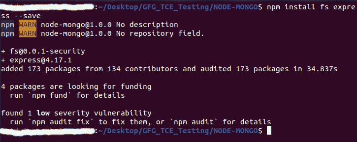

# Node.js `fs.fsyncSync()` 方法

> 原文: [https://www.geeksforgeeks.org/node-js-fs-fsyncsync-method/](https://www.geeksforgeeks.org/node-js-fs-fsyncsync-method/)

在本文中，我们将在 Node.js 中学习 `fs.fsyncSync()` 方法。在深入话题之前，我们先简单了解一下 [`fsync()`](https://www.geeksforgeeks.org/node-js-fs-fsync-method/) 方法是什么。

Node.js 为我们提供了 `fs` 模块，可以帮助我们实现同步和异步两种形式。异步表单的最后一个参数是回调，而在同步表单中，它只包含文件描述符。`fsync()` 函数不返回值，但是有助于同步获取文件描述符。`fsyncSync()` 方法正好是 `fsync()` 的同步形式。有助于同步磁盘缓存。

## 语法

```js
fs.fsyncSync(fd)
```

`fd` 指的是文件描述符，其返回值为 `undefined`。

## 参数

文件描述符。

## 返回类型

`undefined`。

文件描述符是唯一标识计算机中打开文件的数字。它为全局文件表提供了一个条目，为我们提供了该条目的位置。例如：如果文件描述符为 3，则表示在全局文件表中保存为读/写操作，且偏移量:12。

首先我们需要在我们的 Node.js 项目中安装 `fs` 和 `express` 模块。

```bash
npm install fs express --save
```



在 node.js 项目中创建一个文件 `example.txt`，这样我们就可以对该文件使用任何类型的操作。之后，为我们的项目编写必要的 javascript 代码。

**example.txt**