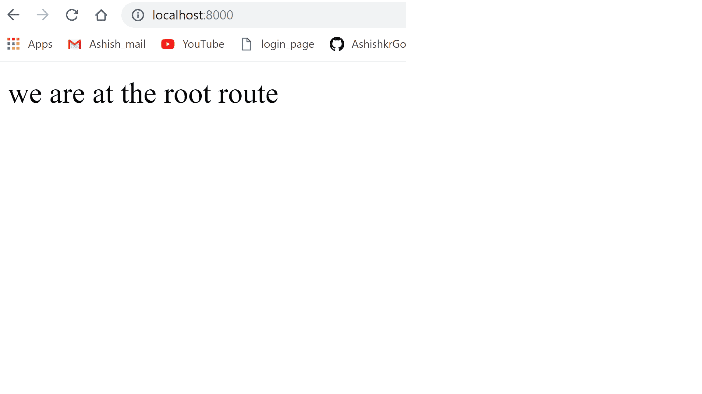
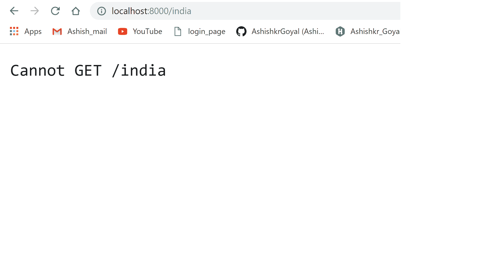

# 节点.js 处理无效路由

> 原文：[https://www.geeksforgeeks.org/node-js-handling-invalid-routes/](https://www.geeksforgeeks.org/node-js-handling-invalid-routes/)

在开发 Node.js 应用程序时，处理无效路由很重要。可以通过编写自定义路由或将所有无效路由重定向到任意自定义页面来实现。

## Let’s develop an simple nodejs server for handling invalid routes:

### 步骤 1: 创建项目文件夹
为无效路由项目创建单独的文件夹。

### 步骤 2: 创建 package.json
将在终端或命令提示符下键入以下命令创建 `package.json`：

```js
npm init -y
```

### 步骤 3: 在项目的根目录下创建一个 javascript 文件

### 步骤 4: 使用 express 创建一个简单的服务器

```js
// importing express package for creating the express server
const express = require('express');
const app = express(); // creating an express object

const port = 8000; //setting server port to 8000

// for mounting static files to express server
app.use(express.static(__dirname+'public/'));

// listening server
app.listen(port, function (err) {
    if(err){
        console.log("error while starting server");
    }
    else{
        console.log("server has been started at port "+port);
    }
})
```

### 步骤 5: Define routes

```js
app.get('/', function (req, res) {
    res.send("Ashish")
})

app.get('/geeksforgeeks', function (req, res) {
    res.sendFile(__dirname+'/public/geeksforgeeks.html')
})
```

现在，我们将按照终端中的命令或命令提示符启动我们的服务器：

```js
node server.js
```

如果您的系统中安装了 `nodemon`，那么也可以通过以下命令完成：
要了解更多关于 `nodemon` 的信息以及如何使用它，请参考：[**本**](https://www.geeksforgeeks.org/nodejs-automatic-restart-nodejs-server-with-nodemon/)

```js
nodemon server.js
```

到目前为止，在我们的项目中，我们开发了两条路由：

*   **根路由 (`/`)**
    此路由将在 `http://localhost:8000/` 访问。
    
*   **极客路由 (`/geeksforgeeks`)**
    该路由将在 `http://localhost:8000/geeksforgeeks` 进入。
    

现在，让我们尝试访问服务器文件中未定义的不同随机路由。

如截图所示，我们在尝试访问 `/india` 路由时出现错误。


## 编写处理所有无效路由的自定义路由
我们将为所有无效路由添加一条路由，如下所示：

```js
app.get('*', function(req, res){
    res.sendFile(__dirname+'/public/error.html');
}
```

现在，更新后的服务器文件如下所示：

```js
// importing express package for creating the express server
const express = require('express');
const app = express(); // creating an express object

const port = 8000; // setting server port to 8000

app.use(express.static(__dirname+'/public'));

// creating routes
app.get('/', function (req, res) {
    res.send("Ashish")
})

app.get('/geeksforgeeks', function (req, res) {
    res.sendFile(__dirname+'/public/geeksforgeeks.html')
})

app.get('*', function (req, res) {
    res.sendFile(__dirname+'/public/error.html');
})

// listening server
app.listen(port, function (err) {
    if(err){
        console.log("error while starting server");
    }
    else{
        console.log("server has been started at port "+port);
    }
})
```

让我们尝试访问我们获得的相同 `india` 路由 **无法到达 `/india` 错误**

为此，网址将是：`http://localhost:8000/India`


现在，如果我们试图访问任何随机无效或错误的路由，我们将得到如上所示的错误页面。

## Points to remember
*   无效路由的路由应该放在所有路由的最后，因为路由是按照写入的顺序调用的。
*   如果我们把这个路由写在开头或中间某个地方，那么在这个路由之后写的所有路由都将无法工作，并将被重定向为作为无效路由处理。

让我们用一个例子来理解这一点：
我们在这里改变路由的顺序

```js
// importing express package for creating the express server
const express = require('express');
const app = express(); // creating an express object

const port = 8000; // setting server port to 8000

app.use(express.static(__dirname+'/public'));

// creating routes
app.get('*', function (req, res) {
    res.sendFile(__dirname+'/public/error.html');
})

app.get('/', function (req, res) {
    res.send("Ashish")
})

app.get('/geeksforgeeks', function (req, res) {
    res.sendFile(__dirname+'/public/geeksforgeeks.html')
})

// listening server
app.listen(port, function (err) {
    if(err){
        console.log("error while starting server");
    }
    else{
        console.log("server has been started at port "+port);
    }
})
```

**现在，我们将在访问任何路由时获得无效路由响应，无论它是否在代码中定义，因为我们正在服务器顶部处理无效路由**


**所以需要在所有路由的末尾写自定义路由，这样才不会干扰其他任何路由的功能。**

这样，我们可以在 nodejs 中处理无效路由访问。