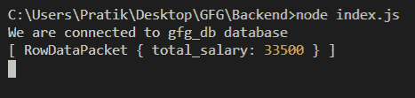
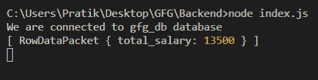

# Node.js MySQL SUM()函数

> 原文: [https://www.geeksforgeeks.org/node-js-mysql-sum-function/](https://www.geeksforgeeks.org/node-js-mysql-sum-function/)

我们使用 MySQL 中的 `SUM()` 函数来获取某些列值的总和。

**语法：**

```js
SUM(column_name)
```

**参数：** `SUM()` 函数接受一个参数，如下所述。

*   **column_name:** 我们需要从中返回总和的列名。

**模块安装：** 使用以下命令安装 `mysql` 模块。

```bash
npm install mysql
```

**数据库：** 我们的 SQL `publishers` 表带有样本数据，预览如下所示：


## 示例1：计算所有发布者的工资总和

### index.js

```js
const mysql = require("mysql");

let db_con  = mysql.createConnection({
    host: "localhost",
    user: "root",
    password: '',
    database: 'gfg_db'
});

db_con.on('error', (err) => {
    console.log(err.code);
});

db_con.connect((err) => {
    if (err) {
      console.log("Database Connection Failed !!!", err.code);
      return;
    }

    console.log("We are connected to gfg_db database");

    // Here is the query
    let query = "SELECT SUM(salary) AS total_salary FROM publishers";

    db_con.query(query, (err, rows) => {
        if(err) throw err;

        console.log(rows);
    });
});
```

使用以下命令运行 `index.js` 文件：

```bash
node index.js
```

**输出：**



## 示例2：计算特定ID范围内的工资总和

### index.js

```js
const mysql = require("mysql");

let db_con  = mysql.createConnection({
    host: "localhost",
    user: "root",
    password: '',
    database: 'gfg_db'
});

db_con.on('error', (err) => {
    console.log(err.code);
});

db_con.connect((err) => {
    if (err) {
      console.log("Database Connection Failed !!!", err.code);
      return;
    }

    console.log("We are connected to gfg_db database");

    // Here is the query
    let query = "SELECT SUM(salary) AS total_salary FROM \
                 publishers WHERE id BETWEEN 2 AND 7";

    db_con.query(query, (err, rows) => {
        if(err) throw err;

        console.log(rows);
    });
});
```

使用以下命令运行 `index.js` 文件：

```bash
node index.js
```

**输出：**

