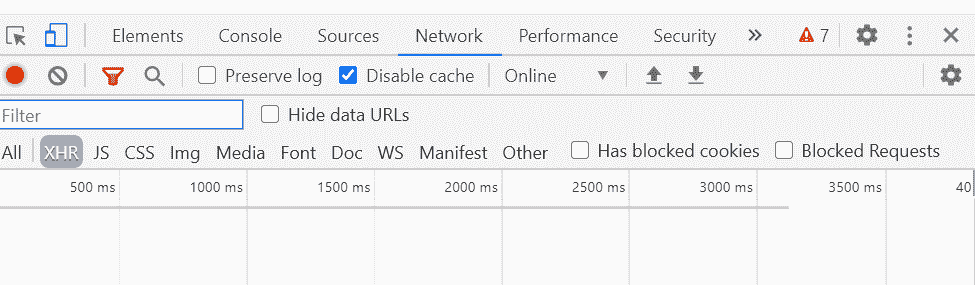

# 节点.js 用 Helmet.js 保护应用

> 原文：[https://www.geeksforgeeks.org/node-js-securing-apps-with-helmet-js/](https://www.geeksforgeeks.org/node-js-securing-apps-with-helmet-js/)

`Helmet.js` 是一个 Node.js 模块，帮助保护 HTTP 头。它在 Express 应用程序中实现。因此，我们可以说，`Helmet.js` 有助于保护 Express 应用程序。它设置了各种 HTTP 头来防止像跨站点脚本（XSS）、点击劫持等攻击。

## 为什么 HTTP 头的安全性很重要

有时候开发人员会忽略 HTTP 头。由于 HTTP 头可能会泄露有关应用程序的敏感信息，因此，以安全的方式使用头非常重要。

## 节点-Helmet.js 中包含的模块有

`Helmet.js` 自带更多内置模块，增加了 Express 应用的安全性。

*   **`content-security-policy`**：设置安全策略。
*   **`expect-ct`**：用于处理证书透明度。
*   **`dns-prefetch-control`**：用于控制浏览器 DNS 的预取。
*   **`frameguard`**：用于防止点击劫持。
*   **`hide-powered-by`**：用于移除 `X-Powered-By` 表头。`X-Powered-By` 头泄露了服务器及其供应商的版本。
*   **`hpkp`**：用于 HTTP 公钥锁定。
*   **`hsts`**：用于 HTTP 严格传输策略。
*   **`ienoopen`**：限制为各种下载选项。
*   **`nocache`**：用于禁用客户端缓存。
*   **`nosniff`**：用于防止嗅探攻击。
*   **`referrer-policy`**：用于隐藏引荐者头。
*   **`x-xss-protection`**：用于为 XSS 攻击增加防护。

## 如何检查 HTTP 标头

要检查标头，首先右键单击要检查的页面。现在，点击 **检查元素**。之后打开 **网络** 标签。网络页签会是这样的：

一开始是空的。在网络选项卡中，将显示浏览器发出的所有 HTTP 请求。

## 先决条件

1.  您选择的集成开发环境。
2.  Node.js 安装在您的系统中。
3.  了解 Node.js 和 Express 应用程序。

## 设置基本 Express 应用程序

1.  首先用 `package.json` 文件初始化应用程序。写下以下命令：

    ```js
    npm init
    ```

2.  使用以下命令安装 `express` 模块：

    ```js
    npm install express --save
    ```

    下面显示的是我们的 `package.json` 文件：

    ```js
    {
      "name": "HelmetJs",
      "version": "1.0.0",
      "description": "",
      "main": "index.js",
      "scripts": {
        "test": "echo \"Error: no test specified\" && exit 1"
      },
      "author": "Pranjal Srivastava",
      "license": "ISC",
      "dependencies": {
        "express": "^4.17.1",
      }
    }
    ```

3.  创建一个文件，我们将在其中编写 JavaScript 代码。例如 `app.js`。你可以随意命名你的文件。现在，编写以下设置服务器的代码：

    ```js
    const express = require('express');
    const app = express();

    app.get('/', (req, res) => {
        res.send("This is the Demo page for"
           + " setting up express server !")
    });

    app.listen(3000, (err) => {
        if (err) { console.log(err); }
        else { console.log('Server started '
            + 'at http://localhost:3000'); }
    });
    ```

4.  使用以下命令运行 `app.js` 文件：

    ```js
    node app.js
    ```

    上述命令的输出如下所示：

    ```js
    Server started at http://localhost:3000
    ```

5.  打开浏览器，转到 `http://localhost:3000`。再次打开 **网络** 选项卡，您将看到浏览器发出的请求列表。选择 **localhost** 请求，您将看到如下响应标题列表：

    ```js
    HTTP/1.1 304 Not Modified
    X-Powered-By: Express
    ETag: W/"35-QqeUaYjSJ35gtyT3DcgtpQlitTU"
    Date: Thu, 04 Jun 2020 15:55:00 GMT
    Connection: keep-alive
    ```

## 在 Express 应用程序中设置和实现 Helmet.js

1.  要安装 `Helmet.js` 模块，请编写以下命令：

    ```js
    npm install helmet --save
    ```

2.  在 `app.js` 文件中，编写以下代码来使用 `helmet` 模块：

    ```js
    const express = require('express');
    const helmet = require('helmet');
    const app = express();

    app.use(helmet());

    app.get('/', (req, res) => {
        res.send("This is the Demo page for"
            + " setting up express server !")
    });

    app.listen(3000, (err) => {
        if (err) { console.log(err); }
        else { console.log('Server started '
            + 'at http://localhost:3000'); }
    });
    ```

3.  使用以下命令启动服务器：

    ```js
    node app.js
    ```

4.  通过单击检查元素打开 **网络** 选项卡。单击 **localhost**，您会注意到响应中有一组额外的头部。头部如下：

    ```js
    HTTP/1.1 304 Not Modified
    X-DNS-Prefetch-Control: off
    X-Frame-Options: SAMEORIGIN
    Strict-Transport-Security: max-age=15552000; includeSubDomains
    X-Download-Options: noopen
    X-Content-Type-Options: nosniff
    X-XSS-Protection: 1; mode=block
    ETag: W/"35-QqeUaYjSJ35gtyT3DcgtpQlitTU"
    Date: Thu, 04 Jun 2020 16:11:37 GMT
    Connection: keep-alive
    ```

    这里，我们的 `Helmet.js` 模块应用了新的头部集合。添加这些标头是为了提高安全性。

## 结论

`Helmet.js` 模块对 Node.js 开发者非常有用，因为它增加了 Express 应用的安全性。在本教程中，我们学习了 `Helmet.js`，并在一个基本的 Express 应用程序中看到了它的实现。