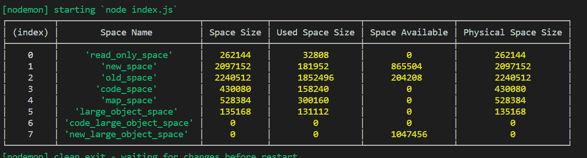

# Node.js V8.getHeapSpaceStatistics() 方法

> 原文: [https://www.geeksforgeeks.org/node-js-v8-getheapspacestatistics-method/](https://www.geeksforgeeks.org/node-js-v8-getheapspacestatistics-method/)

`v8.getHeapSpaceStatistics()` 方法是 `v8` 模块的内置 API，用于获取 V8 引擎堆空间的统计信息。

## 语法

```js
v8.getHeapSpaceStatistics();
```

## 参数

该方法没有任何参数。

## 返回值

这个方法返回一个包含 V8 堆空间统计信息的对象。返回的对象通常包含一个元素数组，其中每个元素由以下字段组成：

*   `space_name`：字符串，表示堆空间的名称。
*   `space_size`：数字，代表堆空间大小。
*   `space_used_size`：数字，表示已用堆空间大小。
*   `space_available_size`：数字，代表可用堆空间大小。
*   `physical_space_size`：数字，指定物理堆空间大小。

下面的例子说明了 Node.js 中 `v8.getHeapSpaceStatistics()` 方法的使用。

## 示例 1

**文件名：`index.js`**

```js
// Accessing v8 module
const v8 = require('v8');

// Calling v8.getHeapSpaceStatistics()
console.log(v8.getHeapSpaceStatistics());
```

使用以下命令运行 `index.js` 文件：

```bash
node index.js
```

**输出：**

```js
[ { space_name: 'read_only_space',
    space_size: 524288,
    space_used_size: 35208,
    space_available_size: 480376,
    physical_space_size: 524288 },
  { space_name: 'new_space',
    space_size: 2097152,
    space_used_size: 975376,
    space_available_size: 55792,
    physical_space_size: 2097152 },
  { space_name: 'old_space',
    space_size: 2330624,
    space_used_size: 2272448,
    space_available_size: 184,
    physical_space_size: 2330624 },
  { space_name: 'code_space',
    space_size: 1048576,
    space_used_size: 571968,
    space_available_size: 0,
    physical_space_size: 1048576 },
  { space_name: 'map_space',
    space_size: 536576,
    space_used_size: 344784,
    space_available_size: 0,
    physical_space_size: 536576 },
  { space_name: 'large_object_space',
    space_size: 0,
    space_used_size: 0,
    space_available_size: 1520180736,
    physical_space_size: 0 } ]
```

## 示例 2

**文件名：`index.js`**

```js
// Accessing v8 module
const v8 = require('v8');

// Calling v8.getHeapSpaceStatistics()
stats = v8.getHeapSpaceStatistics();

var myList = []
for (var i = 0; i < stats.length; i++){
  var element = stats[i];

myList.push({ "Space Name": element['space_name'],
  "Space Size": element['space_size'],
  "Used Space Size": element['space_used_size'],
  "Space Available": element['space_available_size'],
  "Physical Space Size":element['physical_space_size'] },
  );
}

// Printing in tabular form
console.table(myList)
```

使用以下命令运行 `index.js` 文件：

```bash
node index.js
```

**输出：**



## 参考

[https://nodejs.org/api/v8.html#v8_v8_getheapspacestatistics](https://nodejs.org/api/v8.html#v8_v8_getheapspacestatistics)