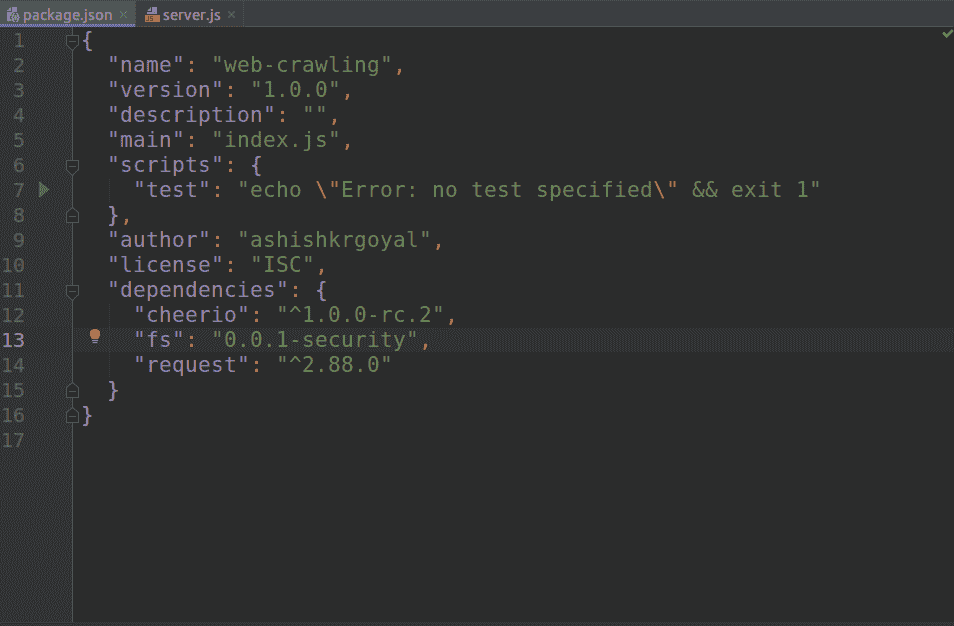
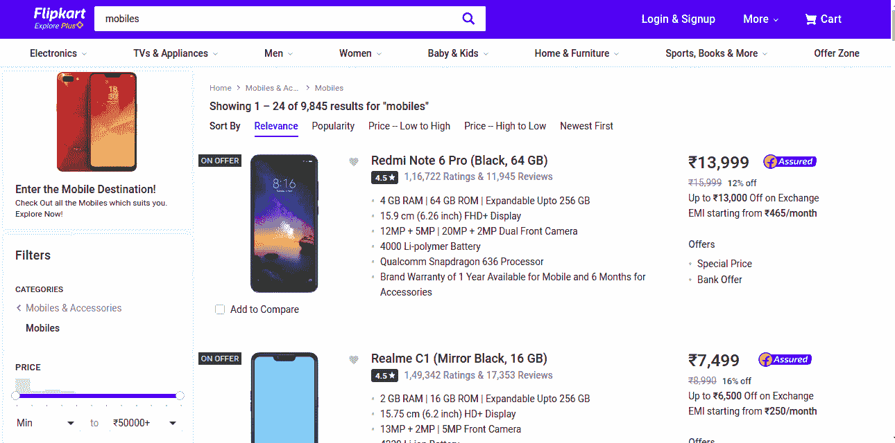
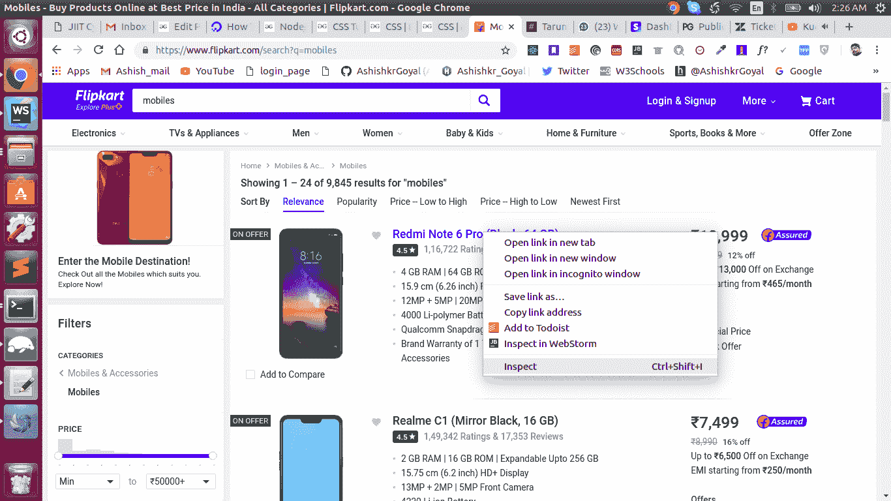
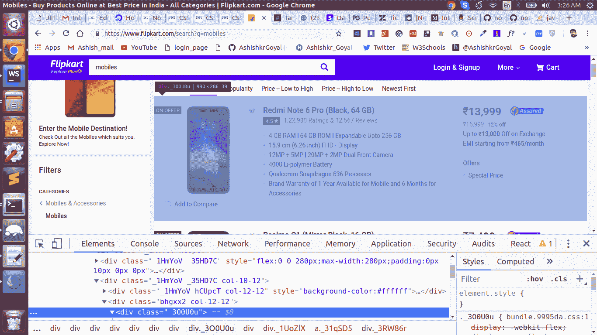
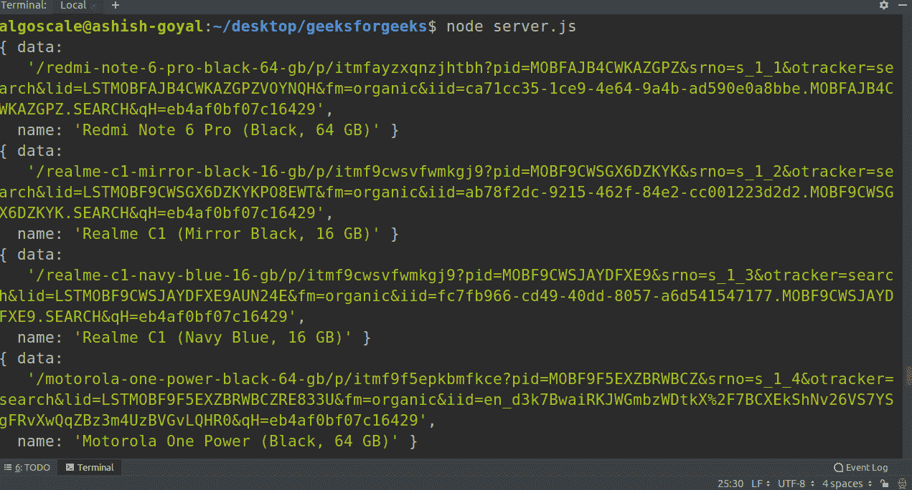

# Node.js | 使用 Cheerio 进行网络爬行

> 原文: [https://www.geeksforgeeks.org/nodejs-web-crawling-using-cheerio/](https://www.geeksforgeeks.org/nodejs-web-crawling-using-cheerio/)

通过向特定的网址发送 HTTP 请求，然后提取该网页的 HTML 来获取有用的信息，这就是所谓的爬行或网页抓取。

## 用于在 Node.js 中爬行的模块

1.  [`request`](https://www.npmjs.com/package/request): 向网址发送 HTTP 请求
2.  [`cheerio`](https://www.npmjs.com/package/cheerio): 用于解析 DOM 和提取网页的 HTML
3.  [`fs`](https://www.npmjs.com/package/fs): 用于将数据读取或写入文件

## 安装这些模块

在 Node.js 中安装模块最简单的方法就是使用 NPM。可以通过两种方式完成：

1.  **全局安装:** 如果我们在全局安装任何模块，那么我们可以在系统的任何地方使用它。可以通过以下命令完成：
    ```js
    npm i -g package_name
    ```

2.  **本地安装:** 如果我们在本地安装任何模块，那么我们只能在该特定项目目录中使用它。可以通过以下命令完成：
    ```js
    npm i package_name
    ```

对于此任务，我们将使用本地安装。

## 使用 Cheerio 进行网络爬行的步骤

### 第一步：为此项目创建文件夹

### 第二步：在项目目录中打开终端，然后键入以下命令：
```js
npm init
```
它将创建一个名为 `package.json` 的文件。它包含关于模块、作者、GitHub 存储库及其版本的所有信息。如需了解更多关于 `package.json` 的信息，请访问此链接：[package.json 讲解](https://write.geeksforgeeks.org/nodejs-package-json-explained/)

要使用 NPM 在本地安装模块，只需执行：
```js
npm install request
npm install cheerio
npm install fs
```
这也可以使用 NPM 在单行中完成：
```js
npm install request cheerio fs
```

成功安装模块后，我们的 `package.json` 将具有如下结构：


在这个截图中，我们可以看到我们所有的依赖项都在 `dependencies` 对象中列出，这意味着我们已经成功地将它们全部安装到了当前的项目目录中。

### 第三步：现在我们将为爬虫编写代码

## 编码步骤

1.  首先，我们将导入所有必需的模块。
2.  然后，我们将向 URL 发送一个 HTTP 请求，然后所需网站的服务器将会以网页进行响应，这将通过 `request` 模块来完成。
3.  现在，我们有了网页的 HTML，我们的任务是从中提取有用的信息，所以我们将遍历 DOM 树并找出选择器。
4.  提取我们的信息后，我们会将其保存到一个文件中，这个任务将在 `fs` 模块的帮助下完成。

### 爬虫代码

创建一个名为 `server.js` 的文件，并添加以下行：
```js
const request = require('request');
const cheerio = require('cheerio');
const fs = require('fs');
```
这几行代码的解释：在这三行中，我们将爬行和数据保存所需的这三个模块都导入到一个文件中。

### 我们将访问想要从中爬取数据的 URL

这里我们将从一个电子商务网站 Flipkart 爬取智能手机列表。在 Flipkart 中显示智能手机列表的 URL 如下：
```js
const URL = "https://www.flipkart.com/search?q=mobiles";
```
**在这个 URL 网页上看起来是这样的：**


现在我们将在 `request` 模块的帮助下点击这个网址：
```js
request(URL, function (err, res, body) {
    if(err)
    {
        console.log(err, "error occured while hitting URL");
    }
    else
    {
        console.log(body);
    }
});
```
让我们来理解这段代码：这里我们使用 `request` 模块将 HTTP 请求发送到智能手机的 Flipkart 的 URL，`request` 模块内的函数分别取三个参数 `error`、`response`、`body`。在这里，如果出现错误，我们会记录下来，否则我们会记录 `body`。

为了测试它，我们将在终端运行脚本：
```js
node server.js
```
我们可以在控制台中看到页面的整个 HTML。`body` 是该网址网页的完整 HTML。

现在我们的任务是提取有用的信息，因此我们将访问 DOM 树，并通过检查元素来找出选择器。为此，在网页上点击右键，进入检查元素，如下所示：


现在我们将访问 DOM：


现在，我们将根据检查结果更改我们的请求以点击网址：
```js
request(URL, function (err, res, body) {
    if(err)
    {
        console.log(err);
    }
    else
    {
        let $ = cheerio.load(body);  //loading of complete HTML body
        $('div._1HmYoV > div.col-10-12>div.bhgxx2>div._3O0U0u').each(function(index){
            const link = $(this).find('div._1UoZlX>a').attr('href');
            const name = $(this).find('div._1-2Iqu>div.col-7-12>div._3wU53n').text();
            console.log(link);   //link for smartphone
            console.log(name);   //name of smartphone
        });
    }
});
```

### 将数据保存到文件中

为此，我们将创建一个数组和一个对象：
```js
let arr = [];  //creating an array
let object = {
    link : link,
    name : name,
}  //creating an object
fs.writeFile('data.txt', arr, function (err) {
    if(err) {
        console.log(err);
    }
    else{
        console.log("success");
    }
});
```
在每一次迭代中，我们将把对象转换成字符串后推入数组；最后我们将整个数组写入文件。通过这种方法，我们的完整数据将成功保存在文件中！

### 现在我们整个代码都会像这样：

```js
// Write Javascript code here
const request = require('request');
const cheerio = require('cheerio');
const fs = require('fs');

const URL = "https://www.flipkart.com/search?q=mobiles";

request(URL, function (err, res, body) {
    if(err)
    {
        console.log(err);
    }
    else
    {
        const arr = [];
        let $ = cheerio.load(body);
        $('div._1HmYoV > div.col-10-12>div.bhgxx2>div._3O0U0u').each(function(index){
            const data = $(this).find('div._1UoZlX>a').attr('href');
            const name = $(this).find('div._1-2Iqu>div.col-7-12>div._3wU53n').text();
            const obj = {
                data : data,
                name : name
            };
            console.log(obj);
            arr.push(JSON.stringify(obj));
        });
        console.log(arr.toString());
        fs.writeFile('data.txt', arr, function (err) {
            if(err) {
                console.log(err);
            }
            else{
                console.log("success");
            }
        });
    }
});
```

现在运行代码：
```js
node server.js
```
运行代码时，您可以在终端上看到如下输出：


成功运行代码后，有一个名为 `data.txt` 的文件，它也提取了所有的数据！我们可以在项目目录中找到这个文件。

这是一个简单的例子，展示了如何使用 `cheerio` 模块在 Node.js 中创建一个网络爬虫。从这里，你可以尝试爬取你选择的任何其他网站。如有任何疑问，请在下方评论区发表。