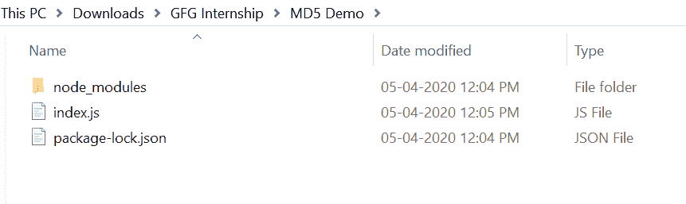
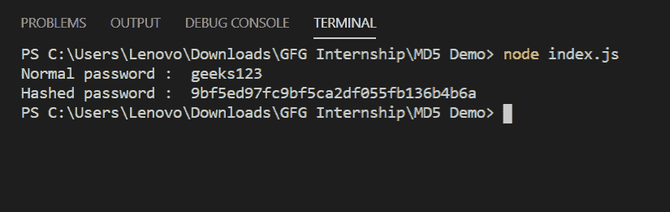

# 在Node.js中使用MD5模块进行密码哈希

> 原文：[https://www.geeksforgeeks.org/password-hashing-with-md5-module-in-node-js/](https://www.geeksforgeeks.org/password-hashing-with-md5-module-in-node-js/)

`node.js`中的`MD5`模块使用消息摘要算法，它是一个广泛使用的哈希函数，产生128位哈希值。密码散列是一个重要的概念，因为在数据库中，实际的密码不应该被存储，因为这是一种不好的做法，也使系统不太安全，所以密码以散列的形式存储在数据库中，这使系统更加安全。

## 简介

1.  上手简单，使用方便。
2.  它是广泛使用和流行的密码散列模块。
3.  它产生一个128位的哈希值。

## 安装MD5模块

1.  您可以访问链接[安装MD5模块](https://www.npmjs.com/package/md5)。您可以使用以下命令安装此软件包。

```js
npm install md5
```

2.  安装`multer`后，您可以使用命令在命令提示符下检查您的`md5`版本。

```js
npm version md5
```

3.  之后，您可以创建一个文件夹并添加一个文件，例如`index.js`。

```js
node index.js
```

4.  **要求模块：**您需要使用这些行在您的文件中包含`md5`模块。

```js
var md5 = require('md5');
```

## 文件名：index.js

```js
const md5 = require('md5')

var password = 'geeks123'

console.log('Normal password : ', password)
console.log('Hashed password : ', md5(password))
```

## 运行程序的步骤

1.  项目结构会是这样的：
    
2.  确保您已经使用以下命令安装了`md5`模块：

```js
npm install md5
```

3.  使用以下命令运行`index.js`文件：

```js
node index.js
```



这就是如何使用`MD5`模块在节点`js`中散列密码。市场上还有其他哈希模块，如加密、加密等。