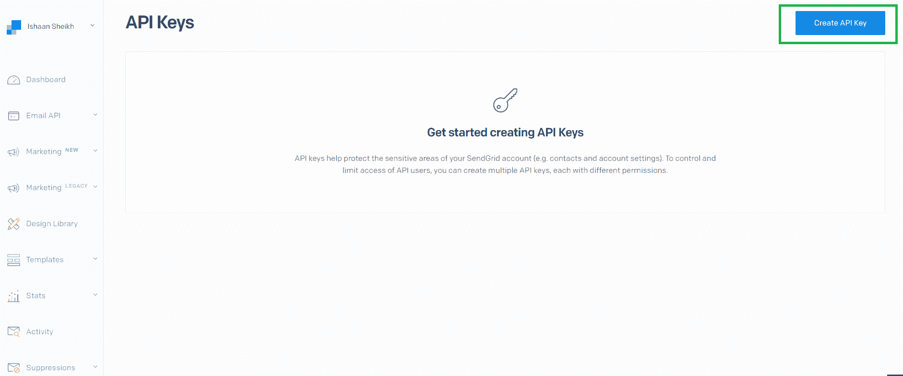
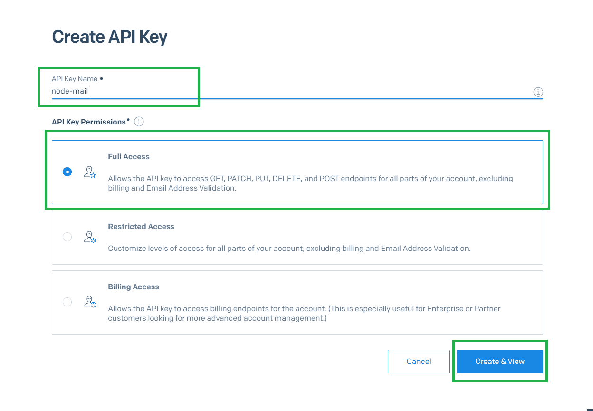
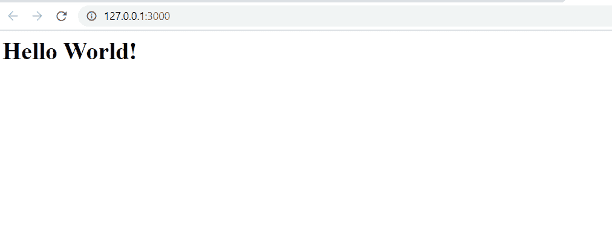
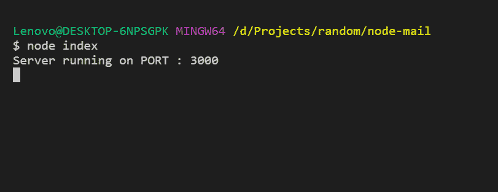

# 使用 SendGrid API 在 Node.js 中发送批量邮件

> 原文：[https://www.geeksforgeeks.org/sending-bulk-emails-in-node-js-using-sendgrid-api/](https://www.geeksforgeeks.org/sending-bulk-emails-in-node-js-using-sendgrid-api/)

## 什么是 SendGrid API？

SendGrid 是一个向客户发送交易和营销电子邮件的平台。它提供了可伸缩性、可靠性和可交付性，这对组织来说是一个重要的问题。

## 使用 SendGrid API 的好处

*   如果你使用的是带有 Gmail 的 `nodemailer`，那么你每天只能发送一定数量的邮件。
*   还有就是**不需要设置自己的 SMTP 服务器**。
*   SMTP 不提供**送达功能**，即邮件可以发送，也可以不发送。

## 使用 SendGrid API 发送电子邮件的步骤

### 1. 设置 API 密钥

*   转到 SendGrid [仪表盘](https://app.sendgrid.com/settings/api_keys)，点击 **Create API Key** 按钮。
    
*   为 API 密钥命名，本教程中我们将其命名为 `node-mail`。
    

复制 API 密钥，因为出于安全原因，您可能无法再次看到它。

### 2. 设置 Node.js 应用

*   使用以下命令创建一个空的 `NPM` 包。（通过 `--y` 标志使用生成器中的默认值，而不是提问）

```bash
npm init -y
```

*   创建一个名为 `index.js` 的文件，并添加以下样板代码。

```javascript
// Importing http library
const http = require("http");

const PORT = 3000; // Defining PORT

http.createServer((req, res) => {
    // Output Hello World on HTML page
    res.write("<h1>Hello World!</h1>");
    res.end();
})
// Initializing server
.listen(PORT, () => console.log(`Server running on PORT : ${PORT}`));
```

*   现在使用 `node index` 命令运行代码，并转到 `127.0.0.1:3000` 链接。您将看到输出。
    
*   而在控制台：
    

### 3. 安装 SendGrid 库

通过运行以下命令安装 `@sendgrid/mail` 库：

```bash
npm i @sendgrid/mail
```

### 4. 使用库发送邮件

```javascript
const http = require("http");

const PORT = 3000;

http.createServer((req, res) => {
    // Initializing sendgrid object
    const mailer = require("@sendgrid/mail");

    // Insert your API key here
    mailer.setApiKey("<your-api-key>");

    // Setting configurations
    const msg = {
        to: ["youremail@gmail.com", "your.second.email@gmail.com"],
        from: "noreply@example.com",
        subject: "Message sent for demo purpose",
        html: "<h1>New message from Geeksforgeeks</h1><p>Some demo text from geeksforgeeks.</p>"
    };

    // Sending mail
    mailer.send(msg, function(err, json) {
        if (err) {
            console.log(err);
            // Writing error message
            res.write("Can't send message sent");
        } else {
            // Writing success message
            res.write("Message sent");
        }
    });

    res.end();
})
.listen(PORT, () => console.log(`Server running on PORT : ${PORT}`));
```

现在使用 `node index` 再次运行该应用程序，并在浏览器中转到 `127.0.0.1:3000`，检查您的两封电子邮件，您将看到如下输出。
