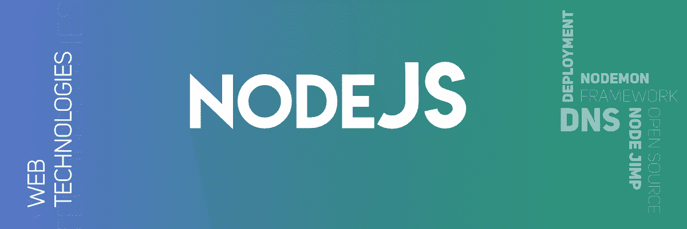

# 关于 Node.js 你必须知道的事情

> 原文：[https://www.geeksforgeeks.org/things-you-must-know-about-node-js/](https://www.geeksforgeeks.org/things-you-must-know-about-node-js/)

如果您不清楚 Node.js 是什么，并且您是来学习 Node.js 中的新内容的，那么让我们从对它的简单介绍开始。
Node.js 由 Ryan Dahl 于 2009 年首创。这个运行时系统得到了广泛的增强，受到了程序员的欢迎，并被用来创建 API。当开发人员使用 Node.js 时，他们需要使用 JavaScript 开发一些实时的 web APIs。如果你对 JavaScript 有一定的了解，那么学习 Node.js 就不会花太多时间。

## 1. Node.js is all JavaScript:
如果你打算为你的网络浏览器开发各种应用程序，那么这是你必须学习的基本要素。Node.js 由 JavaScript 支持以处理事件循环机制，这是 Node.js 的一个优势。JavaScript 现在非常普及，它帮助我们在每个操作系统环境中都能平稳运行。

## 2. JSON is still the best:
如果你是一名 JavaScript 开发者，那么你应该了解关于 JSON（JavaScript 对象表示法）的最重要的事情。JSON 是一种可访问的数据交换格式。通过 JSON，人们可以快速构建允许 Node.js 的 API。以前 JavaScript 并不是单独使用的，现在仍然如此，我们必须将 JSON 与 JavaScript 一起使用。这目前是 JSON 的一种转换，现在，即使我们使用 Node.js 框架，我们也必须考虑 JSON 的使用。

## 3. Reinforced by JSON:
JSON 为开发者提供了一种健壮且可访问的数据交换格式。它被认为是 JavaScript 的支柱，因为它简单并允许开发者快速构建 API。早先，程序员在浏览器中操作 JavaScript 动态数据时必须格外小心。JSON 催生了 NoSQL 数据库，专为 JS 而设。

## 4. Powered by Google Chrome:
由 Google 的 V8 引擎驱动，Node.js 在后端工作。它采用了与 Google Chrome 相同的运行时来执行前端的 JavaScript。然而，Google 的 Node.js 开发团队使其成为与高级 JavaScript 相比最快和最具动态性的运行时之一。此外，Google 将 Node.js 列为其他系统引擎动力之一。另外，使用 Google 开发者工具，开发者可以利用 Node.js 调试功能进行调试，这允许消除前端和后端的错误。

## 5. Node.JS has an extensive library of codes:
Node.js 上有一个庞大的依赖库，称为 Node 包管理器。它帮助我们通过可靠的包管理轻松管理事务，让节点生态系统良好发展。较小的开发者可以使用为他们的项目制作的更好的包，这些包他们决定公开，开发者在较小规模的项目中做得更好。它还将使实施 Node.js 比其他系统更加舒适。

## 6. Small modules working fast:
Node.JS 是一个划分为各种较小模块的框架，其中两个我们可以广泛地称为 Node.JS 应用程序和 Node.JS 核心。虽然我们可以一起使用这两者。在服务器或客户端的末端，并不总是需要一起使用它们，因此它使得不将核心或应用程序集体包含在所有位置都去的地方更轻便。由于这样的好处，许多公司已经承担起提供 Node.js 开发服务的任务。

## 7. 分享是免费的所以鼓励:
Node.js 对喜欢继续分享知识的开发者是有益的。当您在 Node.js 上工作时，您可以快速获得帮助，并且很容易在社区上分享。如果你有一些不同的包，你可以和不同的开发者，甚至原始开发者分享。因此，他们可以节省在其他类型的源和包上工作的时间。