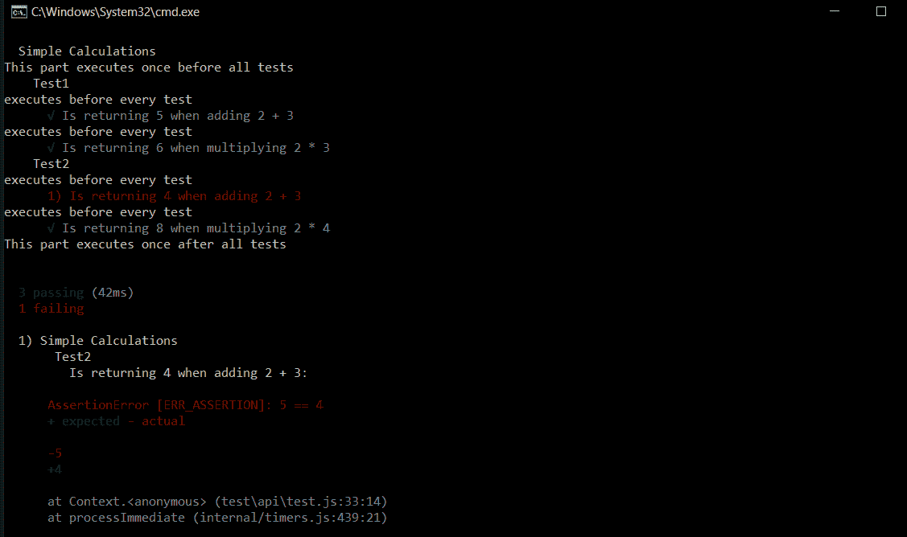
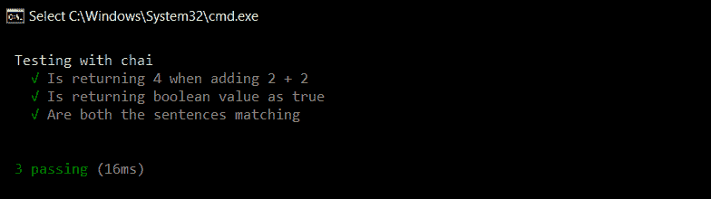
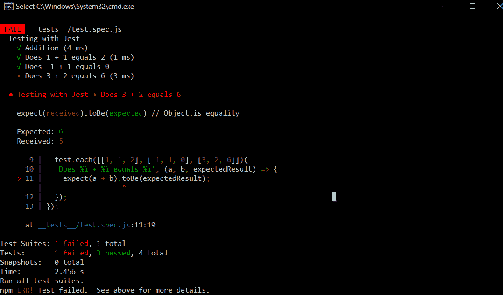

# Node.js应用的单元测试

> 原文：[https://www.geeksforgeeks.org/unit-testing-of-node-js-application/](https://www.geeksforgeeks.org/unit-testing-of-node-js-application/)

Node.js是一个广泛使用的JavaScript库，基于Chrome的V8 JavaScript引擎，用于开发web开发中的服务器端应用程序。

[单元测试](https://www.geeksforgeeks.org/unit-testing-software-testing/)是对单个单元/组件进行隔离测试的软件测试方法。一个单元可以被描述为应用程序中最小的可测试代码部分。单元测试通常由开发人员在应用程序的开发阶段进行。

在Node.js中，有许多运行单元测试的框架。其中一些是：
* Mocha
* Jest
* Jasmine
* AVA

## 使用这些框架对节点应用程序进行单元测试

### Mocha
Mocha是一个古老且广泛使用的Node应用程序测试框架。它支持异步操作，如回调、Promise和async/await。它是一个高度可扩展和可定制的框架，支持不同的断言和模拟库。

要安装它，请打开命令提示符并键入以下命令：
```js
# Installs globally
npm install mocha -g

# installs in the current directory
npm install mocha --save-dev
```

### 摩卡怎么用？
为了在你的应用中使用这个框架：
1. 打开项目的根文件夹，在里面新建一个名为`test`的文件夹。
2. 在`test`文件夹中，创建一个名为`test.js`的新文件，其中包含所有与测试相关的代码。
3. 打开`package.json`并在`scripts`块中添加以下行。
```js
"scripts": {
  "test": "mocha --recursive --exit"
}
```

### 示例
```js
// Requiring module
const assert = require('assert');

// We can group similar tests inside a describe block
describe("Simple Calculations", () => {
  before(() => {
    console.log( "This part executes once before all tests" );
  });

  after(() => {
    console.log( "This part executes once after all tests" );
  });

  // We can add nested blocks for different tests
  describe( "Test1", () => {
    beforeEach(() => {
      console.log( "executes before every test" );
    });

    it("Is returning 5 when adding 2 + 3", () => {
      assert.equal(2 + 3, 5);
    });

    it("Is returning 6 when multiplying 2 * 3", () => {
      assert.equal(2*3, 6);
    });
  });

  describe("Test2", () => {
    beforeEach(() => {
      console.log( "executes before every test" );
    });

    it("Is returning 4 when adding 2 + 3", () => {
      assert.equal(2 + 3, 4);
    });

    it("Is returning 8 when multiplying 2 * 4", () => {
      assert.equal(2*4, 8);
    });
  });
});
```

复制上面的代码并粘贴到我们之前创建的`test.js`文件中。要运行这些测试，请在项目的根目录中打开命令提示符，并键入以下命令：
```js
npm run test
```

### 输出


### 柴是什么？
柴是一个经常和摩卡一起使用的断言库。它可以用作Node.js的TTD(测试驱动开发)/ BDD(行为驱动开发)断言库，可以与任何基于JavaScript的测试框架配对。类似于上面代码中的`assert.equal()`语句，我们可以用柴来写类似英语句子的测试。

要安装它，请在项目的根目录中打开命令提示符，并键入以下命令：
```js
npm install chai
```

### 示例
```js
const expect = require('chai').expect;

describe("Testing with chai", () => {
    it("Is returning 4 when adding 2 + 2", () => {
      expect(2 + 2).to.equal(4);
    });

    it("Is returning boolean value as true", () => {
      expect(5 == 5).to.be.true;
    });

    it("Are both the sentences matching", () => {
      expect("This is working").to.equal('This is working');
    });
  });
```

### 输出


### Jest
Jest也是一个流行的测试框架，以其简单性而闻名。它由Facebook开发和定期维护。Jest的关键特性之一是文档完善，并且支持并行测试运行，即每个测试将在自己的进程中运行以最大化性能。它还包括几个特性，如测试监视、覆盖率和快照。

您可以使用以下命令安装它：
```js
npm install --save-dev jest
```

**注意：**默认情况下，Jest期望在根文件夹中找到名为`__tests__`的文件夹中的所有测试文件。

### 示例
```js
describe("Testing with Jest", () => {
  test("Addition", () => {
    const sum = 2 + 3;
    const expectedResult = 5;
    expect(sum).toEqual(expectedResult);
  });

  // Jest also allows a test to run multiple
  // times using different values
  test.each([[1, 1, 2], [-1, 1, 0], [3, 2, 6]])(
  'Does %i + %i equals %i', (a, b, expectedResult) => {
    expect(a + b).toBe(expectedResult);
  });
});
```

### 输出


### Jasmine
Jasmine也是一个强大的测试框架，自2010年以来就已存在。它是一个用于测试JavaScript代码的[行为驱动开发](https://en.wikipedia.org/wiki/Behavior-driven_development)(BDD)框架。它以其与其他测试框架（如Sinon和Chai）的兼容性和灵活性而闻名。这里测试文件必须有一个特定的后缀(`*spec.js`)。

您可以使用以下命令安装它：
```js
npm install jasmine-node
```

### 示例
```js
describe("Test", function() {
  it("Addition", function() {
    var sum = 2 + 3;
    expect(sum).toEqual(5);
  });
});
```

### AVA
AVA是一个相对较新的简约框架，允许您并发运行JavaScript测试。像Jest框架一样，它也支持快照和并行处理，这使得它比其他框架相对较快。关键特性包括没有隐式全局变量和内置对异步函数的支持。

您可以使用以下命令安装它：
```js
npm init ava
```

### 示例
```js
import test from 'ava';

test('Addition', t => {
  t.is(2 + 3, 5);
});
```