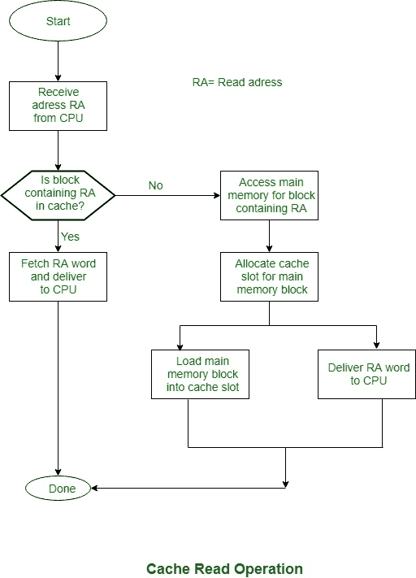

# 缓存设计

> 原文: [https://www.geeksforgeeks.org/cache-memory-design/](https://www.geeksforgeeks.org/cache-memory-design/)

先决条件 – [缓存内存](https://www.geeksforgeeks.org/cache-memory/)

本文给出了缓存设计的详细讨论。这里简要总结了关键要素。我们将看到，类似的设计问题应该在解决存储和缓存设计时自行解决。它们代表后续类别：缓存大小、块大小、映射功能、替换算法和写入策略。这些解释如下。



## 缓存大小

看起来适度微小的缓存对性能的影响会很大。

## 块大小

块大小是缓存和主内存之间信息变化的单位。

由于块的大小将从非常小的大小增加到更大的大小，命中率关系最初会由于局部性原则而增加。在不久的将来，记录的单词平方度量的知识被记录的可能性很大。随着块大小的增加，大量有用的知识被放入缓存。

然而，命中数量关系可能开始减小，因为块变得更大，并且牺牲新获取的知识的机会变得更小，但是重用应该从高速缓存中提取的信息以形成新块的区域的机会变得更小。

## 映射功能

当一个替换块的数据被扫描进缓存时，映射功能决定了该块将占据的缓存位置。两个约束影响映射功能的设计。首先，当一个块被扫描进来时，另一个块可能被替换。

我们希望以最简单的方式做到这一点，以最大限度地减少我们将在不久的将来更换一个需要的区块的机会。很多通用的映射功能，很多范围，我们必须设计一个替换算法规则来最大化命中率。第二，映射功能很多通用功能，很多高级功能是电子设备需要查看缓存，以查看给定的块是否在缓存中。

## 替换算法

替换算法在映射功能的约束下，周期性地选择当一个新块要被加载到缓存中且缓存的所有槽位已满时，要替换哪个块。我们希望替换那个在不久的将来最不可能被再次需要的块。虽然不可能准确找出这样的块，但一个相当有效的策略是替换那个在缓存中存在时间最长且没有被访问的块。

这一策略被称为最近最少使用（`LRU`）算法。发现最近最少使用的块所需的硬件机制平方度量。

## 写入策略

如果缓存中一个块的内容被改变，那么在替换它之前有必要将其写回主内存。写入策略规定了内存写操作何时发生。在一个极端情况下，写入操作会在块被更新时立即发生。

在相反的极端情况下，只有当块被替换时，写入才会发生。后一种策略最大限度地减少了内存写操作，但使主内存处于相关的过时状态。这会干扰多处理器操作和输入/输出硬件模块的直接操作。

```
if (condVar > someVal) {console.log("xxx")}
```