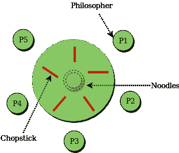

# 用信号量解决同步的经典问题

> 原文：[https://www.geeksforgeeks.org/classical-problems-of-synchronization-with-semaphore-solution/](https://www.geeksforgeeks.org/classical-problems-of-synchronization-with-semaphore-solution/)

在本文中，我们将看到许多经典的[同步](https://www.geeksforgeeks.org/process-synchronization-set-1/)问题，作为一大类并发控制问题的例子。在我们的问题解决方案中，我们使用[信号量](https://www.geeksforgeeks.org/semaphores-operating-system/)进行同步，因为这是呈现此类解决方案的传统方式。然而，这些解决方案的实际实现可以使用[互斥锁](https://www.geeksforgeeks.org/mutex-vs-semaphore/)代替二进制信号量。

这些问题几乎用于测试每一个新提出的同步方案。以下同步问题被认为是经典问题：

```
1. Bounded-buffer (or Producer-Consumer) Problem,
2. Dining-Philosophers Problem,
3. Readers and Writers Problem,
4. Sleeping Barber Problem
```

这些都是总结出来的，对于详细的解释，你可以查看每个的链接文章。

## 有界缓冲（或生产者-消费者）问题

有界缓冲问题也叫生产者消费者问题。这个问题被概括为生产者-消费者问题。这个问题的解决方案是，创建两个计数信号量“满”和“空”，分别跟踪当前已满和空缓冲区的数量。生产者生产产品，消费者消费产品，但双方每次都使用其中一个容器。

## 哲学家就餐问题

哲学家就餐问题指出，K 位哲学家围坐在一张圆桌旁，每对哲学家之间有一根筷子。每位哲学家之间有一根筷子。如果一位哲学家能拿起他旁边的两根筷子，他就可以吃。一根筷子可以被其相邻的任一位跟随者拿起，但不能同时被两人拿起。这个问题涉及以无死锁和无饥饿的方式将有限资源分配给一组进程。



## 读者和作者问题

假设一个数据库要在几个并发进程之间共享。其中一些进程可能只想读取数据库，而另一些进程可能想更新（即读写）数据库。我们通过将前者称为读者，将后者称为作者来区分这两种过程。确切地说，在操作系统中，我们称这种情况为读者-作者问题。问题参数：
*   一组数据由多个进程共享。
*   一旦编写器准备好了，它就执行它的写操作。一次只能有一个作家写作。
*   如果一个进程正在写入，没有其他进程可以读取它。
*   如果至少有一个读取器正在读取，则没有其他进程可以写入。
*   读者不可以写，只能读。

## 睡眠理发师问题

理发店有一位理发师、一把理发椅和 N 把等待椅。当没有顾客时，理发师会在理发椅上睡觉，当有顾客进来时必须被叫醒。当理发师在剪头发时，新顾客会坐在空椅子上等待，或者如果没有空位就离开。

