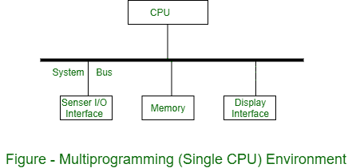
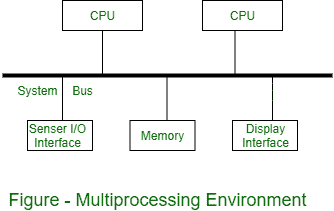
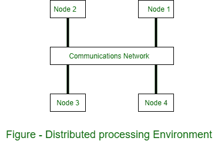

# 操作系统中的并发进程

> 原文：[https://www.geeksforgeeks.org/concurrent-processes-in-operating-system/](https://www.geeksforgeeks.org/concurrent-processes-in-operating-system/)

**并发处理**是多处理器同时执行指令以获得更好性能的计算模型。并发的意思是，当其他事情发生时发生。这些任务被分成子类型，然后分配给不同的处理器来同时、顺序地执行，因为它们必须由一个处理器来执行。并发处理有时与并行处理同义。

并发处理中的真实和虚拟并发术语：

### 1. 多道程序设计环境
在多道程序设计环境中，多个任务由一个处理器共享。虽然操作系统可以实现虚拟并发，但如果处理器为每个单独任务分配，使得每个任务都有专用处理器，那么虚拟概念就是可见的。多层环境如图所示。

### 2. 多处理环境
在多处理环境中，两个或更多处理器与共享内存一起使用。只使用一个虚拟地址空间，该空间对所有处理器都是通用的。所有任务都驻留在共享内存中。在此环境中，并发以并发执行的处理器的形式得到支持。在不同处理器上执行的任务通过共享内存彼此交互。多处理环境如图所示。

### 3. 分布式处理环境
在分布式处理环境中，两个或更多计算机通过通信网络或高速总线相互连接。处理器之间没有共享内存，每台计算机都有自己的本地内存。因此，一个由并发任务组成的分布式应用程序，通过网络通信以消息的方式进行分发。分布式处理环境如图所示。

