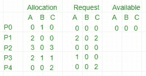

# 操作系统中的死锁检测算法

> 原文: [https://www.geeksforgeeks.org/deadlock-detection-algorithm-in-operating-system/](https://www.geeksforgeeks.org/deadlock-detection-algorithm-in-operating-system/)

如果系统没有采用死锁预防或[死锁避免算法](https://www.geeksforgeeks.org/operating-system-bankers-algorithm-print-safe-state-safe-sequences/)，则可能出现死锁情况。在这种情况下：

*   应用一种算法来检查系统状态，以确定死锁是否已经发生。
*   应用算法从死锁中恢复。更多信息请参考 - [死锁恢复](https://www.geeksforgeeks.org/deadlock-detection-recovery/)

## 死锁避免算法/银行家算法

该算法采用了多次变化的数据结构：

*   **可用（`Available`）** - 长度为 `m` 的向量，表示每种类型的可用资源数量。
*   **分配（`Allocation`）** - 一个 `n*m` 矩阵，定义了当前分配给一个进程的每种类型的资源数量。列代表资源，行代表进程。
*   **请求（`Request`）** - 一个 `n*m` 矩阵，表示每个进程的当前请求。如果 `Request[i][j]` 等于 `k`，那么进程 `P_I` 正在请求 `k` 个更多的资源类型为 `R_j` 的实例。

**这个算法已经讨论过** [**这里**](https://www.geeksforgeeks.org/operating-system-bankers-algorithm-print-safe-state-safe-sequences/)

现在，Bankers 算法包括一个**安全算法/死锁检测算法**。发现系统是否处于安全状态的算法可以描述如下：

## 算法步骤

```
1. 让 Work 和 Finish 分别是长度为 m 和 n 的向量。初始化 Work = Available。对于 i = 0, 1, …, n-1，如果 Request_i = 0，则 Finish[i] = true；否则，Finish[i] = false。
2. 找到一个索引 i，使得两者都：
   a) Finish[i] == false
   b) Request_i <= Work
   如果没有这样的 i 存在，请转到步骤 4。
3. Work = Work + Allocation_i
   Finish[i] = true
   转到步骤 2。
4. 如果 Finish[i] == false 对于一些 i，0 <= i < n，则系统处于死锁状态。而且如果 Finish[i] == false，进程 P_i 就陷入僵局。
```

## 示例



1.  在此，`Work = [0, 0, 0]` & `Finish = [false, false, false, false, false]`
2.  `i=0` 被选择，因为 `Finish[0] == false` 且 `[0, 0, 0] <= [0, 0, 0]`。
3.  `Work = [0, 0, 0] + [0, 1, 0] => [0, 1, 0]` & `Finish = [true, false, false, false, false]`。
4.  `i=2` 被选择，因为 `Finish[2] == false` 且 `[0, 0, 0] <= [0, 1, 0]`。
5.  `Work = [0, 1, 0] + [3, 0, 3] => [3, 1, 3]` & `Finish = [true, false, true, false, false]`。
6.  `i=1` 被选择，因为 `Finish[1] == false` 且 `[2, 0, 2] <= [3, 1, 3]`。
7.  `Work = [3, 1, 3] + [2, 0, 0] => [5, 1, 3]` & `Finish = [true, true, true, false, false]`。
8.  `i=3` 被选择，因为 `Finish[3] == false` 且 `[1, 0, 0] <= [5, 1, 3]`。
9.  `Work = [5, 1, 3] + [2, 1, 1] => [7, 2, 4]` & `Finish = [true, true, true, true, false]`。
10. `i=4` 被选择，因为 `Finish[4] == false` 且 `[0, 0, 2] <= [7, 2, 4]`。
11. `Work = [7, 2, 4] + [0, 0, 2] => [7, 2, 6]` & `Finish = [true, true, true, true, true]`。
12. 因为 `Finish` 是所有 `true` 的向量，所以在这个例子中它意味着**不存在死锁**。