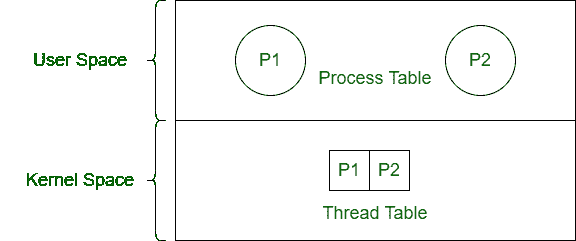

# 进程和内核线程的区别

> 原文：[https://www.geeksforgeeks.org/difference-between-process-and-kernel-thread/](https://www.geeksforgeeks.org/difference-between-process-and-kernel-thread/)

## 1. 进程
进程是执行程序的活动。进程有两种类型——用户进程和系统进程。`进程控制块`控制进程的操作。

## 2. 内核线程
内核线程是一种在内核级管理进程线程的线程类型。内核线程由操作系统调度（内核模式）。

## 进程与内核线程的区别

| 进程 | 内核线程 |
| --- | --- |
| 进程是正在执行的程序。 | 内核线程是在内核级管理的线程。 |
| 开销很大。 | 开销中等。 |
| 进程之间没有共享。 | 内核线程共享地址空间。 |
| 操作系统使用`进程表`调度进程。 | 内核线程由操作系统使用`线程表`来调度。 |
| 它是重重量活动。 | 与进程相比，它重量轻。 |
| 可以暂停。 | 不能暂停。 |
| 暂停一个进程不会影响其他进程。 | 内核线程的挂起导致所有线程停止运行。 |
| 其类型有——用户进程和系统进程。 | 它的类型有——内核级单线程和内核级多线程。 |