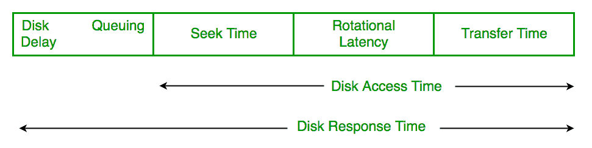
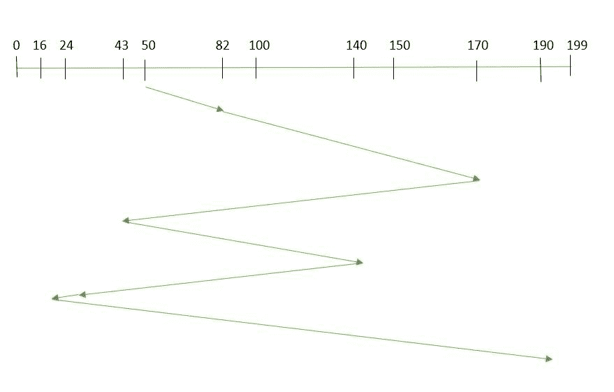
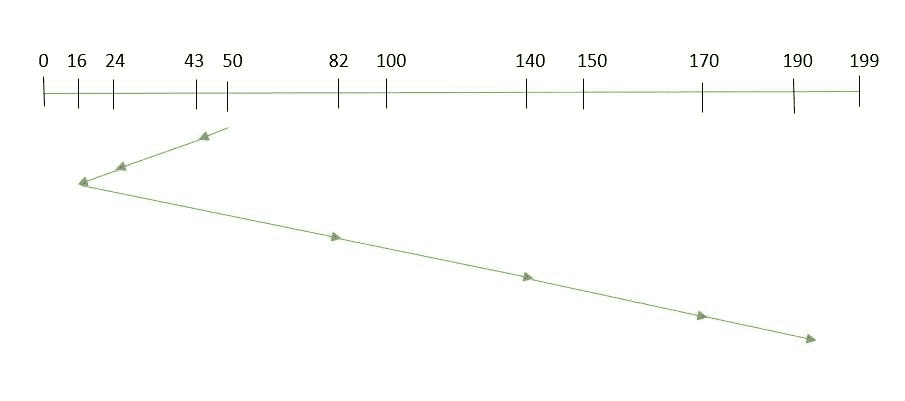
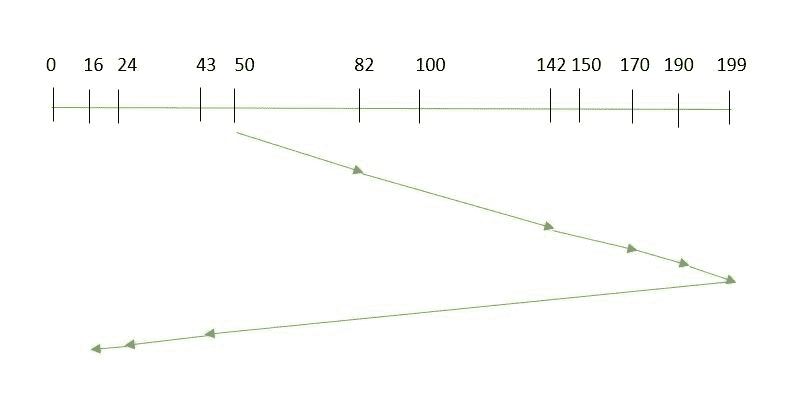
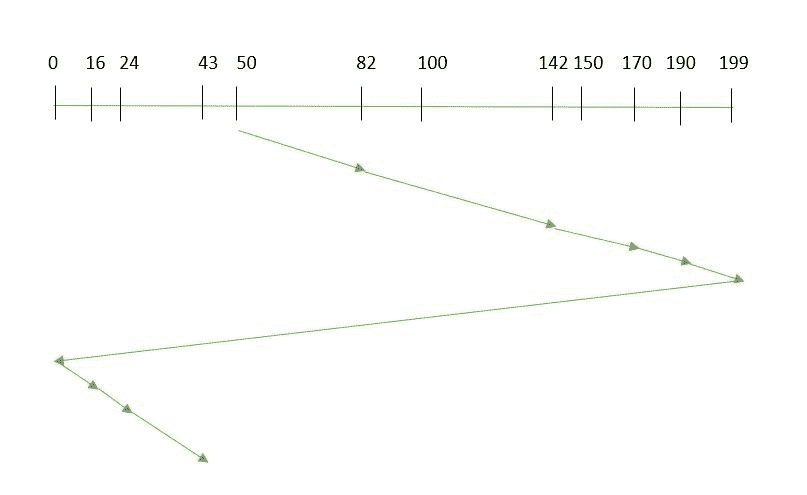
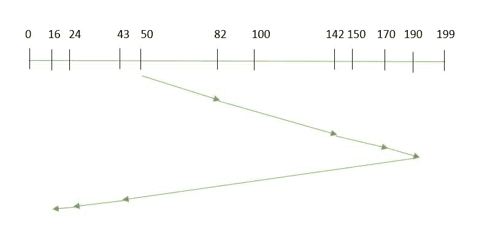
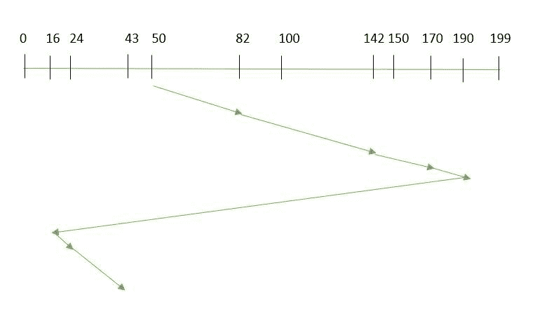
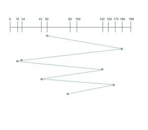

# 磁盘调度算法

> 原文: [https://www.geeksforgeeks.org/disk-scheduling-algorithms/](https://www.geeksforgeeks.org/disk-scheduling-algorithms/)

**磁盘调度**由操作系统来调度到达磁盘的 I/O 请求。磁盘调度也称为输入/输出调度。

磁盘调度很重要，因为:

*   多个输入/输出请求可能通过不同的进程到达，并且磁盘控制器一次只能处理一个输入/输出请求。因此，其他输入/输出请求需要在等待队列中等待，并需要进行调度。
*   两个或多个请求可能相距较远，因此可能会导致磁盘臂移动更大。
*   硬盘是计算机系统中最慢的部分之一，因此需要以高效的方式进行访问。

有许多磁盘调度算法，但在讨论它们之前，让我们先快速了解一些重要术语:

*   **寻道时间**: 寻道时间是将磁盘臂定位到要读取或写入数据的指定磁道所花费的时间。所以给出最小平均寻道时间的磁盘调度算法更好。
*   **旋转延迟:** 旋转延迟是指磁盘的所需扇区旋转到某个位置以访问读/写磁头所需的时间。所以给出最小旋转延迟的磁盘调度算法更好。
*   **传输时间:** 传输时间是传输数据的时间。这取决于磁盘的转速和要传输的字节数。
*   **磁盘访问时间:** 磁盘访问时间为:

```
Disk Access Time = Seek Time + 
                         Rotational Latency + 
                         Transfer Time
```

[](https://media.geeksforgeeks.org/wp-content/uploads/disc-scheduling-algorithms.png)

*   **磁盘响应时间:** 响应时间是请求等待执行其 I/O 操作所花费的平均时间。*平均响应时间*是所有请求的响应时间。*差异响应时间*是相对于平均响应时间来衡量如何服务单个请求。所以给出最小方差响应时间的磁盘调度算法更好。

## 磁盘调度算法

### 1. FCFS

`FCFS` 是所有磁盘调度算法中最简单的。在 `FCFS` 中，请求按照它们到达磁盘队列的顺序进行处理。让我们通过一个例子来理解这一点。

#### 例:

假设请求的顺序为- (`82`，`170`，`43`，`140`，`24`，`16`，`190`)
并且读/写磁头的当前位置为: `50`

那么，总寻道时间:
`= (82-50) + (170-82) + (170-43) + (140-43) + (140-24) + (24-16) + (190-16)`

优点:

*   每个请求都有公平的机会
*   没有无限期推迟

缺点:

*   不尝试优化寻道时间
*   可能无法提供最好的服务

### 2. SSTF

在 `SSTF` (最短寻道时间优先)中，具有最短寻道时间的请求首先执行。因此，队列中每个请求的寻道时间都会预先计算，然后根据计算出的寻道时间进行调度。结果，靠近磁盘臂的请求将首先执行。`SSTF` 肯定是对 `FCFS` 的改进，因为它降低了平均响应时间并增加了系统的吞吐量。让我们通过一个例子来理解这一点。

#### 例:

假设请求顺序为- (`82`，`170`，`43`，`140`，`24`，`16`，`190`)
，读写头当前位置为: `50`


总寻道时间:
`= (50-43) + (43-24) + (24-16) + (82-16) + (140-82) + (170-40) + (190-170)`
`= 208`

优点:

*   平均响应时间缩短
*   吞吐量增加

缺点:

*   提前计算寻道时间的开销
*   如果请求的寻道时间比传入请求的寻道时间长，可能会导致请求饥饿
*   响应时间差异大，因为 `SSTF` 只支持某些请求

### 3. SCAN

在 `SCAN` 算法中，磁盘臂向一个特定方向移动，并服务沿途到达的请求，到达磁盘末端后，它会反转方向，并再次服务沿途到达的请求。因此，该算法的工作原理类似于电梯，因此也被称为 **电梯算法**。结果，中间范围的请求得到更多服务，而到达磁盘臂后面的请求将不得不等待。

#### 例:

假设要处理的请求是- `82`，`170`，`43`，`140`，`24`，`16`，`190`。而读/写臂在 `50`，也给出了盘臂应该向**“更大值”移动。**


因此，寻道时间计算如下:
`= (199-50) + (199-16)`
`= 332`

优点:

*   高流通量
*   响应时间的低方差
*   平均响应时间

缺点:

*   磁盘臂刚刚访问的位置的请求等待时间很长

### 4. CSCAN

在 `SCAN` 算法中，盘臂在反转方向后，再次扫描已扫描的路径。因此，可能有太多的请求在另一端等待，或者可能有零个或很少的请求在扫描区域等待。

在 `CSCAN` 算法中避免了这些情况，在该算法中，磁盘臂不是反转方向，而是到达磁盘的另一端，并从那里开始服务请求。因此，磁盘臂以圆形方式移动，该算法也类似于扫描算法，因此被称为 `C-SCAN`(圆形扫描)。

#### 例:

假设要处理的请求是- `82`，`170`，`43`，`140`，`24`，`16`，`190`。而读/写臂在 `50`，也给出了盘臂应该向**“更大值”移动。**


寻道时间计算如下:
`= (199-50) + (199-0) + (43-0)`
`= 391`

优点:

*   与扫描相比，提供更均匀的等待时间

### 5. LOOK

它与 `SCAN` 磁盘调度算法类似，不同之处在于磁盘臂不是移动到磁盘的末端，而是只移动到磁头前方要服务的最后一个请求，然后从那里反转方向。因此，它防止了由于不必要地遍历到磁盘末端而产生的额外延迟。

#### 例:

假设要处理的请求是- `82`，`170`，`43`，`140`，`24`，`16`，`190`。而读/写臂在 `50`，也给出了盘臂应该向**“更大值”移动。**


因此，寻道时间计算如下:
`= (190-50) + (190-16)`
`= 314`

### 6. CLOOK

正如 `LOOK` 类似于 `SCAN` 算法，类似地，`CLOOK` 类似于 `CSCAN` 磁盘调度算法。在 `CLOOK` 中，磁盘臂不是移动到末端，而是只移动到磁头前方要服务的最后一个请求，然后从那里移动到另一端的最后一个请求。因此，它也防止了由于不必要地遍历到磁盘末端而产生的额外延迟。

#### 例:

假设要处理的请求是- `82`，`170`，`43`，`140`，`24`，`16`，`190`。而读/写臂在 `50`，也给出了磁盘臂应该向更大的值移动。


因此，寻道时间计算如下:
`= (190-50) + (190-16) + (43-16)`
`= 341`

### 7. RSS

`RSS`–代表随机调度，就像它的名字一样，它就是自然。它用于调度涉及随机属性的情况，如随机处理时间、随机到期日、随机权重和随机机器故障，这种算法是完美的。这就是为什么它通常用于分析和模拟。

### 8. LIFO

在 `LIFO` (后进先出)算法中，最新的作业在现有作业之前得到服务，即按照请求得到服务的顺序，最新或最后进入的作业首先得到服务，然后其余的按相同顺序服务。

优势

*   最大限度地提高位置和资源利用率

**缺点**

*   似乎对其他请求有点不公平，如果新的请求不断出现，就会导致旧的和现有的请求饥饿。

#### 例
假设请求顺序为- (`82`，`170`，`43`，`142`，`24`，`16`，`190`)
读写头当前位置为: `50`


### 9. N-STEP SCAN

它也被称为 `N-STEP LOOK` 算法。在此算法中，为 `N` 个请求创建一个缓冲区。属于一个缓冲区的所有请求将一次性得到服务。此外，一旦缓冲区已满，就不会有新请求保存在此缓冲区中，而是被发送到另一个缓冲区。现在，当这 `N` 个请求得到服务后，就轮到接下来的 `N` 个请求了，这样所有请求都能得到有保证的服务。

优势

*   它完全消除了请求的匮乏

### 10. FSCAN

该算法使用两个子队列。在扫描过程中，第一个队列中的所有请求都将得到服务，新的传入请求将被添加到第二个队列中。所有新请求都将暂停，直到第一个队列中的现有请求得到服务。

优势

*   `FSCAN` 和 `N-Step-SCAN` 一起防止了“臂粘性”(I/O 调度中的现象，其中调度算法继续服务当前扇区或其附近的请求，从而防止任何寻找)

**每种算法都有其独特之处。整体性能取决于请求的数量和类型。**
**注:** 平均旋转潜伏期一般取 `1/2` (旋转潜伏期)。

## 练习

**1)** 假设一个磁盘有 `201` 个柱面，编号从 `0` 到 `200`。在某个时间，磁盘臂处于柱面 `100`，并且存在针对柱面 `30`、`85`、`90`、`100`、`105`、`110`、`135` 和 `145` 的磁盘访问请求队列。如果最短寻道时间优先(`SSTF`)用于调度磁盘访问，则在处理了 ___________ 个请求后，将处理柱面 `90` 的请求。(GATE CS 2014)
(A) `1`
(B) `2`
(C) `3`
(D) `4`
解决方法见[本](https://www.geeksforgeeks.org/gate-gate-cs-2014-set-1-question-29/)。

**2)** 考虑能够一次加载并执行单个顺序用户进程的操作系统。使用的磁盘头调度算法是先到先得(`FCFS`)。如果 `FCFS` 被供应商声称的最短寻道时间优先(`SSTF`)所取代，以给出 `50%` 的更好基准测试结果，那么用户程序的 I/O 性能会有什么样的预期改进？(GATE CS 2004)
(A) `50%`
(B) `40%`
(C) `25%`
(D) `0%`
解决方案见[本](https://www.geeksforgeeks.org/gate-gate-cs-2004-question-12/)。

**3)** 假设给定了具有 `100` 个磁道的磁盘的以下磁盘请求序列(磁道号): `45`、`20`、`90`、`10`、`50`、`60`、`80`、`25`、`70`。假设读写头的初始位置在轨道 `50` 上。当使用最短寻道时间优先(`SSTF`)算法时，与 `SCAN`(电梯)算法(假设 `SCAN` 算法开始执行时向 `100` 移动)相比，读/写磁头将穿越的额外距离是 __________ 个磁道
(A) `8`
(B) `9`
(C) `10`
(D) `11`
有关解决方案，请参见本。

**4)** 考虑一个典型的磁盘，它以每分钟 `15000` 转(`RPM`)的速度旋转，传输速率为 `50 × 10^6` 字节/秒。如果磁盘的平均寻道时间是平均旋转延迟的两倍，并且控制器的传输时间是磁盘传输时间的 `10` 倍，则读取或写入磁盘的 `512` 字节扇区的平均时间(以毫秒为单位)是 _______
参见[本](https://www.geeksforgeeks.org/gate-gate-cs-2015-set-2-question-59/)了解解决方案。

**本文由**安基特·米塔尔**供稿。如果你发现任何不正确的地方，或者你想分享更多关于上面讨论的话题的信息，请写评论。**