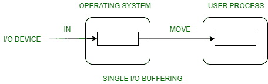
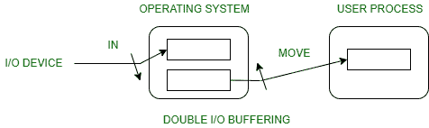
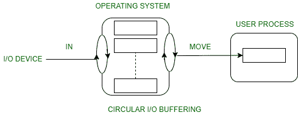

# 输入输出缓冲及其各种技术

> 原文:[https://www . geeksforgeeks . org/I-o-缓冲及其各种技术/](https://www.geeksforgeeks.org/i-o-buffering-and-its-various-techniques/)

`缓冲区`是存储在两个设备之间或设备与应用程序之间传输的数据的内存区域。

## 输入/输出缓冲的使用:

*   缓冲是为了有效地处理数据流的生产者和消费者之间的速度不匹配。
*   主内存中产生一个`缓冲区`，用于堆积从调制解调器接收的字节。
*   在接收到`缓冲区`中的数据后，数据在一次操作中从`缓冲区`传输到磁盘。
*   这个数据传输过程不是瞬时的，因此调制解调器需要另一个`缓冲器`来存储额外的输入数据。
*   当第一个`缓冲区`被填满时，就会请求将数据传输到磁盘。
*   然后，当第一个`缓冲区`中的数据传输到磁盘时，调制解调器开始填充第二个`缓冲区`中的附加输入数据。
*   当两个`缓冲区`都完成任务时，调制解调器切换回第一个`缓冲区`，同时第二个`缓冲区`的数据传输到磁盘。
*   两个`缓冲区`的使用分解了数据的生产者和消费者，因此最大限度地减少了他们之间的时间要求。
*   缓冲还为具有不同数据传输大小的设备提供了变化。

## 各种输入输出缓冲技术的类型:

### 1。单一缓冲区:
操作系统向主内存的系统部分提供`缓冲区`。

**面向块的设备–**

*   `系统缓冲区`接受输入。
*   接受输入后，该块被进程转移到`用户空间`，然后进程请求另一个块。
*   两个数据块同时工作，当一个数据块被用户进程处理时，下一个数据块被读入。
*   操作系统可以交换进程。
*   操作系统可以将`系统缓冲区`的数据记录到用户进程中。

**面向流的设备–**

*   一次一行操作用于滚动终端。用户一次输入一行，在一行的末尾有一个回车信号。
*   当每次击键都很重要时，在窗体模式和终端上使用字节一次操作。

### 2。双缓冲:

**面向区块–**

*   系统中有两个`缓冲区`。
*   `驱动程序`或`控制器`使用一个`缓冲区`来存储数据，同时等待它被更高级别的层次结构获取。
*   其他`缓冲区`用于存储来自低级模块的数据。
*   `双缓冲`也称为缓冲交换。
*   `双缓冲`的一个主要缺点是过程的复杂性增加。
*   如果进程执行输入/输出的快速突发，那么使用`双缓冲`可能会有缺陷。

**流向–**

*   行-在一次输入/输出中，用户进程不需要暂停输入或输出，除非进程在`双缓冲区`之前运行。
*   一次一个字节的操作，`双缓冲区`比两倍长度的单`缓冲区`没有优势。

### 3。循环缓冲区:

*   当使用两个以上的`缓冲区`时，`缓冲区`的集合本身称为`循环缓冲区`。
*   在这种情况下，数据不会直接从生产者传递到消费者，因为数据会因`缓冲区`在被消费之前被覆盖而改变。
*   当`缓冲区` I 中的数据等待被使用时，生产者只能填满`缓冲区` i-1。

