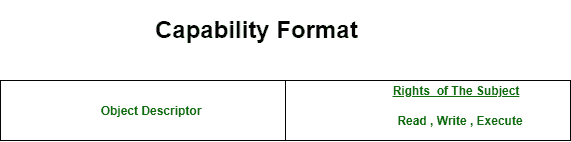

# 分布式操作系统中访问矩阵的实现

> 原文：[https://www.geeksforgeeks.org/implementation-of-access-matrix-in-distributed-os/](https://www.geeksforgeeks.org/implementation-of-access-matrix-in-distributed-os/)

如前所述，[访问矩阵](https://www.geeksforgeeks.org/access-matrix-in-operating-system/)可能非常稀疏，并占用大量内存。因此，直接实现用于访问控制的访问矩阵是存储低效的。

低效率可以通过将访问矩阵分解为行或列来消除。可以通过删除空值来折叠行，这样可以提高列的效率。从这些分解方法中，可以形成广泛使用的访问矩阵的三种实现。它们如下：

1.  Capabilities
2.  Access Control List
3.  Lock and Key Method

因此，我们将简要讨论上述实现。
值得记住的是，我们是用`s`来表示主语，用`O`来表示宾语，并把它们分别放在列和行上。

## 1. 能力 (Capabilities)

这个方法指的是访问矩阵的逐行分解。每个主体都被分配了一个元组列表`*(o, M[s, o])*`，用于它被允许访问的所有对象。这种元组称为能力。如果一个主体拥有一种能力`(o, M[s, o])`，那么它被允许以`M[s, o]`中描述的方式访问对象`o`。主体被允许访问其拥有能力的任何对象。能力不是伪造的。

能力包含两个字段：

```
(i) Object Descriptor,
(ii) Access Rights
```

对象描述符可以包含对象的地址，访问权限可以包含主体对对象的权限，主要是读、写、执行。由于对象描述符包含地址，它也可以用作寻址机制。

下面是能力的格式。



## 2. 访问控制列表 (Access Control List)

这个方法指的是访问矩阵的列向分解。每个对象`o`都有一个列表，其中包含形式为`*(s, M[s, o])*`的元组，对应所有可以访问该对象的主体`s`。`P[s, o]`表示主体`s`在对象`o`上的权限。

当主体请求访问对象时，以下列方式执行：

*   系统搜索`o`的访问控制列表，以找出是否存在针对主体`s`的条目`(s, φ)`。
*   如果主体`s`的条目`φ`存在，则系统检查所请求的访问是否被允许（即`α ∈ φ`）。
*   如果请求的访问被允许，则执行该请求，否则会引发适当的异常。

下面是一个对象的访问控制列表的示例实现：

| 主体 | 访问权限 |
| :--- | :--- |
| Ravi | 读、写、执行 |
| Chinafrog | 读 |
| Jeff | 写 |
| Alice | 执行 |

**轻松撤销**和**轻松审查访问**是访问控制列表的主要功能。

## 3. 锁与钥匙方法 (Lock and Key Method)

锁与钥匙方法是访问控制列表和能力方法的混合体。

在锁和钥匙方法中，每个主体都有一个能力列表，其中包含形式为`(o, key)`的元组，表示主体可以使用钥匙`key`访问对象`o`。对象有一个访问控制列表，其中包含形式为`(lock, φ)`的元组，称为锁条目，表示锁`lock`可以通过设置`φ`中的模式访问。

当主体在模式`α`下请求访问对象`o`时，系统按以下方式执行：

*   系统在主体的能力列表中定位元组`(o, key)`。如果没有找到这样的元组，则不允许访问。
*   否则，只有在对象`o`的访问控制列表中存在锁条目`(lock, φ)`时才允许访问，以便`key = lock`且`α ∈ φ`。

这就是最常用的访问矩阵的实现。我们已经以简短紧凑的方式讨论了流程。用法和优缺点可以在后面的帖子中介绍。