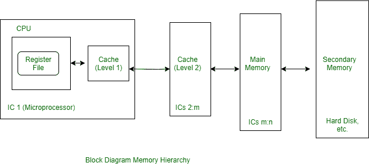

# 操作系统中的内存级别

> 原文：[https://www.geeksforgeeks.org/levels-of-memory-in-operating-system/](https://www.geeksforgeeks.org/levels-of-memory-in-operating-system/)

[计算机系统的内存层次](https://www.geeksforgeeks.org/memory-hierarchy-design-and-its-characteristics/)它处理速度上的差异。“层次”是一个很好的方式来表达“思考的顺序”，比如从上到下，从快到慢，从最重要到最不重要。

如果你看看计算机内部的内存层次结构，按照最快到最慢：

```
1. CPU Registers
2. Caches memory
3. Main or Primary Memory
4. Secondary Memory 
```



这些解释如下。

## CPU Register
[CPU Register](https://www.geeksforgeeks.org/different-classes-of-cpu-registers/)：这些`CPU`中的高速寄存器用作指令的工作内存和数据的临时存储。通常，它们创建一个通用寄存器文件来存储正在处理的数据。寄存器文件的典型容量是32个数据字，并且每个寄存器可以在单个时钟周期内被读取或写入。

## Caches Memory
[Caches Memory](https://www.geeksforgeeks.org/cache-memory-in-computer-organization/)：如今，大多数计算机包含另一级`IC`内存——有时是多个这样的级别——称为高速缓存存储器，它在逻辑上位于`CPU`寄存器和主存之间。高速缓存的存储容量小于主存，但访问时间为一到三个周期，高速缓存比主存快得多，因为它的部分或全部可以与`CPU`位于同一块`IC`上。

对于高性能计算机，高速缓存是必不可少的组件。与其他三种类型的存储器不同，高速缓存通常对程序员是透明的。同时，计算机的高速缓存和主存通过`CPU`的指令直接映射外部内存。

## Main or Primary Memory
[Main or Primary Memory](https://practice.geeksforgeeks.org/problems/explain-primary-memory-secondary-memory-virtual-memory)：它是相当大的、速度较快的外部存储器，存储正在使用的程序和数据。在主存中，存储位置由`CPU`的加载和存储指令直接寻址。虽然使用了与`CPU`寄存器文件类似的`IC`技术，但由于主存容量大且物理上与`CPU`分离，访问速度较慢。通常访问时间是五个或更多的时钟周期。

## 二级内存
[二级内存](https://www.geeksforgeeks.org/introduction-of-secondary-memory/)：二级内存容量很大，但是比内存慢很多。辅助存储器存储系统程序、大数据文件等，这些不是中央处理器一贯需要的。当主存储器的容量不足时，信息会被转移到二级存储器。在二级存储器中，信息被认为是在线的，但通过在主存储器和二级存储器之间传输信息的`I/O`程序间接访问。

二级存储器最常见的例子是磁性硬盘和`CD-ROM`（光盘只读存储器），两者都有相对较慢的电存取机制。典型的存储容量为几千兆字节，而访问时间以毫秒为单位。