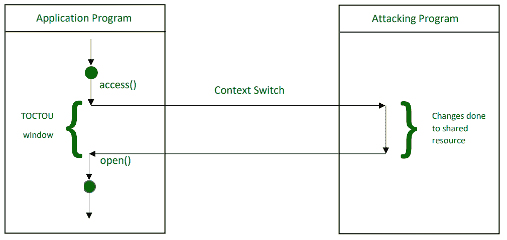

# 竞争条件漏洞

> 原文: [https://www.geeksforgeeks.org/race-condition-vulnerability/](https://www.geeksforgeeks.org/race-condition-vulnerability/)

## 什么是竞争条件漏洞

**竞争条件**发生在多个线程读写同一个变量的时候，也就是说，它们可以访问一些共享数据，并且它们试图同时改变它。在这种情况下，线程相互“竞争”以访问/更改数据。

这是一个主要的安全漏洞（[CWE-362](https://cwe.mitre.org/data/definitions/362.html)），通过操纵动作的时间，可能会出现异常结果。此漏洞出现在检查时间和使用时间窗口期间。

文件在其存储窗口期间的访问流程

那么，如果我们在这个 TOCTOU 窗口本身锁定文件呢！

## 为什么简单的文件锁定无效

1.  **普遍误解 –**
    一个看似简单的解决方法是在这个检查-使用窗口期间锁定文件本身，因为这样其他进程在该时间窗口内就无法使用文件。

    看似简单，那为什么不实用呢？为什么我们不能用这种方法来解决竞争条件问题？
    答案很简单，仅仅锁定文件实际上无法防止这样的漏洞。

2.  **锁定文件时的问题 –**
    只有当文件已经处于打开状态时，它才会被其他进程锁定。这个过程被称为检查-打开过程，在此期间不可能锁定文件。任何创建的锁都可能被攻击或恶意进程忽略。

    实际发生的情况是，对 `Open()` 的调用不会阻止对锁定文件的攻击。当文件可用于检查和打开过程时，该文件实际上是开放的，可以进行任何访问/更改。所以现在不可能锁定文件。这使得恶意进程几乎可以忽略任何类型的锁。

    在内部，它使用的睡眠时间是每次尝试的两倍。更常见的是，这被称为自旋锁或繁忙等待。此外，文件总是有可能被无限期锁定，即陷入死锁的危险。

## 即使我们能够锁定文件会怎样？

让我们尝试锁定文件，看看可能有什么缺点。最常见的可用锁定机制是原子文件锁定。它是使用锁文件在同一个文件系统上创建一个唯一文件来完成的。我们利用 `link()` 来创建指向锁文件的链接，以进行对文件的任何访问。

*   如果 `link()` 返回 0，则锁定成功。

可用的最常见的修复方法是将应用程序的 PID 存储在锁文件中，这是根据当时的活动 PID 进行检查的。此修补程序的另一个缺陷是，PID 可能已被重用。

## 实际解决方案

一个更好的解决方案是，与其对整个文件创建锁，不如将文件的不同部分锁定给不同的进程。

**示例 –**
当一个进程想要写入一个文件时，它首先要求内核锁定该文件或其一部分。只要进程保持锁定，其他任何进程都不能请求锁定文件的相同部分。因此，您可以看到并发性问题是这样解决的。

同样，在读取文件内容之前，进程会请求锁定，这可以确保只要锁定保持不变，就不会进行任何更改。

区分这些不同种类的锁是由系统本身完成的。系统能够区分文件读取所需的锁和文件写入所需的锁。这种锁定系统是通过 `flock()` 系统调用实现的。`flock()` 调用可以有不同的值:

*   `LOCK_SH` (用于读取锁定)
*   `LOCK_EX` (用于写入锁定)
*   `LOCK_UN` (解锁)

使用这些单独的调用，我们可以知道需要什么样的锁。

这里需要注意的一点是，许多进程可以同时受益于读锁，因为没有人会试图改变文件内容。然而，在给定时间，只有一个进程可以受益于当前正在使用它的写锁。因此，不能同时允许使用其他锁，即使是读取锁。

这种精心制作的系统可以很好地与应用程序一起工作，这些应用程序可以要求内核在读取或写入重要的系统文件之前保留它们的访问权限（它们的锁）。因此，这种选择性锁定文件的方法比我们最初的方法实用得多。因此，当您试图为目录实现自己的文件系统时，您可以利用这种安全的编码技术来防止潜在的 `CWE-362`（竞争条件漏洞）。