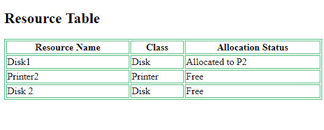

# 流程的资源分配技术

> 原文：[`https://www.geeksforgeeks.org/resource-allocation-techniques-for-processes/`](https://www.geeksforgeeks.org/resource-allocation-techniques-for-processes/)

当程序需要资源时，操作系统分配资源。当程序终止时，资源被取消分配，并分配给其他需要它们的程序。现在的问题是，操作系统使用什么策略将这些资源分配给用户程序？

有两种资源分配技术：

## 1. `Resource partitioning approach`

在这种方法中，操作系统预先决定哪些资源应该分配给哪个用户程序。它将系统中的资源划分为许多`resource partitions`，每个分区可能包含各种资源——例如，1 MB内存、磁盘块和一台打印机。

然后，它在程序启动前为每个用户程序分配一个资源分区。资源表记录资源分区及其当前分配状态（已分配或空闲）。

**优势：**

*   易于实施
*   减少开销

**缺点：**

*   **缺乏灵活性**——如果一个资源分区包含的资源多于特定进程所需的资源，那么额外的资源就会被浪费。
*   如果一个程序需要比单个资源分区更多的资源，它就不能执行（尽管其他分区中有空闲资源）。

示例资源表可能如下所示：

## 2. `Pool based approach`

在这种方法中，存在一个`common pool of resources`。每当程序请求资源时，操作系统都会检查资源表中的分配状态。如果资源空闲，它就将资源分配给该程序。

**优势：**

*   分配的资源没有浪费。
*   如果资源是空闲的，任何资源需求都可以满足（不像分区方法）。

**缺点：**

*   每次请求和释放时分配和取消分配资源的开销。