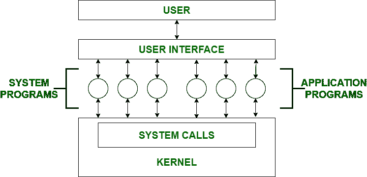

# 操作系统中的系统程序

> 原文：[https://www.geeksforgeeks.org/system-programs-in-operating-system/](https://www.geeksforgeeks.org/system-programs-in-operating-system/)

**系统编程**可以定义为使用系统编程语言构建系统软件的行为。根据计算机体系结构，最后一个是硬件。然后是操作系统、系统程序，最后是应用程序。程序开发和执行可以在系统程序中方便地完成。有些系统程序只是简单的用户界面，有些则很复杂。传统上，它位于用户界面和系统调用之间。

因此，在这里，用户只能查看他看不到的最新系统程序系统调用。

## 系统程序可分为以下几类

### 1. 文件管理
文件是存储在计算机系统内存中的特定信息的集合。文件管理被定义为在计算机系统中操作文件的过程，其管理包括创建、修改和删除文件的过程。
*   它有助于在计算机系统中创建新文件，并将其放置在特定位置。
*   它有助于在计算机系统中轻松快速地定位这些文件。
*   它使不同用户之间共享文件的过程变得非常容易和用户友好。
*   它有助于将文件存储在称为目录的单独文件夹中。
*   这些目录帮助用户快速搜索文件或根据文件的使用类型管理文件。
*   它帮助用户修改文件的数据或修改目录中的文件名。

### 2. 状态信息
有些用户会询问日期、时间、可用内存量或磁盘空间等信息。其他更复杂的信息，如详细的性能、日志和调试信息也会被提供。所有这些信息都会被格式化并显示在输出设备上或打印出来。程序的输出通过终端、其他输出设备、文件或图形用户界面的窗口来显示。

### 3. 文件修改
我们使用这类程序来修改文件的内容。对于存储在磁盘或其他存储设备上的文件，我们使用不同类型的编辑器。为了搜索文件内容或执行文件转换，我们使用特殊命令。

### 4. 编程语言支持
系统为用户提供了常见的编程语言支持，包括编译器、汇编器、调试器和解释器。它为用户提供了全方位的支持。我们可以运行任何编程语言。所有重要的语言都已提供。

### 5. 程序加载与执行
当程序经过汇编和编译准备好后，必须被加载到内存中才能执行。加载器是操作系统的一部分，负责加载程序和库。这是启动程序必不可少的阶段之一。系统提供了加载器、可重定位加载器、链接编辑器和覆盖加载器。

### 6. 通信
程序提供了进程、用户和计算机系统之间的虚拟连接。用户可以在屏幕上向另一个用户发送消息，可以发送电子邮件、浏览网页、远程登录、将文件从一个用户传输到另一个用户。

操作系统中系统程序的一些例子有：
*   Windows 10
*   Mac OS X
*   人的本质
*   Linux 操作系统
*   Unix 操作系统
*   机器人
*   反病毒
*   磁盘格式化
*   计算机语言翻译