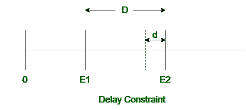
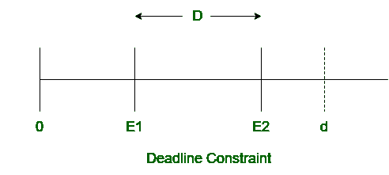

# 实时系统中的时序约束

> 原文：[https://www.geeksforgeeks.org/timing-constraints-in-real-time-system/](https://www.geeksforgeeks.org/timing-constraints-in-real-time-system/)

**时间限制**是[实时系统](https://www.geeksforgeeks.org/real-time-systems/)的一个重要属性。时间约束决定了实时系统中结果的完全正确性。实时系统中结果的正确性不仅取决于逻辑正确性，而且结果应该在时间约束内获得。实时系统中可能会发生几个事件，这些事件由调度程序使用时间约束进行调度。

## 定时约束的分类

对与实时系统相关联的定时约束进行分类，以识别实时系统中不同类型的定时约束。时间限制大致分为两类：

### 1. 性能约束

对系统响应施加的约束称为性能约束。这基本上描述了系统的整体性能。这显示了系统响应的速度和准确性。它确保实时系统的性能令人满意。

### 2. 行为约束

对环境产生的刺激施加的约束被称为行为约束。这基本上描述了环境的行为。它确保系统的环境表现良好。

此外，性能和行为约束分为三类：延迟约束、截止时间约束和持续时间约束。这些解释如下。

#### 1. 延迟约束

延迟约束描述了实时系统中两个连续事件发生之间的最小时间间隔。如果一个事件发生在延迟约束之前，则称为延迟违规。两个事件发生之间的时间间隔应大于或等于延迟约束。

如果 `D` 是两个事件发生之间的实际时间间隔，`d` 是延迟约束，那么

```
D >= d
```



#### 2. 截止时间约束

截止时间约束描述了实时系统中两个连续事件发生之间的最大时间间隔。如果一个事件发生在截止时间约束之后，则该事件的结果被视为不正确。两个事件发生之间的时间间隔应小于或等于截止时间约束。

如果 `D` 是两个事件发生之间的实际时间间隔，`d` 是截止日期约束，那么

```
D <= d
```



#### 3. 持续时间约束

持续时间约束描述实时系统中事件的持续时间。它描述了事件的最小和最大时间段。在此基础上，它进一步分为两种类型：

- **最小持续时间约束**：描述事件发起后，在一定时间前不能停止。
- **最大持续时间约束**：描述事件开始后，必须在某个时间之前结束。