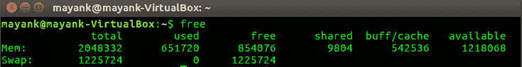
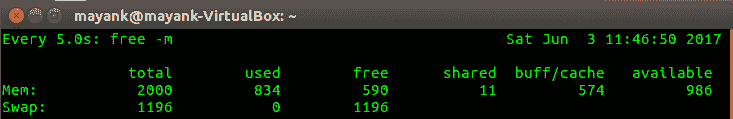
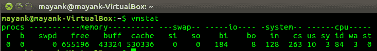
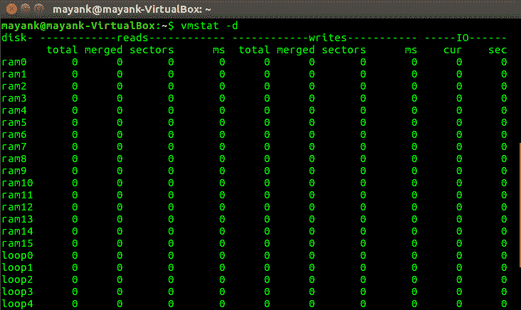
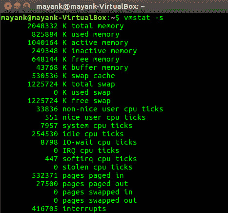
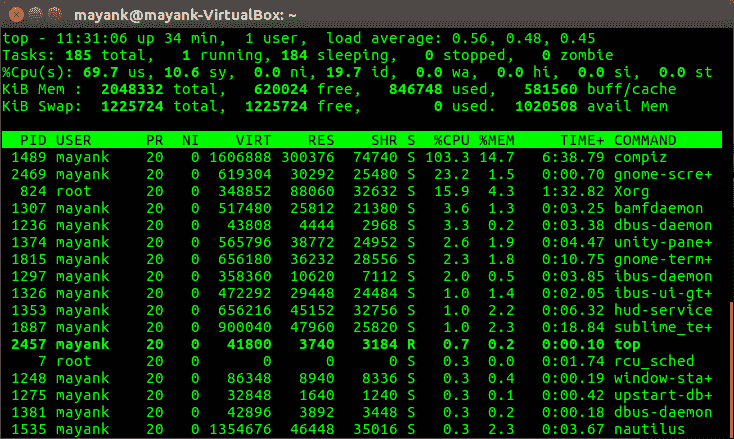
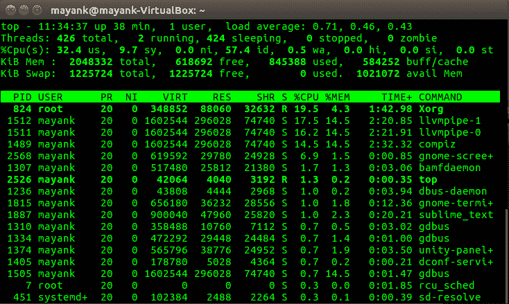
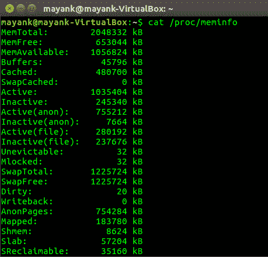
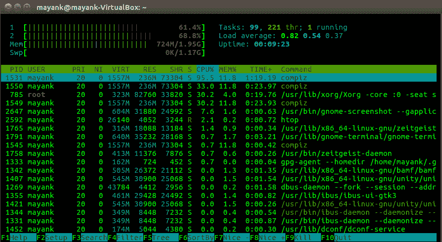

# 跟踪 Linux 中的内存使用情况

> 原文：[https://www.geeksforgeeks.org/tracing-memory-usage-linux/](https://www.geeksforgeeks.org/tracing-memory-usage-linux/)

通常需要跟踪系统的内存使用情况，以确定消耗所有 CPU 资源的程序或导致 CPU 活动变慢的程序。跟踪内存使用情况对于确定服务器上的负载也很有必要。解析使用数据使服务器能够平衡负载并满足用户的请求，而不会降低系统的速度。

## 1. `free`

`free` 命令显示系统当前可用和已使用的内存量（包括物理内存和交换空间）。`free` 命令通过解析 `/proc/meminfo` 来收集此数据。默认情况下，内存量以千字节显示。

**UNIX 中的自由命令**

[](https://media.geeksforgeeks.org/wp-content/uploads/Screenshot-from-2017-06-03-11-16-35-e1496478387353.png)

```
watch -n 5 free -m
```
`watch` 命令用于定期执行程序。

[](https://media.geeksforgeeks.org/wp-content/uploads/Screenshot-from-2017-06-03-11-46-53-e1496478442792.png)

根据上图，总共有 2000 兆内存和 1196 兆交换空间分配给 Linux 系统。在这 2000 兆的内存中，目前有 834 兆用于 590 兆的空闲空间。同样，对于交换空间，在 1196 兆字节中，0 兆字节正在使用，1196 兆字节当前在系统中可用。

## 2. `vmstat`

`vmstat` 命令用于显示系统的虚拟内存统计信息。该命令报告有关内存、页面调度、磁盘和 CPU 活动等数据。首次使用此命令将返回自上次重启以来的数据平均值。后续使用将返回基于长度延迟的采样周期的数据。

[](https://media.geeksforgeeks.org/wp-content/uploads/Screenshot-from-2017-06-03-11-21-16-e1496478359885.png)

```
vmstat -d
```
报告磁盘统计信息。

[](https://media.geeksforgeeks.org/wp-content/uploads/Screenshot-from-2017-06-03-11-21-50.png)

```
vmstat -s
```
显示已使用和可用的内存量。

[](https://media.geeksforgeeks.org/wp-content/uploads/Screenshot-from-2017-06-03-11-22-54-e1496478489876.png)

## 3. `top`

`top` 命令显示系统中所有当前正在运行的进程。此命令显示内核当前正在处理的进程和线程列表。`top` 命令也可用于监视总内存量使用情况。

[](https://media.geeksforgeeks.org/wp-content/uploads/Screenshot-from-2017-06-03-11-31-08.png)

```
top -H
```
线程模式操作。显示系统中当前存在的各个线程。不使用此命令选项时，将显示每个进程中所有线程的总和。

[](https://media.geeksforgeeks.org/wp-content/uploads/Screenshot-from-2017-06-03-11-34-39.png)

## 4. `/proc/meminfo`

此文件包含有关内存使用的所有数据。它提供当前的内存使用详细信息，而不是旧的存储值。

[](https://media.geeksforgeeks.org/wp-content/uploads/Screenshot-from-2017-06-03-11-42-25-e1496478415564.png)

## 5. `htop`

`htop` 是一个交互式进程查看器。此命令类似于 `top` 命令，但它允许垂直和水平滚动，使用户能够查看系统上运行的所有进程及其完整的命令行，以及将它们作为进程树查看、选择多个进程并同时对它们进行操作。

**UNIX 中 htop 命令的工作:**

[](https://media.geeksforgeeks.org/wp-content/uploads/Screenshot-from-2017-06-03-13-48-49.png)

**参考:**

*   [Ubuntu 手册](http://manpages.ubuntu.com/)

本文由 [Mayank Kumar](https://www.linkedin.com/in/mayank-kumar-a9058b137/) 供稿。如果你喜欢 GeeksforGeeks 并想投稿，你也可以使用 [contribute.geeksforgeeks.org](http://contribute.geeksforgeeks.org) 写一篇文章或者把你的文章邮寄到 contribute@geeksforgeeks.org。看到你的文章出现在极客博客主页上，帮助其他极客。

如果你发现任何不正确的地方，或者你想分享更多关于上面讨论的话题的信息，请写评论。