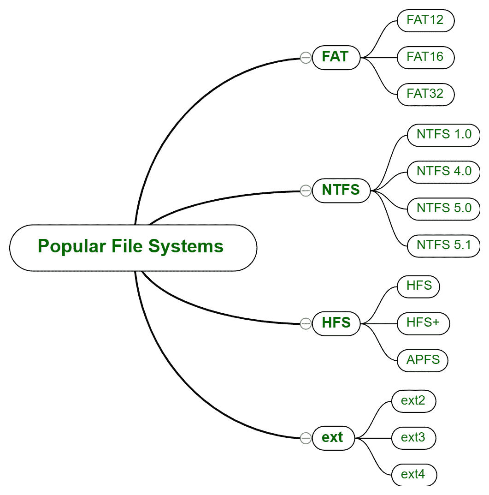
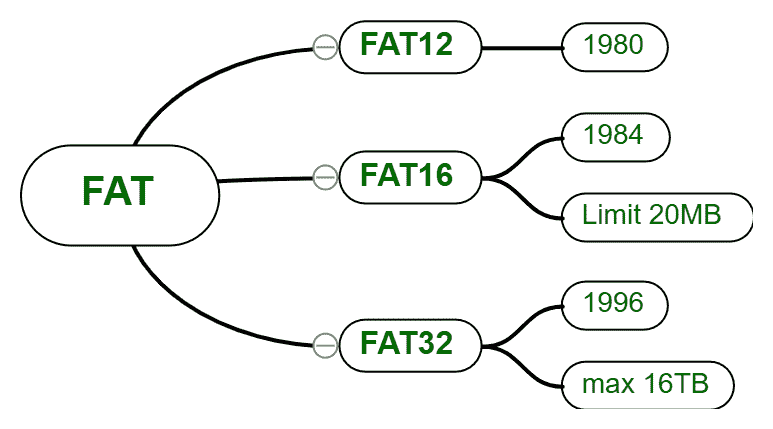
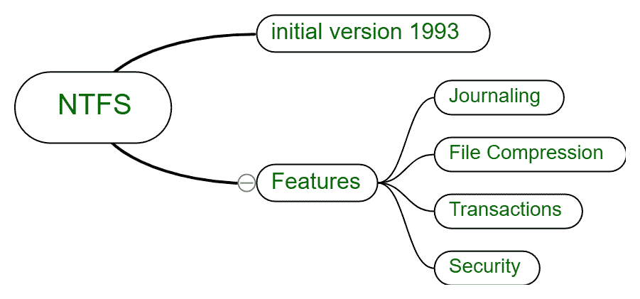
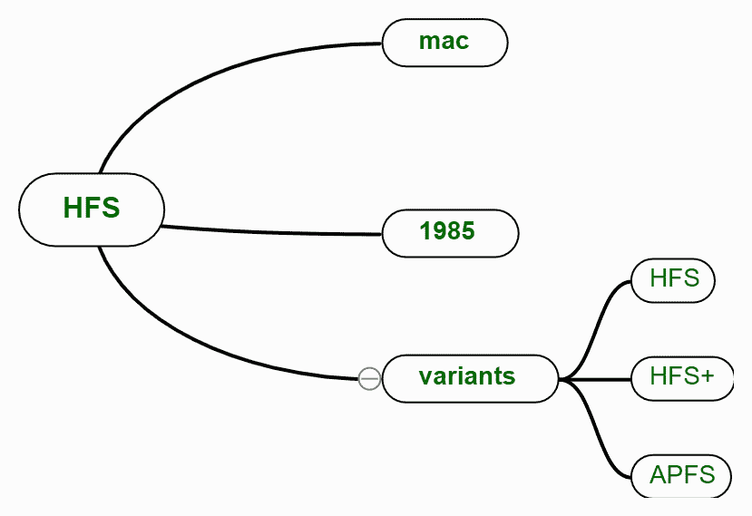
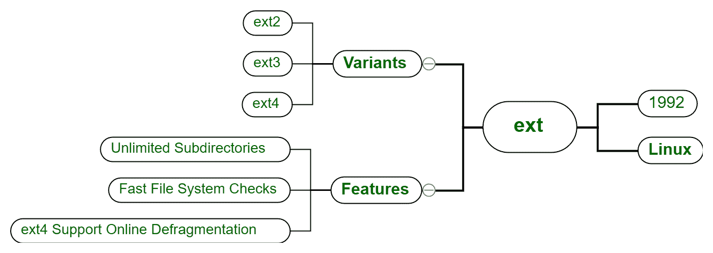

# 了解文件系统

> 原文：[https://www.geeksforgeeks.org/understanding-file-system/](https://www.geeksforgeeks.org/understanding-file-system/)

先决条件 – [操作系统中的文件系统](https://www.geeksforgeeks.org/file-systems-in-operating-system/)

文件和文件夹是人类生活中不可分割的一部分。我们每天都会浏览这两个名字，并在不知不觉中使用它们。这些文件确实有不同的类型，随着用户和开发人员需求的变化而演变。一些科技巨头建立了自己的文件系统来增加他们产品的市场，他们也做了一些改变，增强了在任何类型的存储器上存储文件的技术。

一些最流行的文件存储系统是：

```
(i). FAT
(ii). NTFS
(iii). HFS
(iv). EXT
```

这些解释如下。



<center>**Figure –** Popular File System</center>

## (i). FAT (File Allocation Table)

FAT 代表文件分配表，之所以这样称呼，是因为它使用表来分配不同的文件和文件夹。这最初是为处理小型文件系统和磁盘而设计的。该系统主要有三个变体：`FAT12`、`FAT16` 和 `FAT32`，分别于 1980 年、1984 年和 1996 年推出。

这些变体各有利弊，像 `FAT32`（多用于笔式驱动和 micro SD）。它可以存储或复制最大大小为 4GB 的文件（要存储的单个文件的大小），如果文件大小超过 4GB，它不会在存储介质上复制，但其分区大小高达 8TB（可应用 `FAT` 的分区大小）。



<center>**Figure –** FAT File System</center>

这个文件系统在最初的时候是 Windows 使用的，现在 Windows 已经切换到了 `NTFS`，这也是它自己的一个文件系统，我们来了解一下。

## (ii). NTFS (New Technology File System)

Windows NT 在 1993 年推出了一种新的文件系统，称为 `NTFS`。这代表新技术文件系统。这是 `FAT` 系统的增强和更先进的版本。所有 Windows 安装都在 `NTFS` 上完成，它首先将存储格式化为 `NTFS` 格式，然后在其上安装。`NTFS` 主要用于内部驱动器。

这没有文件大小限制，也没有分区或卷限制。理论上，单个文件的大小可达 16 个 EiB。



<center>**Figure –** NTFS File System</center>

*   **日志记录 –** 这种技术在卷或分区中记录元数据及其变化。
    *   **事务 –** 该功能可以在不影响其他文件和文件夹的情况下，重新创建、重命名、删除文件和文件夹等。

## (iii). HFS (Hierarchical File System)

`HFS` 代表分层文件系统，顾名思义，这是文件和文件夹的层次结构。这是苹果公司专为 macOS 设计的。市场上较高的版本是 `AHFS`（苹果分层文件系统）。这最初是为软盘和 HDD 等介质设计的，在一定程度上也用于 CD-ROM 作为只读介质。



<center>**Figure –** HFS File System</center>

```
Max file size = 2GB
Max volume size = 2TB
```

## (iv). EXT (Extended File System)

最初是为 UNIX 和 LINUX 等操作系统开发的。它的第一个变体于 1992 年进入市场。通过变体的更新，它克服了单个文件大小、卷大小、文件夹或目录中文件数量等限制。我们有许多软件可以帮助在 Windows 操作系统上开发 `ext2` 环境。



<center>**Figure –** ext File System</center>

```
Max file size EXT4 = 16TB
Max volume size EXT4 = 50TB
```

## 哪个是最好的文件系统？

质量取决于它的用例，正如我们所知在计算机科学世界里没有最好的编程语言同样也没有最好的文件系统，但是有不同的实现。Linux 与 `ext` 最兼容，Windows 与 `NTFS` 和 `FAT` 兼容，Mac OS 与 `AHFS`、`HFS` 兼容。

## 如何更改笔电、微标等存储设备的文件系统？

有两种方式：

1.  **格式化驱动器，选择文件系统 –** 您将丢失所有数据。
2.  **使用一些软件 –** 你不会丢失任何数据，但必须安装一些可以付费或免费的软件。