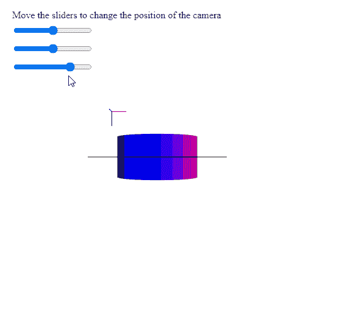

# p5.js Camera.setPosition()方法

> 原文：[https://www.geeksforgeeks.org/p5-camera-setposition-method/](https://www.geeksforgeeks.org/p5-camera-setposition-method/)

`p5.js` 中的 `Camera` 用于设置相机在世界空间中给定点的位置。`setPosition()` 方法在改变位置的同时保持当前的相机方向。

## 语法

```
setPosition( x, y, z )
```

## 参数

该方法接受三个参数：

*   `x`：表示该点在世界空间中 x 位置的数字。
*   `y`：表示世界空间中点的 y 位置的数字。
*   `z`：表示世界空间中点的 z 位置的数字。

下面的例子说明了 `p5.js` 中的 `setPosition()` 方法。

## 示例

### JavaScript 描述语言

```
let currCamera;

function setup() {
  createCanvas(500, 500, WEBGL);
  helpText = createP(
    "Move the sliders to change the " +
    "position of the camera"
  );
  helpText.position(20, 0);

  // Create the camera
  currCamera = createCamera();

  // Create three sliders for changing the
  // position of the camera
  xPosSlider = createSlider(-360, 360, 0);
  xPosSlider.position(20, 40);

  yPosSlider = createSlider(-360, 360, 0);
  yPosSlider.position(20, 70);

  zPosSlider = createSlider(0, 800, 600);
  zPosSlider.position(20, 100);
}

function draw() {
  clear();
  lights();
  normalMaterial();
  debugMode();

  // Get the x, y, z values from the
  // sliders
  let currX = xPosSlider.value();
  let currY = yPosSlider.value();
  let currZ = zPosSlider.value();

  // Set the position of the camera
  // to these points in the world space
  currCamera.setPosition(currX, currY, currZ);

  cylinder(90);
}
```

## 输出



## 在线编辑

[https://editor.p5js.org/](https://editor.p5js.org/)

## 环境设置

## 参考

[https://p5js.org/reference/#/p5.Camera/setPosition](https://p5js.org/reference/#/p5.Camera/setPosition)