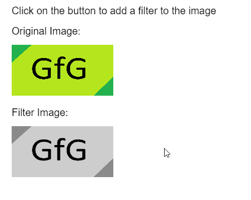
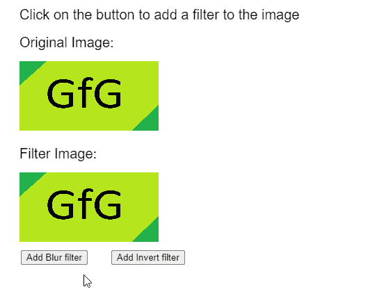

# p5.Image.filter()方法

> 原文：[https://www.geeksforgeeks.org/p5-image-filter-method/](https://www.geeksforgeeks.org/p5-image-filter-method/)

`p5.js`库中的`p5.Image`对象的`filter()`方法用于对图像应用滤镜。在`p5.js`中有几个预定义的预设，可以使用不同的强度级别来获得所需的效果。

## 语法

```
filter( filterType, filterParam )
```

## 参数

该函数接受两个参数，如下所述。

*   `filterType`：它是一个常数，定义了用作过滤器的预设。它可以有`THRESHOLD`、`GRAY`、`OPAQUE`、`INVERT`、`POSTERIZE`、`BLUR`、`ERODE`、`DILATE`或`BLUR`的值。
*   `filterParam`：它是每个过滤器独有的数字，影响过滤器的功能。这是一个可选参数。

**注意：** 以下示例中使用的 JavaScript 库如下。这些用于任何 HTML 文件的头部。本文底部提供了下载参考链接。

> `<script src="p5.min.js"></script>`

## 示例 1

以下示例说明了`p5.js`中的`filter()`方法。

### JavaScript

```
function preload() {
    img_orig =
      loadImage("sample-image.png");
    img_filter =
      loadImage("sample-image.png");
}

function setup() {
    createCanvas(500, 400);
    textSize(20);

    // Draw the original image
    text("Click on the button to " +
      "add a filter to the image", 20, 20);
    text("Original Image:", 20, 60);
    image(img_orig, 20, 80, 200, 100);

    // Apply the GRAYSCALE filter
    img_filter.filter(GRAY);

    // Draw the image with filter
    text("Filter Image:", 20, 220);
    image(img_filter, 20, 240, 200, 100);
}
```

**输出：**



## 示例 2

### JavaScript

```
function preload() {
  img_orig =
    loadImage("sample-image.png");
  img_filter =
    loadImage("sample-image.png");
}

function setup() {
  createCanvas(500, 400);
  textSize(20);

  btnBlur = createButton("Add Blur filter");
  btnBlur.position(30, 360);
  btnBlur.mousePressed(applyBlur);

  btnInvert = createButton("Add Invert filter");
  btnInvert.position(160, 360);
  btnInvert.mousePressed(applyInvert);
}

function draw() {
  clear();

  text("Click on the button to add a " +
    "filter to the image", 20, 20);
  text("Original Image:", 20, 60);
  image(img_orig, 20, 80, 200, 100);

  text("Filter Image:", 20, 220);
  image(img_filter, 20, 240, 200, 100);
}

function applyBlur() {
  // Add the BLUR filter to the image
  img_filter.filter(BLUR, 10);
}

function applyInvert() {
  // Add the INVERT filter to the image
  img_filter.filter(INVERT);
}
```

**输出：**



### 在线编辑
[https://editor.p5js.org/](https://editor.p5js.org/)

### 环境设置
[https://www.geeksforgeeks.org/p5-js-soundfile-object-installation-and-methods/](https://www.geeksforgeeks.org/p5-js-soundfile-object-installation-and-methods/)

### 参考
[https://p5js.org/reference/#/p5.Image/filter](https://p5js.org/reference/#/p5.Image/filter)