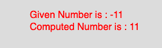

# p5.js | abs()功能

> 原文: [https://www.geeksforgeeks.org/p5-js-abs-function/](https://www.geeksforgeeks.org/p5-js-abs-function/)

p5.js 中的 `abs()` 函数用于计算一个数字的绝对值。这个函数映射到 JavaScript 的 `Math.abs()`。一个数的绝对值总是正数。

## 语法

```
abs(number)
```

## 参数

该函数只接受一个参数，如下所述：

### number
此参数存储要计算的数字。

## 示例

下面的程序举例说明 `abs()` 函数在 p5.js 中的用法：

```
function setup() {
    // 创建尺寸为 270*80 的画布
    createCanvas(270, 80);
}

function draw() {
    background(220);
    // 初始化参数
    let x = -11;
    // 调用 abs() 函数
    let y = abs(x);
    textSize(16);
    fill(color('red'));
    text("Given Number is : " + x, 50, 30);
    text("Computed Number is : " + y, 50, 50);
}
```

## 输出



## 参考

[https://p5js.org/reference/#/p5/abs](https://p5js.org/reference/#/p5/abs)