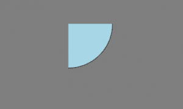
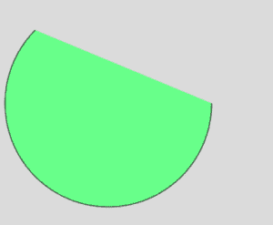
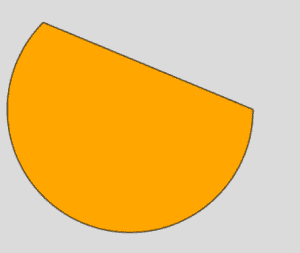
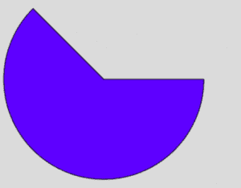

# p5.js | arc() 函数

> 原文: [https://www.geeksforgeeks.org/p5-js-arc-function/](https://www.geeksforgeeks.org/p5-js-arc-function/)

`arc()` 函数是 p5.js 中的一个内置函数，用于绘制圆弧。该功能接受七个参数，即 x 坐标、y 坐标、宽度、高度、起点、终点和可选参数模式。

## 语法

```
arc(x, y, w, h, start, stop, mode)
```

## 参数

该功能接受 7 个参数，如上所述，描述如下：

*   `x`: 此参数用于保存椭圆弧的 x 坐标值。
*   `y`: 此参数用于保存椭圆弧的 y 坐标值。
*   `w`: 此参数取椭圆弧的宽度值。
*   `h`: 此参数取椭圆弧的高度值。
*   `start`: 该参数取圆弧开始的角度值，以弧度表示。
*   `stop`: 此参数取角度值来停止圆弧，以弧度指定。
*   `mode`: 这是一个可选参数，它决定了弧线的绘制方式，可以是 `CHORD`、`PIE` 或 `OPEN`。

## 程序示例

### 程序 1：使用 DEFAULT 模式

```
function setup() {
    createCanvas(400, 400);
}

function draw() {
    background('gray');

    // Quarter arc at 150, 55 of height and width 290px
    arc(150, 55, 290, 290, 0, HALF_PI);
    fill('lightblue');
}
```

**输出:**


### 程序 2：使用 OPEN 模式

```
function setup() {
    createCanvas(400, 400);
}

function draw() {
    background(220);
    fill('lightgreen');

    // An open arc at 150, 150 with radius 280
    arc(150, 150, 280, 280, 0, PI + QUARTER_PI, OPEN);
}
```

**输出:**


### 程序 3：使用 CHORD 模式

```
function setup() {
    createCanvas(400, 400);
}

function draw() {
    background(220);
    fill('orange');

    // A chord-arc at 150, 150 with radius 280
    arc(150, 150, 280, 280, 0, PI + QUARTER_PI, CHORD);
}
```

**输出:**


### 程序 4：使用 PIE 模式

```
function setup() {
    createCanvas(400, 400);
}

function draw() {
    background(220);
    fill('blue');

    // A pie-arc at 150, 150 with radius 280
    arc(150, 150, 280, 280, 0, PI + QUARTER_PI, PIE);
}
```

**输出:**


## 参考文献

[https://p5js.org/reference/#/p5/arc](https://p5js.org/reference/#/p5/arc)