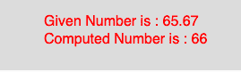

# p5.js | ceil()功能

> 原文: [https://www.geeksforgeeks.org/p5-js-ceil-function/](https://www.geeksforgeeks.org/p5-js-ceil-function/)

p5.js 中的 `ceil()` 函数用于计算一个数字的 ceil 值。该函数映射到 JavaScript 的 `Math.ceil()`。一个数的绝对值总是正数。

## 语法

```
ceil(number)
```

## 参数

该函数只接受一个参数，如上所述，如下所述：

*   `number`：此参数存储要计算的数字。

下面的程序说明了 p5.js 中的 `ceil()` 函数：

### 示例

```
function setup() {
    //create Canvas of size 270*80
    createCanvas(270, 80);
}

function draw() {
    background(220);
    //initialize the parameter
    let x = 65.67;
    //call to ceil() function
    let y = ceil(x);
    textSize(16);
    fill(color('red'));
    text("Given Number is : " + x, 50, 30);
    text("Computed Number is : " + y, 50, 50);
}
```

## 输出



## 参考

[https://p5js.org/reference/#/p5/ceil](https://p5js.org/reference/#/p5/ceil)