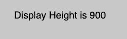
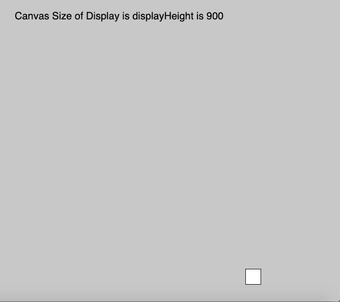

# p5.js: displayHeight变量

> 来源：[https://www.geeksforgeeks.org/p5-js-displayheight-variable/](https://www.geeksforgeeks.org/p5-js-displayheight-variable/)

p5.js 中的 `displayHeight` 变量用于存储设备屏幕显示的高度。高度值根据默认像素密度存储。该变量用于在任何显示尺寸上运行全屏程序。将其乘以 `pixelDensity` 以返回实际屏幕大小。

## 语法

```
displayHeight
```

## 参数

此功能不接受任何参数。

## 示例

下面程序举例说明了 `displayHeight` 变量在 p5.js 中的使用。

### 示例-1

```
function setup() {
    createCanvas(1000, 400);
    // Set text size to 40px
    textSize(20);
}

function draw() {
    background(200);
    rect(mouseX, mouseY, 30, 30);
    //Use of displayHeight Variable
    text("Display Height is " + displayHeight, 30, 40);
}
```

**输出:**


### 示例-2

```
function setup() {
    createCanvas(1000, displayHeight);
    // Set text size to 40px
    textSize(20);
}

function draw() {
    background(200);
    rect(mouseX, mouseY, 30, 30);
    //Use of displayHeight Variable
    text("Canvas Size of Display is displayHeight is " + displayHeight, 30, 40);
}
```

**输出:**


## 参考

[https://p5js.org/reference/#/p5/displayHeight](https://p5js.org/reference/#/p5/displayHeight)