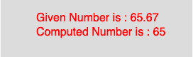

# p5.js | floor()功能

> 原文: [https://www.geeksforgeeks.org/p5-js-floor-function/](https://www.geeksforgeeks.org/p5-js-floor-function/)

p5.js 中的 `floor()` 函数用于计算一个数字的 floor 值。该函数映射到 JavaScript 的 `Math.floor()`。它计算小于或等于参数值的最接近整数。

## 语法

```javascript
floor(number)
```

## 参数

该函数只接受一个参数：

*   `number`：此参数存储要计算的数字。

## 示例

下面的程序举例说明了 `floor()` 函数的用法：

```javascript
function setup() {
    // 创建 270*80 大小的画布
    createCanvas(270, 80);
}

function draw() {
    background(220);
    // 初始化参数
    let x = 65.67;
    // 调用 floor() 函数
    let y = floor(x);
    textSize(16);
    fill(color('red'));
    text("Given Number is : " + x, 50, 30);
    text("Computed Number is : " + y, 50, 50);
}
```

## 输出



## 参考

[https://p5js.org/reference/#/p5/floor](https://p5js.org/reference/#/p5/floor)