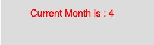

# p5.js `month()`函数

> 原文：[https://www.geeksforgeeks.org/p5-js-month-function/](https://www.geeksforgeeks.org/p5-js-month-function/)

p5.js 中的 `month()` 函数用于从系统时钟中获取当前月份。

## 语法

```
month()
```

## 参数
该函数不接受任何参数。

下面的程序说明了 p5.js 中的 `month()` 函数：

## 示例

```
function setup() {
    //create Canvas of size 270*80
    createCanvas(270, 80);
}

function draw() {
    background(220);

    //initialize the parameter with month
    let m = month();
    textSize(16);
    fill(color('red'));
    text("Current Month is : " + m, 50, 30);
}
```

## 输出


## 参考
[https://p5js.org/reference/#/p5/month](https://p5js.org/reference/#/p5/month)