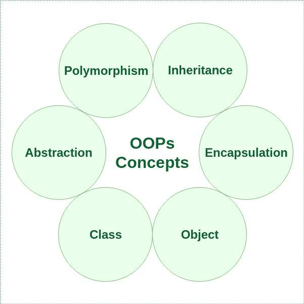
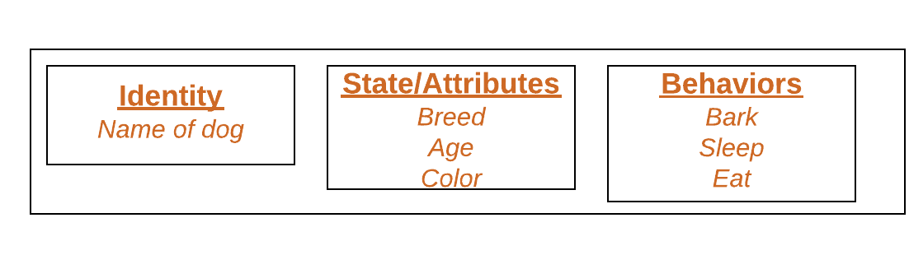
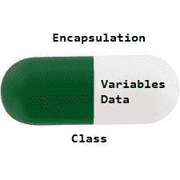

# Perl 中的面向对象编程(OOPs)

> 原文: [https://www.geeksforgeeks.org/object-oriented-programming-oops-in-perl/](https://www.geeksforgeeks.org/object-oriented-programming-oops-in-perl/)

**面向对象编程:** 顾名思义，面向对象编程(Object-oriented programming，简称 OOPs)是指在编程中使用对象的语言。面向对象编程的目标是在编程中实现像继承、隐藏、多态等真实世界的实体。OOP 的主要目的是将数据和对数据进行操作的函数绑定在一起，这样除了函数之外，代码的任何其他部分都不能访问这些数据。

**OOPs 概念:**

*   [类](#类)
*   [对象](#对象)
*   [方法](#方法)
*   [多态性](#多态性)
*   [继承](#继承)
*   [封装](#封装)
*   [抽象](#抽象)



让我们了解一下面向对象编程语言的不同特征:

## 1. 类

[Class](https://www.geeksforgeeks.org/perl-classes-in-oop/) 是一个用户定义的蓝图或原型，从中创建对象。它表示一种类型的所有对象共有的属性或方法。通常，类声明可以按顺序包含以下组件:

1.  **类名:** 名称应以首字母(按惯例大写)开头。
2.  **超类(如果有的话):** 类的父类(超类)的名称，如果有的话，前面加关键字 `use`。
3.  **构造函数(如果有):** Perl 子程序中的构造函数返回一个对象，该对象是类的实例。在 Perl 中，惯例是将构造函数命名为 `new`。
4.  **类体:** 大括号 `{ }` 包围的类体。

## 2. 对象

[Object](https://www.geeksforgeeks.org/perl-objects-in-oops/) 是面向对象编程的基本单元，代表现实生活中的实体。一个典型的 Perl 程序会创建许多对象，这些对象通过调用方法进行交互。一个对象包含:

1.  **状态**: 用一个对象的属性来表示。它还反映了对象的属性。
2.  **行为**: 用一个对象的方法来表示。它还反映了一个对象与其他对象的反应。
3.  **身份**: 为一个对象赋予唯一的名称，使一个对象能够与其他对象进行交互。

一个物体的例子: 狗

[](https://media.geeksforgeeks.org/wp-content/uploads/Blank-Diagram-Page-1-5.png)

## 3. 方法

[Method](https://www.geeksforgeeks.org/perl-methods-in-oops/) 是执行某些特定任务并返回结果给调用者的一组语句。方法也可以执行特定任务而不返回任何内容。方法是 **省时器**，帮助我们 **重用** 代码而无需重新输入。

## 4. 多态性

[Polymorphism](https://www.geeksforgeeks.org/perl-polymorphism-in-oops/) 指的是 OOPs 编程语言有效区分同名实体的能力。Perl 通过这些实体的签名和声明来实现这一点。

Perl 中的多态性主要有两种类型:

*   Perl 中的重载
*   Perl 中的重写

## 5. 继承

[Inheritance](https://www.geeksforgeeks.org/perl-inheritance-in-oops/) 是 OOP(面向对象编程)的重要支柱。它是 perl 中的一种机制，允许一个类继承另一个类的特性(字段和方法)。

**重要术语:**

*   **超类:** 特征被继承的类称为超类(或基类或父类)。
*   **子类:** 继承另一个类的类称为子类(或派生类、扩展类或子类)。除了超类字段和方法之外，子类还可以添加自己的字段和方法。
*   **可重用性:** 继承支持“可重用性”的概念，即当我们想要创建一个新的类，并且已经有一个类包含了我们想要的一些代码时，我们可以从现有的类中派生出我们的新类。通过这样做，我们重用了现有类的字段和方法。

一个类可以通过使用[包](https://www.geeksforgeeks.org/packages-in-perl/)在 perl 中创建，并且可以通过使用 `use` 关键字继承。

**语法:**

```perl
use package_name
```

## 6. 封装

[Encapsulation](https://www.geeksforgeeks.org/perl-encapsulation-in-oops/) 被定义为将数据包装在一个单一单元下。它是将代码及其操作的数据绑定在一起的机制。另一种思考封装的方式是，它是一个保护罩，防止数据被此保护罩外的代码访问。

*   从技术上讲，在封装中，一个类的变量或数据对任何其他类都是隐藏的，只能通过声明它们的自己类的任何成员函数来访问。
*   与封装一样，一个类中的数据对其他类是隐藏的，因此也被称为 **数据隐藏**。
*   封装可以通过以下方式实现: 将类中的所有变量声明为私有，并在类中编写公共方法来设置和获取变量的值。

[](https://media.geeksforgeeks.org/wp-content/uploads/Encapsulation.jpg)

## 7. 抽象

数据抽象是只向用户显示必要细节的特性。琐碎或非必要的单元不会显示给用户。例如: 汽车被视为一辆汽车，而不是其单独的组件。

数据抽象也可以定义为只识别对象所需特征而忽略无关细节的过程。对象的属性和行为使其区别于其他类似类型的对象，也有助于对对象进行分类/分组。

考虑一个男人开车的真实例子。这个人只知道踩油门会提高汽车的速度，或者踩刹车会让汽车停下来，但他不知道踩油门后速度实际上是如何提高的，他不知道汽车的内部机制或者油门、刹车等在汽车中的实施。这就是抽象。