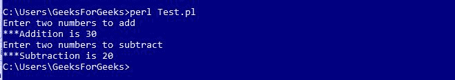
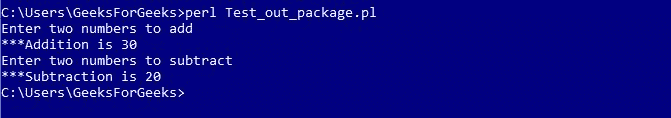

# Perl 中的包

> 原文: [https://www.geeksforgeeks.org/packages-in-perl/](https://www.geeksforgeeks.org/packages-in-perl/)

一个 Perl 包是驻留在它自己的名称空间中的代码的集合。Perl 模块是一个定义在文件中的包，该文件与包同名，扩展名为`.pm`。两个不同的模块可能包含一个同名的变量或函数。任何不包含在任何包中的变量都属于主包。因此，所有正在使用的变量都属于“主”包。通过声明额外的包，可以保证不同包中的变量不会相互干扰。

## Perl 模块的声明

模块的名称必须与包名相同，并具有 `.pm` 扩展名。

**示例: `Calculator.pm`**

```perl
package Calculator;

# Defining sub-routine for Addition
sub addition
{
    # Initializing Variables a & b
    $a = $_[0];
    $b = $_[1];

# Performing the operation
    $a = $a + $b;

# Function to print the Sum
    print "\n***Addition is $a";
}

# Defining sub-routine for Subtraction
sub subtraction
{
    # Initializing Variables a & b
    $a = $_[0];
    $b = $_[1];

# Performing the operation
    $a = $a - $b;

# Function to print the difference
    print "\n***Subtraction is $a";
}
1;
```

这里，文件的名称是`Calculator.pm`，存储在`Calculator`目录中。注意`1;`写在代码的末尾，向解释器返回一个真值。Perl 接受任何真实的东西，而不是`1`。

## 使用 Perl 模块

要使用这个计算器模块，我们使用`require`或`use`函数。要从模块访问函数或变量，使用`::`。下面是一个演示相同内容的示例：

**示例: `Test.pl`**

```perl
#!/usr/bin/perl

# Using the Package 'Calculator'
use Calculator;

print "Enter two numbers to add";

# Defining values to the variables
$a = 10;
$b = 20;

# Subroutine call
Calculator::addition($a, $b);

print "\nEnter two numbers to subtract";

# Defining values to the variables
$a = 30;
$b = 10;

# Subroutine call
Calculator::subtraction($a, $b);
```

**输出:**


## 从不同目录访问包

如果访问包的文件位于目录之外，那么我们使用`::`来指定模块的路径。例如，使用计算器模块的文件位于计算器包之外，所以我们写`GFG::Calculator`来加载模块，其中`::`左边的值代表目录名，`::`右边的值代表 Perl 模块名。让我们看一个例子来理解这一点：

**示例: `计算器目录外的 Test_out_package.pl`**

```perl
#!/usr/bin/perl

use GFG::Calculator; # Directory_name::module_name

print "Enter two numbers to add";

# Defining values to the variables
$a = 10;
$b = 20;

# Subroutine call
Calculator::addition($a, $b);

print "\nEnter two numbers to subtract";

# Defining values to the variables
$a = 30;
$b = 10;

# Subroutine call
Calculator::subtraction($a, $b);
```

**输出:**


## 使用模块中的变量

可以通过在使用前声明来使用来自不同包的变量。下面的例子演示了这一点。

**示例: `Message.pm`**

```perl
#!/usr/bin/perl

package Message;

# Variable Creation
$username;

# Defining subroutine
sub Hello
{
  print "Hello $username\n";
}
1;
```

Perl 文件访问模块如下：

**示例**

```perl
#!/usr/bin/perl

# Using Message.pm package
use Message;

# Defining value to variable
$Message::username = "ABC";

# Subroutine call
Message::Hello();
```

**输出:**


## BEGIN 和 END 块

当我们想在脚本开头运行部分代码，在脚本结尾运行部分代码时，会使用`BEGIN`和`END`块。写在`BEGIN{…}`中的代码在脚本开始时执行，而写在`END{…}`中的代码在脚本结束时执行。下面的程序演示了这一点：

**示例: `begineg.pl`**

```perl
#!/usr/bin/perl

# Predefined BEGIN block
BEGIN
{
    print "In the begin block\n";
}

# Predefined END block
END
{
    print "In the end block\n";
}

print "Hello Perl;\n";
```

**输出:**

```
In the begin block
Hello Perl;
In the end block
```