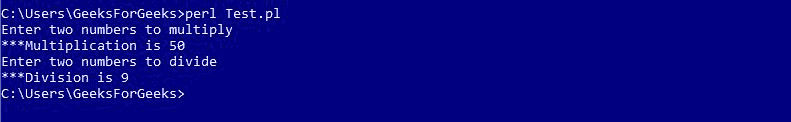

# Perl 模块

> 原文:[https://www.geeksforgeeks.org/perl-modules/](https://www.geeksforgeeks.org/perl-modules/)

Perl 中的模块是执行一组编程任务的相关子程序和变量的集合。Perl 模块是可重用的。各种各样的 Perl 模块可以在综合 Perl 存档网络(CPAN)上获得。这些模块涵盖了广泛的类别，如网络、CGI、XML 处理、数据库接口等。

## 创建 Perl 模块

模块名称必须与包的名称相同，并应以 `.pm` 分机结尾。

**示例:Calculator.pm**

```perl
package Calculator;

# Defining sub-routine for Multiplication
sub multiplication
{
    # Initializing Variables a & b
    $a = $_[0];
    $b = $_[1];

# Performing the operation
    $a = $a * $b;

# Function to print the Sum
    print "\n***Multiplication is $a";
}

# Defining sub-routine for Division
sub division
{
    # Initializing Variables a & b
    $a = $_[0];
    $b = $_[1];

# Performing the operation
    $a = $a / $b;

# Function to print the answer
    print "\n***Division is $a";
}
1;
```

这里，文件的名称是`Calculator.pm`，存储在 Calculator 目录中。注意`1;`写在代码的末尾，向解释器返回一个真值。Perl 接受任何真实的东西，而不是 1。

## 导入和使用 Perl 模块

要导入这个计算器模块，我们使用`require`或`use`函数。要从模块访问函数或变量，使用`::`。下面是一个演示相同内容的示例：

**示例:Test.pl**

```perl
#!/usr/bin/perl

# Using the Package 'Calculator'
use Calculator;

print "Enter two numbers to multiply";

# Defining values to the variables
$a = 5;
$b = 10;

# Subroutine call
Calculator::multiplication($a, $b);

print "\nEnter two numbers to divide";

# Defining values to the variables
$a = 45;
$b = 5;

# Subroutine call
Calculator::division($a, $b);
```

**输出:**


## 使用模块中的变量

不同包中的变量可以通过在使用前声明来使用。下面的例子演示了这个。

**示例:Message.pm**

```perl
#!/usr/bin/perl

package Message;

# Variable Creation
$username;

# Defining subroutine
sub Hello
{
  print "Hello $username\n";
}
1;
```

Perl 文件访问模块如下。

**示例**

```perl
#!/usr/bin/perl

# Using Message.pm package
use Message;

# Defining value to variable
$Message::username = "Geeks";

# Subroutine call
Message::Hello();
```

**输出:**


## 使用预定义模块

Perl 提供了各种预定义模块，可以在 Perl 程序中随时使用。
例如：`strict`、`warnings`等。

**示例:**

```perl
#!/usr/bin/perl

use strict;
use warnings;

print" Hello This program uses Pre-defined Modules";
```

**输出:**

```
Hello This program uses Pre-defined Modules
```