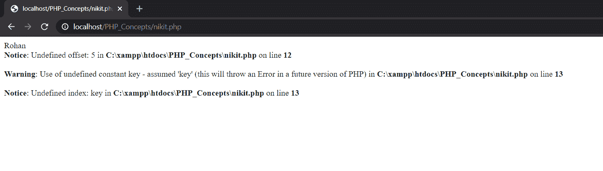
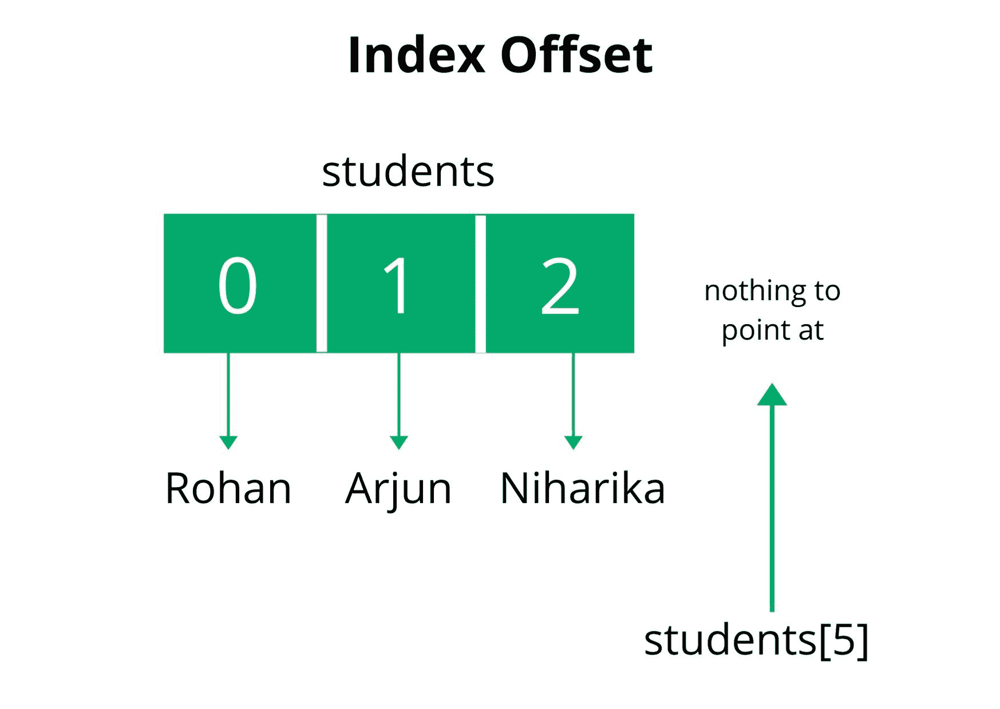

# PHP 中如何避免未定义的偏移量错误？

> 原文: [https://www.geeksforgeeks.org/how-to-avoid-undefined-offset-error-in-php/](https://www.geeksforgeeks.org/how-to-avoid-undefined-offset-error-in-php/)

数组中不存在的偏移量称为未定义的偏移量。未定义的偏移量错误类似于 Java 中的 `ArrayOutOfBoundException`。如果我们访问一个不存在的索引或一个空的偏移量，将导致一个未定义的偏移量错误。

**示例:** 下面的 PHP 代码解释了我们如何访问数组元素。如果被访问的索引不存在，那么它给出一个未定义的偏移误差。

```php
<?php

// Declare and initialize an array
// $students = ['Rohan', 'Arjun', 'Niharika']
$students = array(
    0 => 'Rohan',
    1 => 'Arjun',
    2 => 'Niharika'
);

// Rohan 
echo $students[0];

// ERROR: Undefined offset: 5
echo $students[5];

// ERROR: Undefined index: key
echo $students[key];

?>
```

**输出:**





下面讨论一些避免未定义偏移误差的方法:

## 使用 `isset()` 函数

`isset()` 函数检查变量是否置位且不等于空。它还检查数组或数组键是否有空值。

**例:**

```php
<?php

// Declare and initialize an array
// $students = ['Rohan', 'Arjun', 'Niharika']
$students = array(
    0 => 'Rohan',
    1 => 'Arjun',
    2 => 'Niharika'
);

if(isset($students[5])) {
    echo $students[5];
}
else {
    echo "Index not present";
}

?>
```

**Output:**

```php
Index not present
```

## 使用 `empty()` 函数

`empty()` 函数检查数组中的变量或索引值是否为空。

```php
<?php

// Declare and initialize an array
// $students = ['Rohan', 'Arjun', 'Niharika']
$students = array(
    0 => 'Rohan',
    1 => 'Arjun',
    2 => 'Niharika'
);

if(!empty($students[5])) {
    echo $students[5];
}
else {
    echo "Index not present";
}

?>
```

**Output:**

```php
Index not present
```

## 使用 `array_key_exists()` 函数检查关联数组

关联数组以键值对的形式存储数据，每个键都对应一个值。`array_key_exists()` 函数检查指定的键是否存在于数组中。

**Example:**

```php
<?php 
// PHP program to illustrate the use 
// of array_key_exists() function

function Exists($index, $array) { 
    if (array_key_exists($index, $array)) { 
        echo "Key Found"; 
    } 
    else{ 
        echo "Key not Found"; 
    } 
}

$array = array(
    "ram" => 25, 
    "krishna" => 10, 
    "aakash" => 20
);

$index = "aakash";

print_r(Exists($index, $array)); 
?>
```

**Output:**

```php
Key Found
```

PHP 是一种专门为 web 开发设计的服务器端脚本语言。您可以通过以下 [PHP 教程](https://www.geeksforgeeks.org/php-tutorials/)和 [PHP 示例](https://www.geeksforgeeks.org/php-examples/)从头开始学习 PHP。