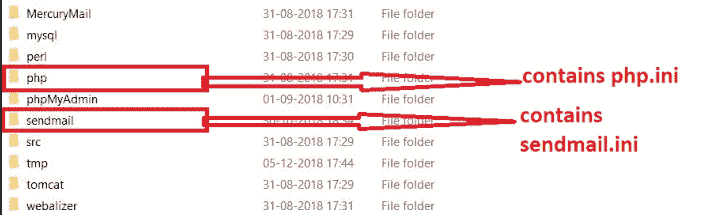
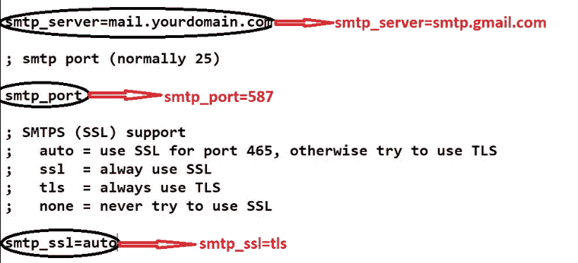
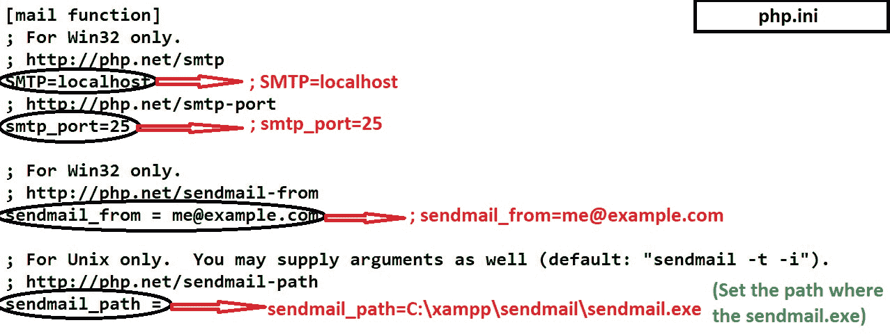

# 如何配置 XAMPP 使用 PHP 从本地主机发送邮件？

> 原文：[https://www.geeksforgeeks.org/how-to-configure-xampp-to-send-mail-from-localhost-using-php/](https://www.geeksforgeeks.org/how-to-configure-xampp-to-send-mail-from-localhost-using-php/)

要将 XAMPP 服务器配置为从本地主机发送邮件，我们必须对两个文件 `sendmail.ini` 和 `php.ini` 进行更改。名为 `sendmail.ini` 的文件存在于 `sendmail` 文件夹中，`php.ini` 文件存在于 XAMPP 文件夹中的 `php` 文件夹中。


## 第一步

*   **前往 `C:\xampp\sendmail`：** 在记事本或任何文本编辑器中打开 `sendmail.ini` 文件，并进行如下更改。

```php
change smtp_server=mail.yourdomain.com to smtp_server=smtp.gmail.com
change smtp_port to smtp_port=587
change smtp_ssl=auto to smtp_ssl=tls
```



```php
uncomment ;error_logfile=error.log to error_logfile=error.log
uncomment ;debug_logfile=debug.log to debug_logfile=debug.log
write your gmail id in auth_username: auth_username=*****@gmail.com
write your gmail assword in auth_password: auth_password=*****
```


```php
write your gmail id in force_sender: *****@gmail.com
change hostname to hostname=localhost
```


## 第二步

*   **前往 `C:\xampp\php`：** 在记事本或任何文本编辑器中打开 `php.ini` 文件，找到 `[mail function]` 部分并进行如下更改。

```php
comment SMTP=localhost by putting semicolon infront=>;SMTP=localhost
comment smtp_port=25 by putting semicolon infront=>;smtp_port=25
comment sendmail_from= by putting semicolon infront=>;sendmail_from=
specify path of file in sendmail_path to sendmail_path=C:\xampp\sendmail\sendmail.exe

check if extension=php_openssl.dll is enabled=>If there is semicolon in front then
un-comment it by removing that semicolon
```



按照给定的步骤操作后，如果没有通过调用邮件功能发送邮件，则转到 `C:\xampp\sendmail` 打开错误日志查看是否发生错误。

**注意：** 这里显示的是 Gmail 的程序，但是可以通过改变 SMTP 服务器、端口号扩展到其他邮件。使用 Gmail 时，请注意启用允许访问不太安全的 Web 应用的选项。