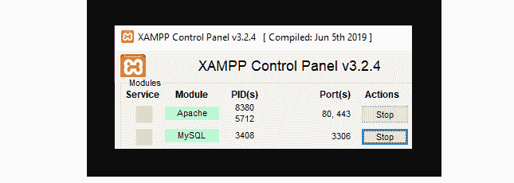
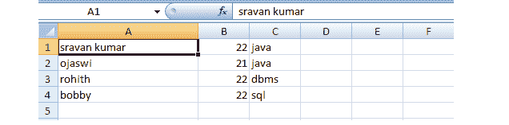

# 如何在 PHP 中将 JSON 文件转换成 CSV？

> 原文：[https://www.geeksforgeeks.org/how-to-convert-json-file-into-csv-in-php/](https://www.geeksforgeeks.org/how-to-convert-json-file-into-csv-in-php/)

在本文中，我们将看到如何使用 PHP 将 [JSON](https://www.geeksforgeeks.org/javascript-json/) 数据转换为 CSV 文件。

JSON (JavaScript 对象符号)是一种类似字典的符号，可以用来构造数据。它与扩展名一起存储。例如 JSON–`geeksforgeeks.json`。

另一方面，CSV(或逗号分隔值)文件以表格格式表示数据，有几行和几列。CSV 文件的一个例子是 Excel 电子表格。这些文件的扩展名为。例如 CSV–`geeksforgeeks.csv`。

**要求：** [`XAMPP` 服务器](https://www.geeksforgeeks.org/how-to-install-xampp-on-windows/)

**JSON 的结构：**

```php
[{
    "data1": "value1", 
    "data2": "value2", 
    ..., 
    "data n": "value n"
}]
```

**示例：**

```php
[{
    "student": "sravan kumar",
    "age": 22,
    "subject": "java"
}]
```

**使用的方法：**

1.  [`json_decode()` 方法：](https://www.geeksforgeeks.org/php-json_decode-function/) 此函数用于解码或将 JSON 对象转换为 PHP 对象。

**语法：**

```php
json_decode( string, assoc )
```

**示例：**

```php
$jsondata = '[{
    "student": "sravan kumar",
    "age": 22,
    "subject": "java"
},
{
    "student": "ojaswi",
    "age": 21,
    "subject": "java"
},
{ 
    "student": "rohith",
    "age": 22,
    "subject": "dbms"
},
{
    "student": "bobby",
    "age": 22,
    "subject": "sql"
}]';

// Decode the json data and convert it
// into an associative array
$jsonans = json_decode($jsondata, true);
```

2.  [`fopen()` 方法：](https://www.geeksforgeeks.org/php-fopen-function-open-file-or-url/) 用于打开文件。

**语法：**

```php
fopen( filename, file_mode )
```

**示例：**

```php
// File pointer in writable mode
$file_pointer = fopen($csv, 'w');
```

3.  [`fclose()` 方法：](https://www.geeksforgeeks.org/php-fclose-function/) 用于关闭文件。

**语法：**

```php
fclose( $file_pointer );
```

**示例：**

```php
fclose( $file_pointer );
```

4.  [`fputcsv()` 方法：](https://www.geeksforgeeks.org/php-fputcsv-function/) 用于将数据写入 CSV 文件。

**语法：**

```php
fputcsv( file, fields )
```

**示例：**

```php
fputcsv( $file_pointer, $i );
```

**运行步骤：**

*   启动 `XAMPP` 服务器



*   打开记事本，在 `json.php` 输入以下代码，放在 `htdocs` 文件夹下。

## PHP 代码

```php
<?php

// Student JSON data
$jsondata = 
  '[
   {"student":"sravan kumar","age":22,"subject":"java"},
   {"student":"ojaswi","age":21,"subject":"java"},
   {"student":"rohith","age":22,"subject":"dbms"},
   {"student":"bobby","age":22,"subject":"sql"}]';

// Decode json data and convert it
// into an associative array
$jsonans = json_decode($jsondata, true);

// CSV file name => geeks.csv
$csv = 'geeks.csv';

// File pointer in writable mode
$file_pointer = fopen($csv, 'w');

// Traverse through the associative
// array using for each loop
foreach($jsonans as $i){

// Write the data to the CSV file
    fputcsv($file_pointer, $i);
}

// Close the file pointer.
fclose($file_pointer);

?>
```

**输出：** 在浏览器中键入 `localhost/json.php`。可以看到 CSV 文件是以 `geeks.csv` 的文件名创建的。

