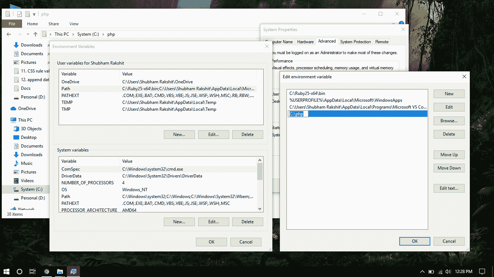
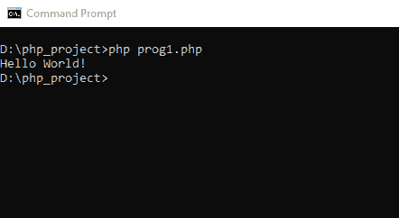
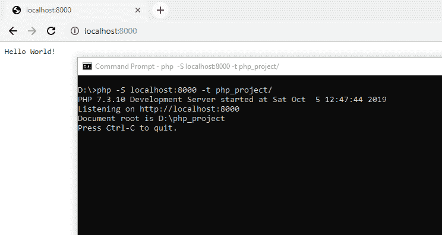

# 如何使用命令行执行 PHP 代码？

> 原文：[https://www.geeksforgeeks.org/how-to-execute-php-code-using-command-line/](https://www.geeksforgeeks.org/how-to-execute-php-code-using-command-line/)

## Windows 用户 PHP 安装

按照步骤在 Windows 操作系统上安装 PHP。

*   **第一步：** 首先我们要从它的[官网](https://windows.php.net/download#php-7.3)下载 PHP。我们必须根据我们的系统架构（x86 或 x64），从相应的部分下载 zip 文件。
*   **步骤 2：** 解压缩文件到您的首选位置。建议在一个名为 `php` 的文件夹中（即 `C:\php`）。
*   **步骤 3：** 现在我们必须将文件夹（`C:\php`）添加到环境变量 `PATH` 中，以便可以从命令行访问。为此，我们必须右键单击“我的电脑”或“此电脑”图标，然后从上下文菜单中选择“属性”。接着单击“高级系统设置”链接，然后单击“环境变量”。在“系统变量”部分，我们必须找到 `PATH` 环境变量，然后选择并编辑它。如果 `PATH` 环境变量不存在，我们必须单击“新建”。在“编辑系统变量”（或“新建系统变量”）窗口中，我们必须指定 `PATH` 环境变量的值（`C:\php` 或我们解压的 php 文件的位置）。之后，我们必须单击“确定”，并通过单击“确定”关闭所有剩余窗口。



## 面向 Linux 用户的 PHP 安装

*   Linux 用户可以使用以下命令安装 `php`。

```php
apt-get install php5-common libapache2-mod-php5 php5-cli
```

它将安装 `php` 与 `apache` 服务器。更多信息请点击[此处](https://www.php.net/manual/en/install.unix.debian.php)。

## Mac 用户 PHP 安装

*   Mac 用户可以使用以下命令安装 `php`。

```php
curl -s https://php-osx.liip.ch/install.sh | bash -s 7.3
```

它会在你的系统中安装 `php`。更多信息请点击[此处](https://www.php.net/manual/en/install.macosx.packages.php)。

## 通过命令行运行 PHP

安装完 PHP 后，我们就可以通过命令行运行 PHP 代码了。您只需按照步骤使用命令行运行 PHP 程序。

*   打开终端或命令行窗口。
*   转到存在 `php` 文件的指定文件夹或目录。
*   然后我们可以使用以下命令运行 `php` 代码：

```php
php file_name.php
```



*   我们也可以使用以下命令通过命令行启动服务器来测试 `php` 代码：

```php
php -S localhost:port -t your_folder/
```



**注意：** 使用 PHP 内置服务器时，根文件夹内的 PHP 文件名称必须是 `index.php`，其他所有 PHP 文件都可以通过主索引页超链接。

PHP 是一种专门为 web 开发设计的服务器端脚本语言。您可以通过以下 [PHP 教程](https://www.geeksforgeeks.org/php-tutorials/)和 [PHP 示例](https://www.geeksforgeeks.org/php-examples/)从头开始学习 PHP。