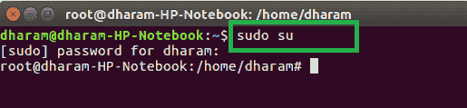
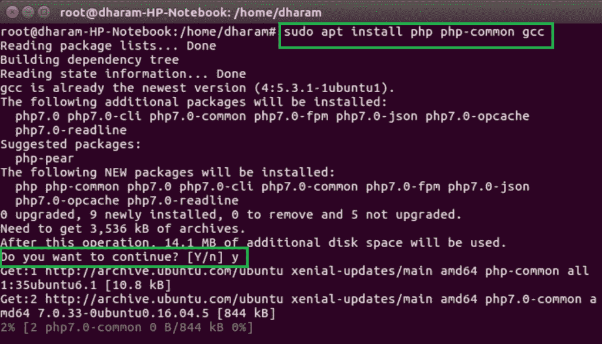
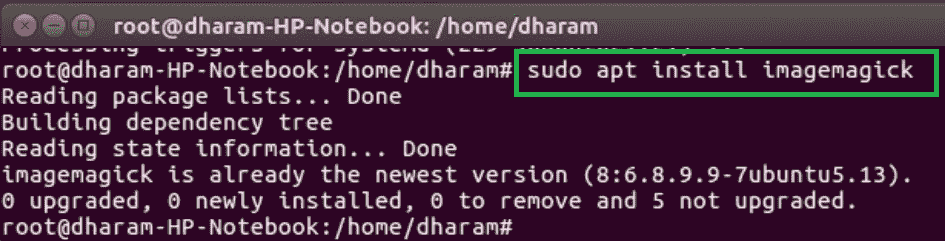
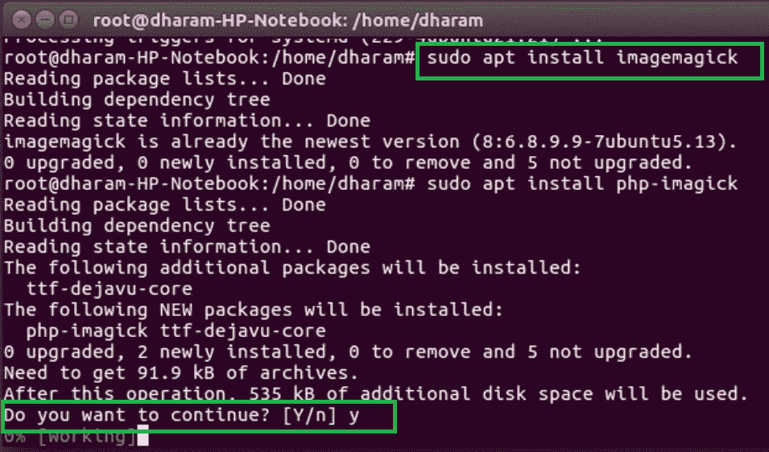
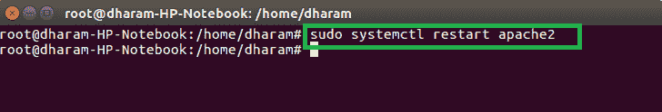

# 如何在 Ubuntu 中安装 ImageMagick 和 Imagick PHP 扩展？

> 原文：[https://www.geeksforgeeks.org/how-to-install-imagemagick-and-imagick-php-extension-in-ubuntu/](https://www.geeksforgeeks.org/how-to-install-imagemagick-and-imagick-php-extension-in-ubuntu/)

Imagick 函数用于使用 ImageMagick 应用编程接口创建和修改图像。ImageMagick 是用于创建、编辑和修改合成位图图像的软件套件。该功能可以读取、写入和转换多种格式的图像，包括 DPX、EXR、GIF、JPEG、JPEG-2000、PDF、PhotoCD、PNG、Postscript、SVG 和 TIFF。

**要求：** 安装 ImageMagick 所需的 PHP 5.1.3 和 ImageMagick 6.2.4 版本。

## 在 Ubuntu 上安装 ImageMagick (Imagick) 的过程

在 Ubuntu 16.04、18.04 及以上版本上安装 ImageMagick 和 Imagick PHP 扩展有一些步骤，下面列出：

### 1. 安装 apache 服务器

如果您的系统中没有安装 `apache` 服务器，那么首先安装 `apache2` 服务器。

### 2. 成为超级用户

打开终端并使用以下命令使自己成为超级用户。

```php
sudo su
```



### 3. 安装所需软件包

使用以下命令安装 ImageMagick 和 Imagick PHP 扩展所需的软件包。

```php
sudo apt install php php-common gcc
```



### 4. 安装 ImageMagick 扩展

现在使用以下命令安装 ImageMagick PHP 扩展。

```php
sudo apt install imagemagick
```



### 5. 安装 Imagick 扩展

完成 ImageMagick 软件包安装后，将安装 Imagick PHP 扩展。

```php
sudo apt install php-imagick
```



### 6. 重启 Apache 服务器

使用以下命令重启 `apache` 服务器。

```php
sudo systemctl restart apache2
```



### 7. 验证 Imagick 扩展

可以使用以下命令验证 `Imagick` 扩展。

```php
php -m | grep imagick
```

