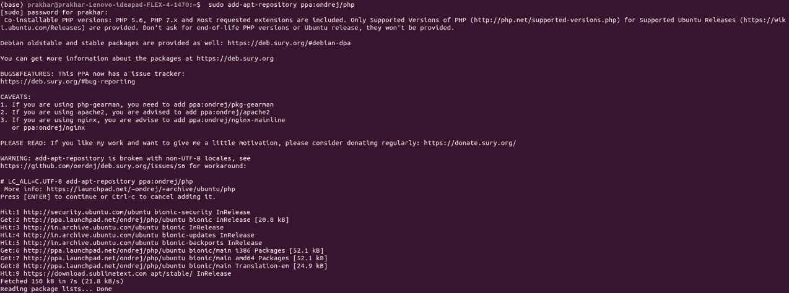
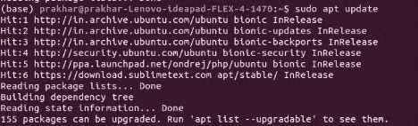
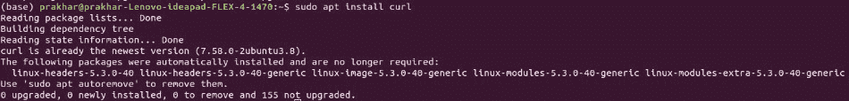
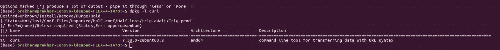

# 如何在 Ubuntu 中安装 php-curl？

> 原文：[https://www.geeksforgeeks.org/how-to-install-php-curl-in-ubuntu/](https://www.geeksforgeeks.org/how-to-install-php-curl-in-ubuntu/)

`curl` 代表客户网址。这是一个 Linux 终端命令，用于将数据从一台服务器传输到另一台服务器。它是一个免费的开源数据传输工具，使用以下协议：`IMAP`、`IMAPS`、`POP`、`POP3`、`POP3S`、`DICT`、`FILE`、`HTTP`、`HTTPS`、`SMB`、`SMBS`、`SMTP`、`SMTPS`、`FTP`、`FTPS`、`TELNET`、`RTSP`、`RMTP` 和 `TFTP`。

它在运行时显示一个类似仪表的进度条，并指示各种参数，如传输的数据量、数据传输速度和预计剩余时间。

以下是在 `Ubuntu` 系统上安装 `php-curl` 的步骤：

### 步骤 1：安装 PHP 库
通过运行以下命令为服务器安装 `PHP` 库：

```php
$ sudo add-apt-repository ppa:ondrej/php
```



### 步骤 2：更新服务器
然后，更新服务器：

```php
$ sudo apt update
```



### 步骤 3：安装 CURL
现在，安装 `CURL`。

```php
$ sudo apt install curl
```



### 步骤 4：检查安装版本
您可以通过以下命令检查已安装 `curl` 的版本：

```php
$ dpkg -l curl
```



### 步骤 5：重启 Web 服务器
一旦您在 `Ubuntu 18.04 PHP` 服务器上安装了 `CURL`，您需要重启运行 `PHP` 的 `Web` 服务器：

如果您使用的是 `Apache` 服务器，请使用以下任一命令重新启动服务器：

```php
$ sudo service apache2 restart
```

或者

```php
$ sudo /etc/init.d/apache2 restart
```

同样，如果您使用的是 `Nginx` 服务器，请使用以下任一命令：

```php
$ sudo systemctl restart nginx
```

或者

```php
$ sudo /etc/init.d/nginx restart
```

`PHP` 是一种专门为 `Web` 开发设计的服务器端脚本语言。您可以通过以下 [PHP 教程](https://www.geeksforgeeks.org/php-tutorials/)和 [PHP 示例](https://www.geeksforgeeks.org/php-examples/)从头开始学习 `PHP`。