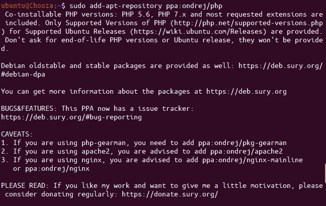
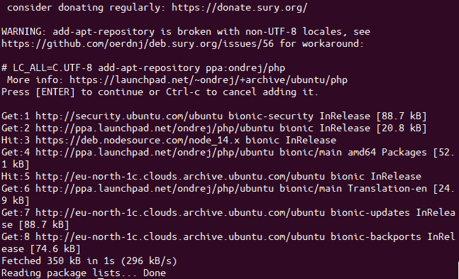
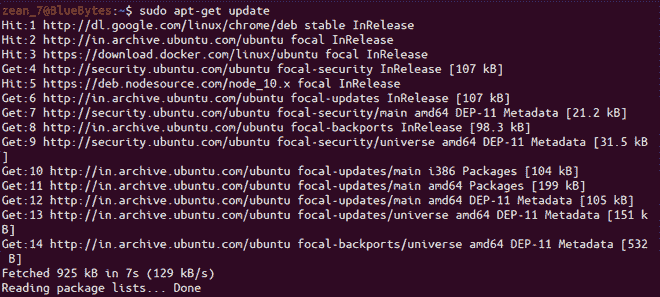
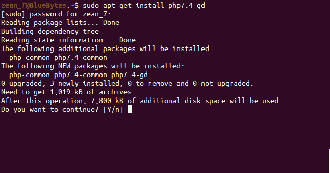

# 如何在 Ubuntu 上安装 php70-gd？

> 原文：[https://www.geeksforgeeks.org/how-to-install-php70-gd-on-ubuntu/](https://www.geeksforgeeks.org/how-to-install-php70-gd-on-ubuntu/)

`Graphics Draw` 或 `GD` 库是一个用于动态创建图像的开源库。它用于创建和操作各种不同图像格式的图像文件，包括 GIF、PNG、JPEG、WBMP 和 XPM。

这个 PHP 7 的软件包可以通过 Ondrej Sur 的 [PPA](https://launchpad.net/~ondrej/+archive/ubuntu/php) 安装。使用终端在 Ubuntu 上安装 `php7.0-gd`。遵循以下步骤：

*   首先，你需要通过添加 `ppa:ondrej/php` 到系统的软件源来更新你的系统，以获取来自这个不受信任的 PPA 的不受支持的软件包。此步骤仅适用于 Ubuntu 15 或更早版本。在终端中输入以下命令，并在提示时按 ENTER 键启用该仓库。

```php
sudo add-apt-repository ppa:ondrej/php
```



向系统软件源添加 PPA 存储库-1



向系统软件源添加 PPA 存储库-2

*   接下来，使用以下命令更新你的软件源。

```php
sudo apt-get update
```



Ubuntu 中更新命令的示例输出

*   现在，我们已经准备好为 PHP 安装 gd 库。运行以下命令来安装所需版本的 `php7.x-gd`，其中 `x` 应替换为你需要安装的版本号。

```php
sudo apt-get install php7.x-gd

# 对于 PHP 版本 7.0，将 x 替换为 0
sudo apt-get install php7.0-gd
```



Ubuntu 中的 `sudo apt-get install php7.4-gd` 命令

**注意：** PHP v7.0 已经过时，不再支持，所以上面安装 `php7.0-gd` 的命令可能无法工作。但是，安装 `php7.4-gd` 会很好，因为它相对较新，有官方支持。