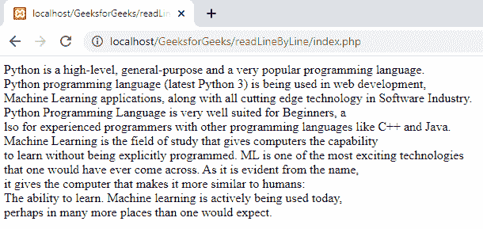

# 如何在 PHP 中逐行读取一个大文件？

> 原文: [https://www.geeksforgeeks.org/how-to-read-a-large-file-line-by-line-in-php/](https://www.geeksforgeeks.org/how-to-read-a-large-file-line-by-line-in-php/)

我们将使用一些文件操作来逐行读取并显示一个大文件。

1.  **读取文件：** 我们将使用 [`fopen()`](https://www.geeksforgeeks.org/php-fopen-function-open-file-or-url/) 函数来读取文件。此函数用于读取和打开文件。

**语法：**

```php
fopen("filename", access_mode);
```

**参数：**

*   **文件名：** 文件名是文件的名称。
*   **access_mode：** 是文件的模式，包括 `r`（读取模式）和 `w`（写入模式）。

2.  **遍历到文件末尾：** 我们可以使用 [`feof()`](https://www.geeksforgeeks.org/php-feof-function/) 函数进行遍历。此函数用于遍历直到文件末尾。

**语法：**

```php
feof($file)
```

**参数：**

*   **$file：** 是文件名。

**逐行获取数据：** 我们可以使用 [`fgets()`](https://www.geeksforgeeks.org/php-fgets-function/) 方法逐行获取数据。

**语法：**

```php
fgets($file)
```

**参数：**

*   **$file：** 是文件名。

**示例：** 让我们考虑数据存储在 `myfile.txt` 中的文件。下面是一行行读取文件并显示的 PHP 代码。

## PHP

```php
<?php

// Open your file in read mode
$input = fopen("myfile.txt", "r");

// Display a line of the file until the end
while(!feof($input)) {

// Display each line
    echo fgets($input). "<br>";
}
?>
```

**myfile.txt：** `myfile.txt` 的内容如下：

> Python 是一种高级、通用和非常流行的编程语言。Python 编程语言(最新的 Python 3)正被用于网络开发、机器学习应用以及软件行业的所有前沿技术。Python 编程语言非常适合初学者，也适合使用其他编程语言(如 C++和 Java)的有经验的程序员。机器学习是一个研究领域，它使计算机能够在没有明确编程的情况下进行学习。ML 是人们可能遇到的最令人兴奋的技术之一。从名字中可以明显看出，它赋予了计算机更类似于人类的能力:学习能力。今天，机器学习正在被积极地使用，也许在比人们预期的更多的地方。

**输出：**



逐行归档