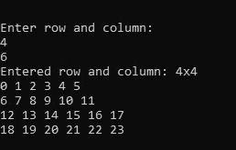

# PHP 中二维(2D)数组如何取用户输入？

> 原文：[https://www.geeksforgeeks.org/how-to-take-user-input-for-two-dimensional-2d-array-in-php/](https://www.geeksforgeeks.org/how-to-take-user-input-for-two-dimensional-2d-array-in-php/)

在 PHP 中，有两种方法可以获取二维(2D)数组中的用户输入。

## 方法一：通过HTML表单

通过 PHP `GET` & `POST` 方法使用 HTML 表单以二维(2D)数组获取用户输入。
1.  首先，向 HTML 表单输入数据。
2.  然后使用 PHP 的 `GET` 或 `POST` 方法将这些输入数据获取或发布到一个变量中。
3.  最后，使用那些保存输入数据的变量，并使用 `for` 循环进行处理。
4.  虽然它是二维数组，所以你需要两个索引/变量来处理 `for` 循环。
5.  输入一个接一个的状态作为两个变量。

下面的示例说明了如何使用 `Form POST` 方法输入 2D 阵列的用户数据。

```php
<?php

echo "Enter n for nxn : <br>";
echo "<form method='POST'>
    Row:<input type='number' min='2'
            max='5' name='1d' value='1'/>
    Column:<input type='number' min='2'
            max='5' name='2d' value='1'/>
    <input type='submit' name='submit'
            value='Submit'/>
</form>";

// Submit user input data for 2D array
if (isset($_POST['submit'])) {

// POST submitted data
    $dimention1 = $_POST["1d"];

// POST submitted data
    $dimention2 = $_POST["2d"];

echo "Entered 2d nxn: " . $dimention1
            . "x" . $dimention2 . " <br>";
    $d = [];
    $k = 0;

for($row = 0; $row < $dimention1; $row++) {
        for ($col = 0; $col < $dimention2; $col++) {
            $d[$row][$col]= $k++;
        }
    }

for ($row = 0; $row < $dimention1; $row++) {
        for ($col = 0; $col < $dimention2; $col++) {
            echo $d[$row][$col]." ";
        }
        echo "<br>";
    }
}
?>
```

**输出:**


## 方法二：使用fopen()函数

使用 `fopen()` 函数在 php 中获取二维(2D)用户输入，该函数有助于在运行时或通过外部输入文件获取用户输入。
1.  首先，将这些输入数据分配给变量。
2.  最后，使用那些保存输入数据的变量，并使用 `for` 循环进行处理。
3.  虽然它是二维数组，所以你需要两个索引/变量来处理 `for` 循环。

下面的示例说明了如何使用 `fopen()` 函数输入 2D 数组的用户数据。

```php
<?php

// fopen() using standard input
$stdin = fopen('php://stdin', 'r');
?>
<?php
error_reporting(0);
echo "\n\n\nEnter row and column: \n";

// Right trim fgets(user input)
$dimention1 = rtrim(fgets($stdin));

// Right trim fgets(user input)
$dimention2 = rtrim(fgets($stdin));

echo "Entered row and column: " .
    $dimention1 . "x" . $dimention1 . " \n";

$d = [];
$k = 0;

for ($row = 0; $row < $dimention1; $row++) {
    for ($col = 0; $col < $dimention2; $col++) {
        $d[$row][$col]= $k++;
    }
}

for ($row = 0; $row < $dimention1; $row++) {
    for ($col = 0; $col < $dimention2; $col++) {
        echo $d[$row][$col]." ";
    }
    echo "\n";
}

?>
```

**输出:**



**参考:** [https://www.geeksforgeeks.org/php-fopen-function-open-file-or-url/](https://www.geeksforgeeks.org/php-fopen-function-open-file-or-url/)