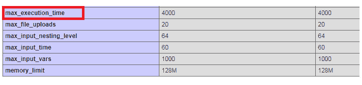

# 一个 PHP 脚本所花费的最大执行时间

> 原文: [https://www.geeksforgeeks.org/maximum-execution-time-taken-by-a-php-script/](https://www.geeksforgeeks.org/maximum-execution-time-taken-by-a-php-script/)

PHP 程序的一个重要方面是执行一个脚本的最长时间是 30 秒。时间限制因托管公司而异，但最长执行时间在 30 到 60 秒之间。用户可能会因大量导入或导出文件或程序（包括向许多收件人发送邮件）而收到超过最长时间限制的错误。为了避免这种情况，您需要增加执行时间限制。

本文描述了如何更改或控制 PHP 脚本的最大执行时间。

## 必需的先决条件

您已经在应用程序中设置了自定义的 `php.ini` 文件，或者必须向维护该文件的所有者提出请求。如果一些 PHP 脚本需要更长的时间，那么服务器就会停止并抛出一个错误：

```php
Fatal error: Maximum execution time of..seconds exceeded in this_file.php on line...
```

为了避免这种情况，您可以在 `php.ini` 配置文件中更改 `max_execution_time` 指令。让我们看看用 PHP 设置脚本执行时间的方法。下面列出了这些内容：

*   在 `php.ini` 文件中搜索 `max_execution_time` 指令并根据 PHP 脚本的需要编辑其值。

```php
; Maximum execution time of each script, in seconds
; http://php.net/max-execution-time
; Note: This directive is hardcoded to 0 for the CLI SAPI
max_execution_time = 4000
```

指令的默认值会根据需要进行更改。


**注意：** 一旦配置文件中的更改完成，我们必须重新启动网络服务器。通过此设置，配置对所有 PHP 脚本都是全局的。以不正确的方式对此文件进行更改会给 web 服务器或实时项目带来问题。

*   使用 PHP 内置函数 `set_time_limit(seconds)`，其中 `seconds` 是传递的参数，即以秒为单位的时间限制。当用户在 `php.ini` 文件外部更改设置时使用此函数。该函数在您自己的 PHP 代码中调用。当 `safe mode` 关闭时，使用 `set_time_limit(0)`。

**注意：** 如果函数在程序刚开始的时候被调用，那么传递给函数的值将是脚本执行的时间限制。否则，如果在代码中间调用该函数，则执行部分脚本，然后对脚本的其余部分应用时间限制。

*   使用 PHP 内置函数 `ini_set(option, value)`，其中参数是给定的配置选项和要设置的值。

```php
// The program is executed for 3mns.
<?php
ini_set('max_execution_time', 180);
?>
```

当您需要在运行时重写配置值时使用它。这个函数是从你自己的 PHP 代码中调用的，只会影响调用这个函数的脚本。当您想要为脚本设置无限执行时间时，请使用 `ini_set('max_execution_time', 0)`。

**注意：** 当 `安全模式` 关闭时，使用 `ini_set()` 功能。

```php
<?php
// Sets to unlimited period of time
ini_set('max_execution_time', 0);
?>
```

**注意：** 这个以‘0’为参数的函数不是很好的编程实践，但可以用于开发和测试目的。在将代码移动到实时或生产模式之前，请确保撤销设置。

*   为了允许永远运行脚本并忽略用户中止，设置 PHP 内置函数 `ignore_user_abort(true)`。默认情况下，它设置为 `False`，这将在客户端中止停止脚本时引发致命错误。

```php
<?php
ignore_user_abort();
?>
```

*   使用 `php_value` 命令在 Apache 配置文件和 `.htaccess` 文件中更改设置。
    **语法：**

```php
php_value name value
```

这将为指定的特定指令设置值。

```php
php_value max_execution_time 200
```

*   使用 cPanel 配置设置选项来更改脚本的执行时间。这可以在 cPanel 的仪表板中完成，并可用于设置 PHP 脚本的时间限制。