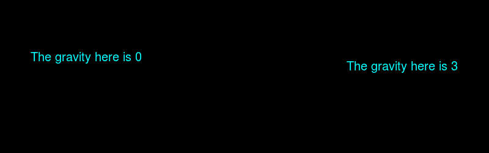

# PHP ImagickDraw::getGravity() 函数

> Original: [https://www.geeksforgeeks.org/php-imagickdraw-getgravity-function/](https://www.geeksforgeeks.org/php-imagickdraw-getgravity-function/)

`ImagickDraw::getGravity()` 函数是 PHP 中的一个内置函数，用于获取在注释文本时使用的文本放置重力。

## 语法

```php
int ImagickDraw::getGravity( void )
```

**参数：** 此函数不接受任何参数。

**返回值：** 此函数返回与[重力常数](https://www.php.net/manual/en/imagick.constants.php/#imagick.constants.gravity-northwest)之一相对应的整数值，或在未设置时返回 0。

重力常数列表如下：

*   `Imagick::GRAVITY_NORTHWEST` (1)
*   `Imagick::GRAVITY_NORTH` (2)
*   `Imagick::GRAVITY_NORTHEAST` (3)
*   `Imagick::GRAVITY_WEST` (4)
*   `Imagick::GRAVITY_CENTER` (5)
*   `Imagick::GRAVITY_EAST` (6)
*   `Imagick::GRAVITY_SOUTHWEST` (7)
*   `Imagick::GRAVITY_SOUTH` (8)
*   `Imagick::GRAVITY_SOUTHEAST` (9)

下面的程序演示了 PHP 中的 `ImagickDraw::getGravity()` 函数：

## 程序 1

```php
<?php

// Create a new ImagickDraw object
$draw = new ImagickDraw();

// Get the font Gravity
$Gravity = $draw->getGravity();
echo $Gravity;
?>
```

输出：
```
0 // Which is the default value.
```

## 程序 2

```php
<?php

// Create a new ImagickDraw object
$draw = new ImagickDraw();

// Set the font Gravity
$draw->setGravity(8);

// Get the font Gravity
$Gravity = $draw->getGravity();
echo $Gravity;
?>
```

输出：
```
8
```

## 程序 3

```php
<?php

// Create a new imagick object
$imagick = new Imagick();

// Create a image on imagick object
$imagick->newImage(800, 250, 'black');

// Create a new ImagickDraw object
$draw = new ImagickDraw();

// Set the fill color
$draw->setFillColor('cyan');

// Set the font size
$draw->setFontSize(20);

// Annotate a text to (50, 100)
$draw->annotation(50, 100, 
    'The gravity here is ' . $draw->getGravity());

// Set the gravity
$draw->setGravity(3);

// Annotate a text to (50, 100)
$draw->annotation(50, 100, 
    'The gravity here is ' . $draw->getGravity());

// Render the draw commands
$imagick->drawImage($draw);

// Show the output
$imagick->setImageFormat('png');
header("Content-Type: image/png");
echo $imagick->getImageBlob();
?>
```

**输出：**


**引用：** [https://www.php.net/manual/en/imagickdraw.getgravity.php](https://www.php.net/manual/en/imagickdraw.getgravity.php)