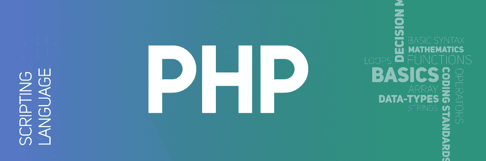

# PHP 面试问答

> Original: [https://www.geeksforgeeks.org/php-interview-questions-and-answers/](https://www.geeksforgeeks.org/php-interview-questions-and-answers/)



## 什么是 PHP ？
PHP 是一种通用编程语言，用于设计网站或 Web 应用程序。它是一种服务器端脚本语言，嵌入到 HTML 中以开发静态网站、动态网站或 Web 应用程序。它由 Rasmus Lerdorf 于 1994 年创建。

## PHP 的全称是什么？
PHP 是 Hypertext Preprocessor（超文本预处理器）的缩写，早期它被缩写为 Personal Home Page（个人主页）。

## PHP 的旧称是什么？
PHP 的旧称是 Personal Home Page。

## PHP 有哪些用途？
*   它是一种服务器端脚本语言，用于设计动态网站或 Web 应用程序。
*   它从表单接收数据以生成动态页面内容。
*   它可以处理数据库、会话、发送和接收 cookie、发送电子邮件等。
*   它可以用来添加、删除、修改数据库中的内容。
*   它可以用来设置对用户访问网页的限制。

## PHP 中的 PEAR 是什么？
PEAR 是一个用于可重用 PHP 组件的框架和分发系统。它代表 PHP Extension and Application Repository（PHP 扩展和应用仓库）。它包含 PHP 代码片段和一个用于复用代码的库。它提供了一个命令行界面来安装包。

## 静态网站和动态网站有什么区别？
*   **静态网站：**从服务器返回的网页是使用 HTML、CSS 或 JavaScript 等简单语言构建的预构建源代码文件。静态网站中的服务器上没有内容处理。
*   **动态网站：**从服务器返回的网页在运行时进行处理，这意味着它们不是预先构建的网页，而是在运行时根据用户的需求，借助服务器支持的 PHP、Node.js、ASP.NET 等服务器端脚本语言构建的。

## 开始和结束 PHP 代码块的正确且最常用的两种方式是什么？
PHP 代码总是以 `<?php` 开始，以 `?>` 结束。PHP 代码块如下：

```php
<?php   [ --Content of PHP code-- ]   ?>
```

## 如何从命令行执行 PHP 脚本？
使用以下步骤通过命令行运行 PHP 程序：
*   打开终端或命令行窗口。
*   转到 PHP 文件所在的指定文件夹或目录。
*   然后，我们可以使用命令 `php file_name.php` 运行 PHP 代码。
*   使用命令 `php -S localhost:port -t your_folder/` 启动服务器以测试 php 代码。

## 如何用 PHP 脚本显示文本？
有两种方法 `echo` 和 `print` 来显示文本。

## PHP 是大小写敏感的语言吗？
不，PHP 是一种部分大小写敏感的语言。这意味着变量名是 **大小写敏感** 的，而函数名 **不是大小写敏感** 的，即用户定义的函数不区分大小写。

## PHP 4 和 PHP 5 的主要区别是什么？
PHP 5 包含许多额外的 OOP（面向对象编程）功能。

## PHP 变量的命名规则是什么？
程序中的变量用于存储一些值或数据，以便以后在程序中使用。PHP 有自己声明和存储变量的方式。变量的特性如下：
*   在 PHP 中声明的变量必须以美元符号 `$` 开头，后跟变量名。
*   变量名称中包含字母数字字符和下划线（即‘a-z’、‘A-Z’、‘0-9’和‘_’）。
*   变量名必须以字母或下划线开头，而不是数字。
*   PHP 是一种松散类型的语言，我们不需要声明变量的数据类型，而是 PHP 通过分析值自动假定变量类型。
*   PHP 变量区分大小写，即 `$SUM` 和 `$sum` 的处理方式不同。

## 如何在 PHP 中定义常量？
`define()` 函数用于创建和检索常量的值。PHP 常量是一个标识符，其值不能随时间改变（例如网站的域名 www.geeksforgeeks.org）。如果定义了常量，它就永远不能被更改或未定义。常量不使用 `$` 符号。

## PHP 中流行的内容管理系统有哪些？
*   **WordPress：**WordPress 是一个免费的开源内容管理系统（CMS）框架。它是目前使用最广泛的 CMS 框架。
*   **Joomla：**它是一个免费的开源内容管理系统（CMS），用于发布网络内容。它遵循可以独立使用的模型-视图-控制器 Web 应用程序框架。
*   **Magento：**它是一个开源的电子商务平台，用于发展在线业务。
*   **Drupal：**它是用 PHP 开发的内容管理系统（CMS）平台，在 GNU（通用公共许可证）下发布。

## break 和 continue 语句的目的是什么？
*   **Break：**Break 语句立即终止循环的整个迭代，程序控制从循环之后的下一条语句恢复。
*   **Continue：**Continue 语句跳过当前迭代，提前进行下一次迭代。 Continue 2 充当 Case 的终止符，并跳过循环的当前迭代。

## PHP 中流行的框架有哪些？
*   拉勒维尔
*   CodeIgniter
*   塞姆法尼
*   CakePHP
*   叶氏
*   Zend 框架
*   法尔康
*   FuelPHP
*   PHPIXIE
*   苗条的 / 小的 / 少的

## 如何在 PHP 中制作单行和多行注释？
注释用于防止语句的执行。它被编译器忽略。在 PHP 中，有两种类型的注释：单行注释和多行注释。
*   **单行注释：**注释以双正斜杠 `//` 开头。
*   **多行注释：**注释包含在 `/* 注释部分 */` 中。

## PHP 中 count() 函数的用途是什么？
PHP 中的 `count()` 函数用于计算数组中存在的元素数量。对于已设置为空数组的变量，该函数可能返回 0。对于未设置的变量，该函数也返回 0。

## PHP 中有哪些不同类型的循环？
PHP 支持四种不同类型的循环，如下所列：
*   For 循环
*   While 循环
*   Do-While 循环
*   Foreach 循环

## PHP 中的 for 循环和 foreach 循环有什么区别？
*   For 循环被认为是公开执行迭代，而 foreach 循环隐藏迭代并明显简化。
*   与 for 循环相比，foreach 循环的性能被认为更好。
*   尽管 foreach 循环遍历了一组元素，但与 for 循环相比，执行得到了简化，完成循环所需的时间更少。
*   Foreach 循环为索引迭代分配临时内存，这使得整个系统在内存分配方面的性能变得冗余。