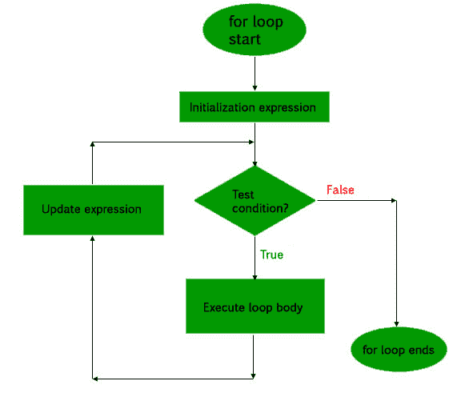
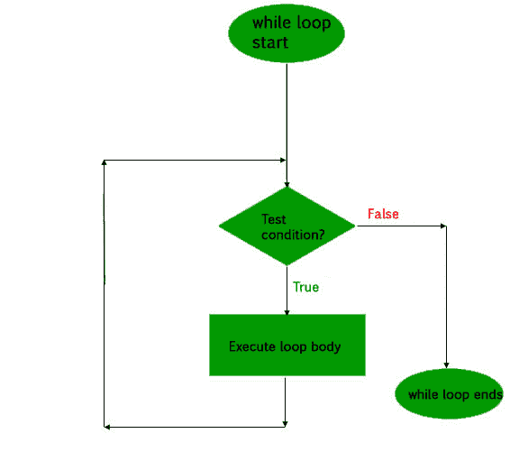
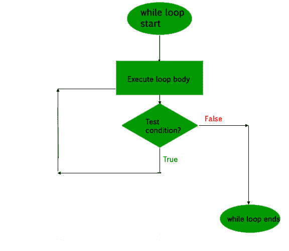

# PHP 循环

> 原文：[https://www.geeksforgeeks.org/php-loops/](https://www.geeksforgeeks.org/php-loops/)

与任何其他语言一样，PHP 中的循环用于多次执行一条语句或一块语句，直到且除非满足特定条件。这有助于用户节省多次编写相同代码的时间和精力。

PHP 支持四种类型的循环技术：

1.  `for` 循环
2.  `while` 循环
3.  `do-while` 循环
4.  `foreach` 循环

现在让我们详细了解一下上述每个循环：

## 1. `for` 循环

这种循环在用户预先知道需要执行代码块多少次时使用。也就是说，迭代次数是事先已知的。这类循环也称为入口控制循环。代码有三个主要参数，即初始化、测试条件和计数器。

**语法**：

```php
for (initialization expression; test condition; update expression) {
    // code to be executed
}
```

在 `for` 循环中，循环变量用于控制循环。首先将此循环变量初始化为某个值，然后检查此变量是否小于或大于计数器值。如果语句为真，则执行循环体并更新循环变量。重复这些步骤，直到出现退出条件。

*   **初始化表达式**：在此表达式中，我们必须将循环计数器初始化为某个值。例如：`$num=1`；
*   **测试表达式**：在此表达式中，我们必须测试条件。如果条件的计算结果为真，那么我们将执行循环体并转到 UPDATE 表达式，否则我们将退出 `for` 循环。例如：`$num<=10`；
*   **更新表达式**：执行循环体后，该表达式将循环变量递增/递减一些值。例如：`$num+=2`；

**示例**：

```php
<?php
// code to illustrate for loop
for ($num = 1; $num <= 10; $num += 2) {
    echo "$num \n";
}
?>
```

**产出**：

```php
1
3
5
7
9
```

**流程图**：



## 2. `while` 循环

`while` 循环也是一个入口控制循环，类似于 `for` 循环，即它首先在循环开始时检查条件，如果为真，则进入循环并执行语句块，并且只要条件保持为真就继续执行。

**语法**：

```php
while (if the condition is true) {
    // code is executed
}
```

**示例**：

```php
<?php
// PHP code to illustrate while loops
$num = 2;
while ($num < 12) {
    $num += 2;
    echo $num, "\n";
}
?>
```

**产出**：

```php
4
6
8
10
12
```

**流程图**：



## 3. `do-while` 循环

这是一个出口控制循环，这意味着它首先进入循环，执行语句，然后检查条件。因此，使用 `do…while` 循环时，语句至少会执行一次。执行一次后，只要条件保持为真，程序就会继续执行。

**语法**：

```php
do {
    //code is executed
} while (if condition is true);
```

**示例**：

```php
<?php
// PHP code to illustrate do...while loops
$num = 2;
do {
    $num += 2;
    echo $num, "\n";
} while ($num < 12);
?>
```

**产出**：

```php
4
6
8
10
12
```

此代码将显示 `While` 和 `Do…while` 循环之间的区别。

```php
<?php
// PHP code to illustrate the difference of two loops
$num = 2;
// In case of while
while ($num != 2) {
    echo "In case of while the code is skipped";
    echo $num, "\n";
}
// In case of do...while
do {
    $num++;
    echo "The do...while code is executed atleast once ";
} while($num == 2);
?>
```

**产出**：

```php
The do...while code is executed atleast once
```

**流程图**：



## 4. `foreach` 循环

此循环用于遍历数组。对于循环的每个计数器，都会分配一个数组元素，下一个计数器会移动到下一个元素。

**语法**：

```php
foreach (array_element as value) {
   //code to be executed
}
```

**示例**：

```php
<?php
$arr = array (10, 20, 30, 40, 50, 60);
foreach ($arr as $val) {
    echo "$val \n";
}
$arr = array ("Ram", "Laxman", "Sita");
foreach ($arr as $val) {
    echo "$val \n";
}
?>
```

**产出**：

```php
10
20
30
40
50
60
Ram
Laxman
Sita
```

本文由 [**Chinmoy Lenka**](https://auth.geeksforgeeks.org/profile.php?user=lenkachinmoy&list=practice) 贡献。如果你喜欢 GeeksforGeek 并想投稿，你也可以使用 [Contribute.geeksforgeeks.org](http://www.contribute.geeksforgeeks.org) 写一篇文章，或者把你的文章邮寄到 `Contribute@geeksforgeeks.org`。看看你的文章出现在 GeeksforGeek 主页上，并帮助其他 Geek。

如果你发现任何不正确的地方，或者你想分享更多关于上面讨论的主题的信息，请写下评论。