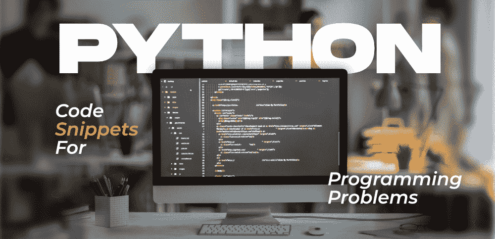

# 10 个日常编程问题的 Python 代码片段

> 原文：[https://www.geeksforgeeks.org/10-python-code-snippets-for-everyday-programming-problems/](https://www.geeksforgeeks.org/10-python-code-snippets-for-everyday-programming-problems/)

近年来，Python 编程语言拥有庞大的用户群。原因之一可能是，与其他面向对象的编程语言（如 `Java`、`C++`、`C#`、`JavaScript`）相比，它更容易学习，因此越来越多进入计算机科学领域的初学者选择了 [Python](https://www.geeksforgeeks.org/python-programming-language/)。Python 在 T2 的受欢迎程度飙升的另一个原因是，它几乎被用于信息技术行业的所有领域，无论是数据科学、机器学习、自动化、网页抓取、人工智能、网络安全、云计算等等！根据最近的开发人员调查，可以看出 Python 是目前仅次于 `JavaScript` 的第二大最受欢迎的编程语言，并且在未来几年将很容易蹿升。对 `Python` 开发人员的需求显著上升，尤其是在过去的几个月里，因此学习 `Python` 可以给你带来一些非常好的职业选择。



所以如果你是 `Python` 开发人员，这篇文章绝对适合你。今天我们将讨论 `Python` 代码片段及其简要解释，它们对开发人员和程序员的日常生活非常有用。我们将研究经常出现的各种编码问题，以及如何使用这里提供的 `Python` 代码片段来解决这些问题。让我们开始吧！

## 1. 使用 If-Else 列出理解

`Python` 中的列表理解超级有帮助和强大。它们将代码长度缩减到很大的长度，使其更具可读性。在下面的代码中，我们可以看到我们使用列表中的 `if-else` 条件来检查 6 的倍数，然后检查 2 和 3 的倍数，这在很大程度上减少了代码。

```py
my_list = ['Multiple of 6' if i % 6 == 0 
           else 'Multiple of 2' if i % 2 == 0 
           else 'Multiple of 3' if i % 3 == 0 
           else i for i in range(1, 20)]
print(my_list)
```

> **输出:**
> [1, 'Multiple of 2', 'Multiple of 3', 'Multiple of 2', 5, 'Multiple of 6', 7, 'Multiple of 2', 'Multiple of 3', 'Multiple of 2', 11, 'Multiple of 6', 13, 'Multiple of 2', 'Multiple of 3', 'Multiple of 2', 17, 'Multiple of 6', 19]

## 2. 合并两本词典

合并或追加两本词典听起来可能很混乱。但令人惊讶的是，有不止一种方法可以合并两本词典。在下面的代码中，第一种方法使用字典解包，其中两个字典一起解包成 `result`。在第二种方法中，我们首先将第一个字典复制到 `result` 中，然后用第二个字典的内容更新它。第三种方法是使用字典理解的简单实现，类似于我们在上面的列表理解中看到的。

```py
my_dict1 = {'a' : 1, 'b' : 2, 'c' : 3}
my_dict2 = {'d' : 4, 'e' : 5, 'f' : 6}

# Method 1
result = { **my_dict1, **my_dict2}
print(result)

# Method 2
result = my_dict1.copy()
result.update(my_dict2)
print(result)

# Method 3
result = {key: value for d in (my_dict1, my_dict2) for key, value in d.items()}
print(result)
```

> **输出:**
> {'a': 1, 'b': 2, 'c': 3, 'd': 4, 'e': 5, 'f': 6}
> {'a': 1, 'b': 2, 'c': 3, 'd': 4, 'e': 5, 'f': 6}
> {'a': 1, 'b': 2, 'c': 3, 'd': 4, 'e': 5, 'f': 6}

## 3. 文件处理

文件处理在各种 `Python` 程序中使用，尤其是那些与数据相关的程序，在这些程序中，我们需要读取大量逗号分隔的值。文件处理有打开文件、读取文件、写入文件、关闭文件等多种操作。

```py
# Open a file
f = open('filename.txt')

# Read from a file
f = open('filename.txt', 'r')

# To read the whole file
print(f.read())

# To read single line
print(f.readline())

# Write to a file
f = open('filename.txt', 'w')
f.write('Writing into a file \n')

# Closing a file
f.close()
```

## 4. 计算执行时间

经常需要优化代码和分析性能指标。在这里，`time` 库来帮忙。我们可以测量代码的运行时间并对其进行优化。我们还可以用它来衡量做同样工作的两段代码的运行时间，这样我们就可以选择最优化的一段。

```py
import time

start_time = time.time()

# printing all even numbers till 20
for i in range(20):
  if i % 2 == 0:
    print(i, end = " ")

end_time = time.time()
time_taken = end_time - start_time
print("\nTime: ", time_taken)
```

> **输出:**
> 0 2 4 6 8 10 12 14 16 18
> Time: 0.00020051002502441406

## 5. 对字典列表进行排序

对字典列表进行排序起初听起来令人生畏，但我们可以使用两种不同但相似的方法来完成。我们可以简单地使用内置的 `sorted()` 或 `sort()` 函数，该函数在列表中使用一个 `lambda` 函数，根据字典的“id”键对字典进行排序。在第一种方法中，返回类型是无，因为更改已经到位，另一方面，在第二种方法中，返回一个新的排序字典列表。

```py
person = [
  {
    'name' : 'alice',
    'age' : 22,
    'id' : 92345
  },
  {
    'name' : 'bob',
    'age' : 24,
    'id' : 52353
  },
  {
    'name' : 'tom',
    'age' : 23,
    'id' : 62257
  }
]

# Method 1
person.sort(key=lambda item: item.get("id"))
print(person)

# Method 2
person = sorted(person, key=lambda item: item.get("id"))
print(person)
```

> **输出:**
> [{'name': 'bob', 'age': 24, 'id': 52353}, {'name': 'tom', 'age': 23, 'id': 62257}, {'name': 'alice', 'age': 22, 'id': 92345}]
> [{'name': 'bob', 'age': 24, 'id': 52353}, {'name': 'tom', 'age': 23, 'id': 62257}, {'name': 'alice', 'age': 22, 'id': 92345}]

## 6. 寻找最高频率元素

我们可以通过传递键作为元素的计数，即元素出现的次数，来找到出现时间最长的元素。

```py
my_list = [8,4,8,2,2,5,8,0,3,5,2,5,8,9,3,8]
print("Most frequent item:", max(set(my_list), key=my_list.count))
```

> **输出:**
> Most frequent item: 8

## 7. 错误处理

错误处理是使用 `try...except...finally` 消除执行时突然停止的任何可能性。可能导致错误的语句被放入一个 `try` 块，后面跟着一个捕获异常（如果有的话）的 `except` 块，然后我们有一个 `finally` 块，它无论如何都会执行，并且是可选的。

```py
num1, num2 = 2,0
try:
    print(num1 / num2)
except ZeroDivisionError:
    print("Exception! Division by Zero not permitted.")
finally:
    print("Finally block.")
```

> **输出:**
> Exception! Division by Zero not permitted.
> Finally block.

## 8. 在字符串列表中查找子字符串

这也是 `Python` 程序员经常遇到的一段非常常见的代码。如果我们需要在字符串列表中查找子字符串（也可以应用于更大的字符串，而不仅仅是列表），我们可以使用 `find()` 方法，如果字符串中没有值，该方法返回 -1，或者返回第一个匹配项。在第二种方法中，我们可以直接使用 `in` 运算符来查看字符串中是否存在所需的子字符串。

```py
records = [
  "Vani Gupta, University of Hyderabad",
  "Elon Musk, Tesla",
  "Bill Gates, Microsoft",
  "Steve Jobs, Apple"
]

# Method 1
name = "Vani"
for record in records:
    if record.find(name) >= 0:
        print(record)

# Method 2
name = "Musk"
for record in records:
    if name in record:
        print(record)
```

> **输出:**
> Vani Gupta, University of Hyderabad
> Elon Musk, Tesla

## 9. 字符串格式

字符串格式化用于格式化或修改字符串。有很多方法可以进行字符串格式化。在第一种方法中，我们使用基本的串联，简单地将字符串加在一起。在第二种方法中，我们使用 `f-strings`，其中变量名用大括号写，并在运行时替换。与第二种方法类似，我们有第三种方法，其中我们使用 `%s`，其中 `s` 表示它是一个字符串，在第四种方法中，我们使用 `format()` 函数，该函数将要插入字符串中的字符串或变量作为参数，并将其放在它看到大括号的任何地方。

```py
language = "Python"

# Method 1
print(language + " is my favourite programming language.")

# Method 2
print(f"I code in {language}")

# Method 3
print("%s is very easy to learn." % (language))

# Method 4
print("I like the {} programming language.".format(language))
```

> **输出:**
> Python is my favourite programming language.
> I code in Python
> Python is very easy to learn.
> I like the Python programming language.

## 10. 展平列表

要展平或展开包含其他可变长度和数字列表的列表，我们可以使用 `append()` 和 `extend()` 方法，并不断将其添加到新列表中。这两种方法的区别在于 `append()` 在列表的末尾添加了一个变量，这样列表的长度就增加了一个，而 `extend()` 将列表中作为参数传递的所有元素逐个添加到原始列表的末尾。

```py
ugly_list = [10,12,36,[41,59,63],[77],81,93]
flat = []
for i in ugly_list:
    if isinstance(i, list): flat.extend(i)
    else: flat.append(i)
print(flat)
```

如果您使用 `Python` 编程语言，这些是一些经常使用的 `Python` 代码片段。希望你发现这些有用！